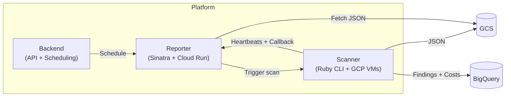
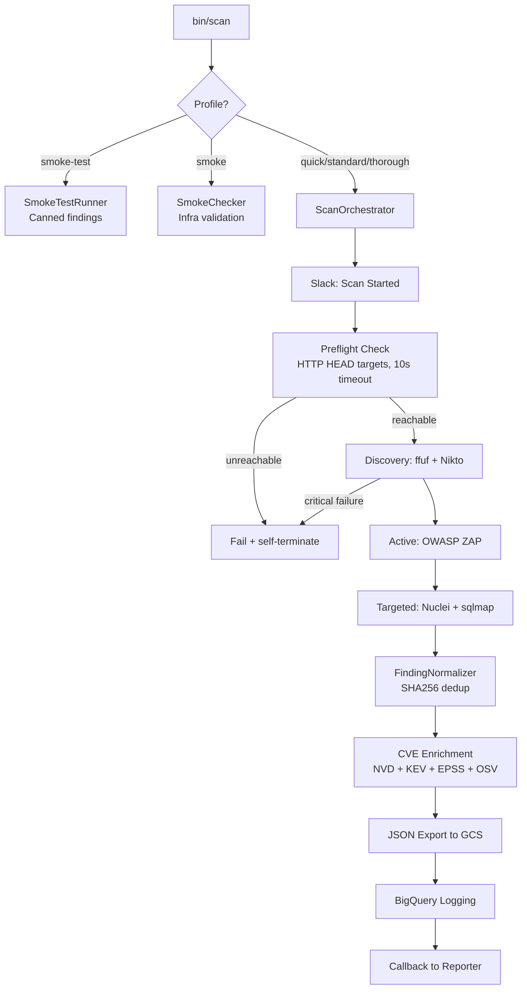
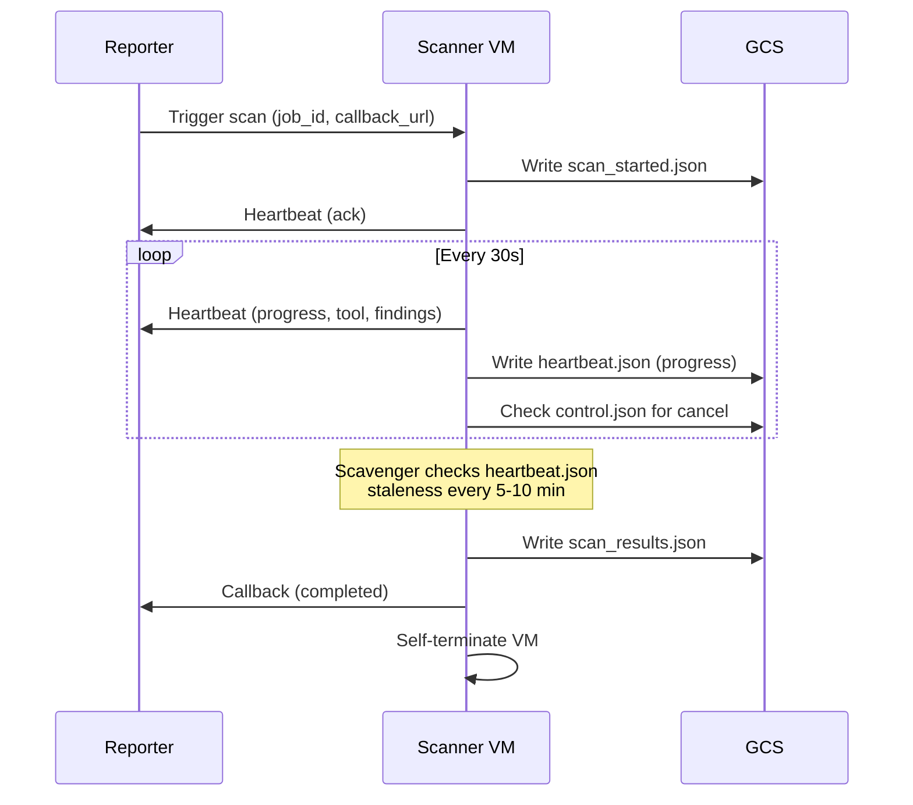

# Peregrine Penetrator Scanner

<!-- Badges -->
[](https://d3ci42.peregrinetechsys.net/repos/5)


Automated security scanning engine that orchestrates open-source penetration testing tools against target web applications, normalizes and deduplicates findings, enriches with CVE intelligence, and exports structured results to GCS and BigQuery.

> See [RELEASE_NOTES.md](RELEASE_NOTES.md) for version history.

---

## Ethics

All tools in this repository are for **authorized testing only**. Explicit written permission is required before scanning any target. Scope constraints are enforced programmatically. See [CODE_OF_CONDUCT.md](CODE_OF_CONDUCT.md).

---

## Architecture

The scanner is one component of a three-service platform:

| Service | Repo | Responsibility |
|---------|------|---------------|
| **Scanner** (this repo) | `peregrine-penetrator-scanner` | Run security tools, normalize findings, export JSON to GCS |
| **Reporter** | [`peregrine-penetrator-reporter`](https://github.com/Peregrine-Technology-Systems/peregrine-penetrator-reporter) | AI analysis, report generation (HTML/PDF), ticketing, email |
| **Backend** | `peregrine-penetrator-backend` | Orchestration API, scheduling, billing |



### Scan Pipeline



### Control Plane

The scanner communicates with the reporter in real-time during scans:



For the full architecture reference, see [docs/ARCHITECTURE.md](docs/ARCHITECTURE.md).

---

## Security Tool Stack

| Tool | Phase | Purpose |
|------|-------|---------|
| **OWASP ZAP** | Active | Full DAST scanning |
| **Nuclei** | Targeted | Template-based CVE scanning (11,000+ templates) |
| **sqlmap** | Targeted | SQL injection detection |
| **ffuf** | Discovery | Directory/endpoint enumeration |
| **Nikto** | Discovery | Server misconfiguration detection |
| **Dawnscanner** | Targeted | Ruby dependency audit |

---

## Quick Start

### Prerequisites
- Ruby 3.2+ and Bundler
- Docker & Docker Compose (for running against DVWA)

### Local Development
```bash
git clone https://github.com/Peregrine-Technology-Systems/peregrine-penetrator-scanner.git
cd peregrine-penetrator-scanner
bundle install
bundle exec rspec           # Run test suite
bundle exec rubocop         # Lint
```

### Run a Scan
```bash
# CLI with flags
bin/scan --profile quick --name "My App" --urls '["https://example.com"]'

# Environment variables (Docker/VM pattern)
SCAN_PROFILE=standard TARGET_NAME="My App" TARGET_URLS='["https://example.com"]' bin/scan
```

### Docker (with DVWA target)
```bash
docker-compose -f docker/docker-compose.yml up -d dvwa
docker build --platform linux/amd64 -f docker/Dockerfile -t scanner .
docker run --platform linux/amd64 --network pentest-net \
  -e SCAN_PROFILE=quick \
  -e TARGET_NAME="DVWA" \
  -e TARGET_URLS='["http://dvwa:80"]' \
  scanner
```

### Cloud Development
```bash
./cloud/dev start          # Create/start GCP dev VM
./cloud/dev build          # Sync code + Docker build on VM
./cloud/dev scan quick     # Run scan, stream output
./cloud/dev results        # Download results locally
./cloud/dev stop           # Stop VM (preserves Docker cache)
```

---

## Scan Profiles

| Profile | Duration | Discovery | Active | Targeted |
|---------|----------|-----------|--------|----------|
| `quick` | ~10 min | -- | ZAP baseline | Nuclei critical/high |
| `standard` | ~30 min | ffuf + Nikto | ZAP full | Nuclei + sqlmap |
| `thorough` | ~2 hr | ffuf + Nikto | ZAP full (deep) | All tools |
| `deep` | ~2 hr | (alias for `thorough`) | Same | Same |
| `smoke` | <30s | -- | -- | Infra validation (tools, GCS, secrets) |
| `smoke-test` | <30s | -- | -- | Canned findings for deploy verification |

---

## Key Design Decisions

| Decision | Rationale |
|----------|-----------|
| **Sequel ORM** over Rails | 80MB RAM, <1s boot, 15 gems (was 300MB, 5s, 38 gems under Rails) |
| **Ephemeral VMs** | Each scan on a fresh spot VM that self-terminates |
| **JSON-first pipeline** | Canonical v1.0 JSON envelope to GCS, then BigQuery |
| **Separation of duties** | Scanner scans, reporter reports, backend orchestrates |
| **Heartbeat protocol** | Real-time progress, stale scan detection, cooperative cancellation |
| **Dead letter to GCS** | No scan results lost even if reporter is down |

### Design Approach

This project followed **stepwise refinement** — building a working monolith first, then extracting clean service boundaries once the domain was understood:

| Version | What happened |
|---------|--------------|
| v0.1.0 | Monolith — Rails app doing everything: scan, analyze, report, notify |
| v0.2.0 | Rails stripped — migrated to Sequel ORM + plain Ruby CLI |
| v0.3.0 | Service extraction — reports, AI, ticketing, email moved to reporter (-7,030 lines) |
| v0.4.0+ | Control plane — heartbeats, cancel, smoke-test, reliability hardening |

---

## Reliability

### 5-Layer VM Safety System

| Layer | Mechanism | Timeout | Catches |
|-------|-----------|---------|---------|
| **Preflight** | HTTP HEAD each target URL | 10s | Bad URLs, DNS failures, unreachable hosts |
| **Critical failure** | First tool or connection errors abort scan | Immediate | Target goes down mid-scan |
| **GCS heartbeat** | `heartbeat.json` every 30s, scavenger checks staleness | 5m stale | Hung scans with live containers |
| **Timeout** | Ruby `Timeout.timeout` + shell `timeout` wrapper | 3600s | Scans exceeding global limit |
| **Scavenger** | SSH + heartbeat check, Cloud Scheduler every 5m | 10m soft / 240m hard | All orphaned VMs |

### Additional Reliability

| Mechanism | Prevents |
|-----------|---------|
| Per-tool timeout (default 600s) | Individual tool hangs |
| Scan-start Slack notification | Silent scan launches |
| `scan_started.json` marker | Detect started-but-never-completed scans |
| `callback_pending.json` dead letter | Recover when callback fails |
| Cancel via GCS `control.json` | Stop stale/runaway scans |
| Deploy smoke test (validates status + results) | Broken baked images |
| Health endpoint method guard (GET = health) | Health polls creating VMs |

### Deploy Verification

Every staging and production deployment triggers a smoke test that launches an ephemeral scan VM with the `smoke-test` profile. The VM boots, pulls the baked image, creates canned findings, writes to GCS, and self-terminates. Reporter calls are stubbed (logged but not POSTed) since the reporter didn't dispatch the scan. Development is excluded (uses interactive VM).

---

## Docker Architecture

Hybrid model — development is fast (no build), staging/production use immutable images:

| Environment | How | Docker build? |
|-------------|-----|---------------|
| **Development** | Clone + `bundle install` at boot | No |
| **Staging** | Baked `scanner:staging` image | Yes |
| **Production** | Re-tag staging as `scanner:production` | No (identical bytes) |

| Image | Contents | Rebuilt |
|-------|----------|--------|
| `scanner-base` | Security tools + Ruby runtime | Monthly |
| `scanner:staging` | Base + gems + app code | Every staging merge |
| `scanner:production` | Same as staging (re-tagged) | Main merge |

---

## CI/CD

CI runs on [Woodpecker CI](https://d3ci42.peregrinetechsys.net) (self-hosted).

| Pipeline | Trigger | Purpose |
|----------|---------|---------|
| `ci.yaml` | Push (not main) | RSpec + RuboCop + RELEASE_NOTES check + Python Cloud Function tests |
| `build-base.yaml` | Dockerfile.base changes | Build scanner-base image |
| `build.yaml` | Staging push | Build baked scanner:staging |
| `deploy.yaml` | Staging/main push | Tag image, trigger scan VM |
| `promote.yaml` | Dev/staging push | Auto-promote to next branch |
| `smoke-test.yaml` | Staging push | Verify GCS outputs |
| `version-bump.yaml` | Main push | Bump VERSION, tag, update RELEASE_NOTES |
| `sync-back.yaml` | Tag v* | Sync RELEASE_NOTES to dev/staging |

---

## Documentation

| Document | Description |
|----------|-------------|
| [docs/ARCHITECTURE.md](docs/ARCHITECTURE.md) | Full architecture with Mermaid diagrams — scan flow, control plane, VM lifecycle, data model, reliability |
| [docs/SECURITY_ARCHITECTURE.md](docs/SECURITY_ARCHITECTURE.md) | Threat model, secrets management, container/network/control plane security |
| [docs/schema_versioning.md](docs/schema_versioning.md) | v1.0 JSON envelope contract between scanner and reporter |
| [docs/data_retention_policy.md](docs/data_retention_policy.md) | 18-month BigQuery/GCS retention policy |
| [docs/audit_logging.md](docs/audit_logging.md) | Audit event types, chain of custody, compliance (SOC 2, ISO 27001) |
| [DEVELOPMENT.md](DEVELOPMENT.md) | Local setup, testing, environment variables |
| [RELEASE_NOTES.md](RELEASE_NOTES.md) | Version history |
| [CONTRIBUTING.md](CONTRIBUTING.md) | Contribution guidelines |
| [CLAUDE.md](CLAUDE.md) | AI assistant context for this project |

---

## License

[Business Source License 1.1](LICENSE) — Free for non-commercial use. Converts to Apache 2.0 on March 19, 2030.
