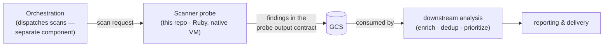
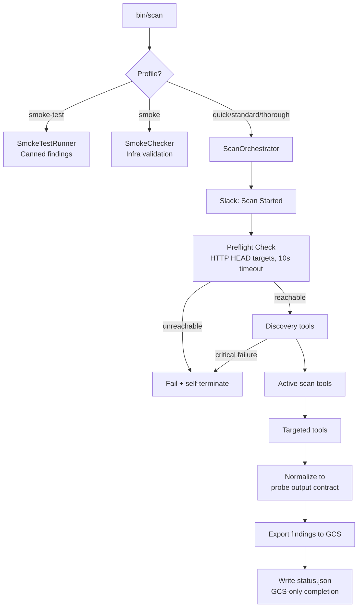
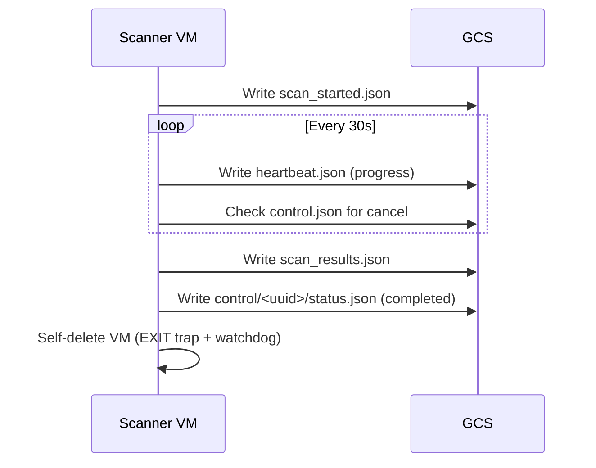

# Peregrine Penetrator Scanner

<!-- Badges -->
[](https://d3ci42.peregrinetechsys.net/repos/5) <!-- allow-sensitive: public Woodpecker CI server (serves the status badge) -->
[](https://github.com/Peregrine-Technology-Systems/peregrine-penetrator-scanner/releases)


-success)


Automated security scanning engine — one **probe** in the Peregrine Penetrator fleet. It runs open-source penetration testing tools against authorized web applications, normalizes their output into the canonical [probe output contract](docs/probe_contract.md), and exports structured findings to GCS for downstream analysis. Enrichment, deduplication, prioritization, and reporting are downstream concerns — out of scope here.

> **Part of the Peregrine Penetrator product line at Peregrine Technology Systems.** This repo is **one component** — the scanning engine — of the Penetrator product. The product as a whole is built to Peregrine Technology Systems' standards for **SOC 2 Type II** compliance (a product-level property, not inferable from this component alone). Penetrator is **cloud-agnostic**; the scanner currently happens to deploy on GCP — a deployment detail, not a platform coupling.
>
> See [RELEASE_NOTES.md](RELEASE_NOTES.md) for version history.

---

## Ethics

All tools in this repository are for **authorized testing only**. Explicit written permission is required before scanning any target. Scope constraints are enforced programmatically. See [CODE_OF_CONDUCT.md](CODE_OF_CONDUCT.md).

---

## Architecture

The scanner is **one probe** in the **Peregrine Penetrator** product. Its job is bounded: run security tools against an **authorized** target, normalize their output into the canonical **probe output contract**, and **export structured findings** to GCS. Everything analytical — CVE/exploit **enrichment**, **deduplication**, **prioritization** — and **reporting** belongs to downstream components, intentionally **out of scope for this repository**. See [docs/probe_contract.md](docs/probe_contract.md) for the finding shape this probe emits.


```mermaid
graph LR
    Orchestration["Orchestration<br/>(dispatches scans —<br/>separate component)"] -->|scan request| Scanner["Scanner probe<br/>(this repo · Ruby, native VM)"]
    Scanner -->|findings in the<br/>probe output contract| GCS[(GCS)]
    GCS -->|consumed by| Analysis["downstream analysis<br/>(enrich · dedup · prioritize)"]
    Analysis --> Reporting["reporting & delivery"]
```

### Scan Pipeline


```mermaid
flowchart TD
    A[bin/scan] --> B{Profile?}
    B -->|smoke-test| C[SmokeTestRunner<br/>Canned findings]
    B -->|smoke| D[SmokeChecker<br/>Infra validation]
    B -->|quick/standard/thorough| E[ScanOrchestrator]

    E --> N[Slack: Scan Started]
    N --> P[Preflight Check<br/>HTTP HEAD targets, 10s timeout]
    P -->|unreachable| X[Fail + self-terminate]
    P -->|reachable| F[Discovery tools]
    F -->|critical failure| X
    F --> G[Active scan tools]
    G --> H[Targeted tools]
    H --> I[Normalize to<br/>probe output contract]
    I --> K[Export findings to GCS]
    K --> M[Write status.json<br/>GCS-only completion]
```

### Control Plane

A scan is dispatched by an orchestration component (separate, out of scope). During the run the scanner writes liveness and completion signals to GCS — there is **no inbound callback** (#906) — and the single-use VM self-deletes:


```mermaid
sequenceDiagram
    participant S as Scanner VM
    participant G as GCS

    S->>G: Write scan_started.json

    loop Every 30s
        S->>G: Write heartbeat.json (progress)
        S->>G: Check control.json for cancel
    end

    S->>G: Write scan_results.json
    S->>G: Write control/<uuid>/status.json (completed)
    S->>S: Self-delete VM (EXIT trap + watchdog)
```

For the full architecture reference, see [docs/ARCHITECTURE.md](docs/ARCHITECTURE.md).

---

## Security Tool Stack

| Tool | Phase | Purpose | Baked in `txn-scanner-app` |
|------|-------|---------|:--:|
| **OWASP ZAP** | Active | Full DAST scanning | ✅ |
| **Nuclei** | Targeted | Template-based CVE scanning (11,000+ templates) | ✅ |
| **testssl.sh** | Discovery | TLS/SSL configuration analysis | ✅ |
| **trufflehog** | Targeted | Hardcoded secret / credential detection | ✅ |
| **sqlmap** | Targeted | SQL injection detection | — |
| **ffuf** | Discovery | Directory/endpoint enumeration | — |
| **Nikto** | Discovery | Server misconfiguration detection | — |
| **retire.js** | Targeted | Vulnerable JS library detection | — |
| **amass** | Discovery | Subdomain enumeration | — |

> The **`reduced`** profile (below) is the org-native production profile today: it uses **only the baked tool set** (testssl + ZAP baseline + Nuclei + trufflehog). The remaining tools (`—`) are wired into the codebase and the fuller profiles, pending the bakery vendoring their apt/npm dependencies into the image.

---

## Quick Start

### Prerequisites
- Ruby 4.0.5 and Bundler (managed via `chruby`/`rbenv`; see `.ruby-version`)

### Local Development
```bash
git clone https://github.com/Peregrine-Technology-Systems/peregrine-penetrator-scanner.git
cd peregrine-penetrator-scanner
bundle install
bundle exec rspec           # Run test suite
bundle exec rubocop         # Lint
```

### Run a Scan
```bash
# CLI with flags
bin/scan --profile quick --name "My App" --urls '["https://example.com"]'

# Environment variables (the pattern the scan VM uses)
SCAN_PROFILE=standard TARGET_NAME="My App" TARGET_URLS='["https://example.com"]' bin/scan
```

> The scanner runs **natively — no Docker**. In production it executes on a **single-use VM booted from a pre-baked image** (`txn-scanner-app`); see [Image Model](#image-model) and [CI/CD](#cicd).

---

## Scan Profiles

| Profile | Duration | Discovery | Active | Targeted |
|---------|----------|-----------|--------|----------|
| `reduced` | ~25 min | testssl | ZAP baseline | Nuclei + trufflehog | 
| `quick` | ~10 min | -- | ZAP baseline | Nuclei critical/high |
| `standard` | ~30 min | ffuf + Nikto | ZAP full | Nuclei + sqlmap |
| `thorough` | ~2 hr | ffuf + Nikto | ZAP full (deep) | All tools |
| `deep` | ~2 hr | (alias for `thorough`) | Same | Same |
| `smoke` | <30s | -- | -- | Infra validation (tools, GCS, secrets) |
| `smoke-test` | <30s | -- | -- | Canned findings for deploy verification |

> **`reduced` is the current org-native production profile** — its tool set matches exactly what is baked into `txn-scanner-app` (see [Security Tool Stack](#security-tool-stack)). The other profiles describe the full design intent; they become runnable on the baked image as the remaining tools are vendored in.

---

## Key Design Decisions

| Decision | Rationale |
|----------|-----------|
| **Sequel ORM** over Rails | 80MB RAM, <1s boot, 15 gems (was 300MB, 5s, 38 gems under Rails) |
| **Single-use VMs** | Each scan on a fresh on-demand VM (booted from the baked image) that self-deletes |
| **JSON-first pipeline** | Canonical JSON envelope to GCS in the [probe output contract](docs/probe_contract.md) shape |
| **One probe** | The scanner scans and exports findings; downstream components analyze, prioritize, and report (out of scope here) |
| **Heartbeat protocol** | Real-time progress, stale scan detection, cooperative cancellation |
| **Dead letter to GCS** | No findings lost even if a downstream consumer is unavailable |

### Lineage

The scanner evolved from a Rails monolith into a lean Sequel CLI, and then into a single-purpose **probe**: analysis and reporting were extracted to downstream components, leaving it to do one thing — scan and emit findings in the probe output contract. Full version history in [RELEASE_NOTES.md](RELEASE_NOTES.md).

---

## Reliability

### 5-Layer VM Safety System

| Layer | Mechanism | Timeout | Catches |
|-------|-----------|---------|---------|
| **Preflight** | HTTP HEAD each target URL | 10s | Bad URLs, DNS failures, unreachable hosts |
| **Critical failure** | First tool or connection errors abort scan | Immediate | Target goes down mid-scan |
| **GCS heartbeat** | `heartbeat.json` every 30s; staleness observable | 5m stale | Hung scans |
| **Timeout** | Ruby `Timeout.timeout` + shell `timeout` wrapper | 3600s | Scans exceeding global limit |
| **Self-delete + reaper** | Bootstrap EXIT-trap self-deletes the VM (success *and* failure) + a background watchdog; an infra-side TTL reaper is the backstop | trap / watchdog | Orphaned VMs |

### Additional Reliability

| Mechanism | Prevents |
|-----------|---------|
| Per-tool timeout (default 600s) | Individual tool hangs |
| Scan-start Slack notification | Silent scan launches |
| `scan_started.json` marker | Detect started-but-never-completed scans |
| `control/<uuid>/status.json` completion (#906) | GCS-only completion signal (no callback) |
| Cancel via GCS `control.json` | Stop stale/runaway scans |
| Health endpoint method guard (GET = health) | Health polls creating VMs |

---

## Image Model

The scanner is **not a Docker image**. A release **bakes a GCE image** — `txn-scanner-app`, built `FROM` a vetted base image via the infrastructure image-build pipeline — with the runtime, the security tools, **and the application's gems already placed** (build tooling stripped; nothing installed or compiled at scan time). A scan boots a **single-use VM from the `txn-scanner-app` family**, runs natively as a dedicated non-root identity, and self-deletes. There is no per-environment image — environment is selected per scan via `SCAN_MODE`.

---

## CI/CD

CI runs on [Woodpecker CI](https://d3ci42.peregrinetechsys.net) (self-hosted). <!-- allow-sensitive: public Woodpecker CI server -->

| Pipeline | Trigger | Purpose |
|----------|---------|---------|
| `ci.yaml` | Push (not main + promotion artifacts) | RSpec + RuboCop + RELEASE_NOTES + pre-publish lint — **native on the agent (ruby 4.0.5)** |
| `promote.yaml` | Dev/staging push | Local merge branch → PR → auto-merge (dev) / manual (staging→main) |
| `version-bump.yaml` | Main push | Bump VERSION, update RELEASE_NOTES, git tag + GitHub Release |
| `bake.yaml` | Tag v* | `repository_dispatch` → infra TP baker → bake the `txn-scanner-app` GCE image |
| `sync-back.yaml` | Tag v* | Sync RELEASE_NOTES to dev/staging |

---

## Documentation

| Document | Description |
|----------|-------------|
| [docs/ARCHITECTURE.md](docs/ARCHITECTURE.md) | Full architecture with Mermaid diagrams — scan flow, control plane, VM lifecycle, data model, reliability |
| [docs/SECURITY_ARCHITECTURE.md](docs/SECURITY_ARCHITECTURE.md) | Threat model, secrets management, container/network/control plane security |
| [docs/probe_contract.md](docs/probe_contract.md) | **Canonical probe output contract** — the finding shape this probe emits for downstream analysis |
| [docs/schema_versioning.md](docs/schema_versioning.md) | JSON envelope version contract + MINOR/MAJOR evolution rules |
| [docs/data_retention_policy.md](docs/data_retention_policy.md) | Data retention: scanner retains nothing; downstream deletes scan records post-delivery; only a minimal audit record (18mo, SOC 2) is kept |
| [docs/audit_logging.md](docs/audit_logging.md) | Audit event types, chain of custody, compliance (SOC 2, ISO 27001) |
| [DEVELOPMENT.md](DEVELOPMENT.md) | Local setup, testing, environment variables |
| [RELEASE_NOTES.md](RELEASE_NOTES.md) | Version history |
| [CONTRIBUTING.md](CONTRIBUTING.md) | Contribution guidelines |
| [CLAUDE.md](CLAUDE.md) | AI assistant context for this project |

---

## License

[Business Source License 1.1](LICENSE) — Free for non-commercial use. Converts to Apache 2.0 on March 19, 2030.
