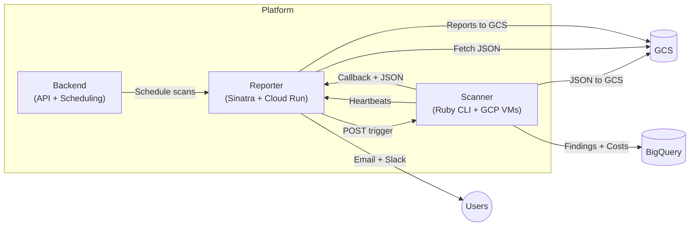
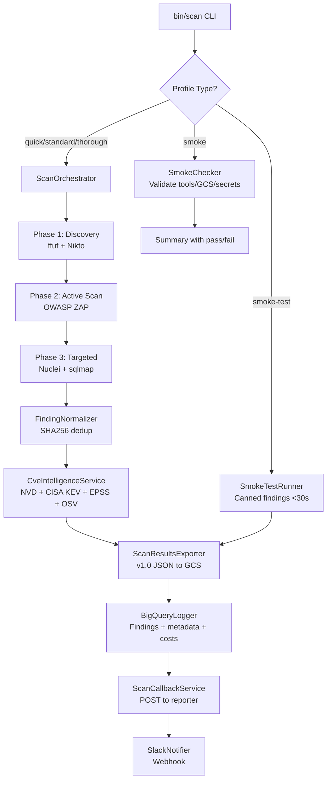
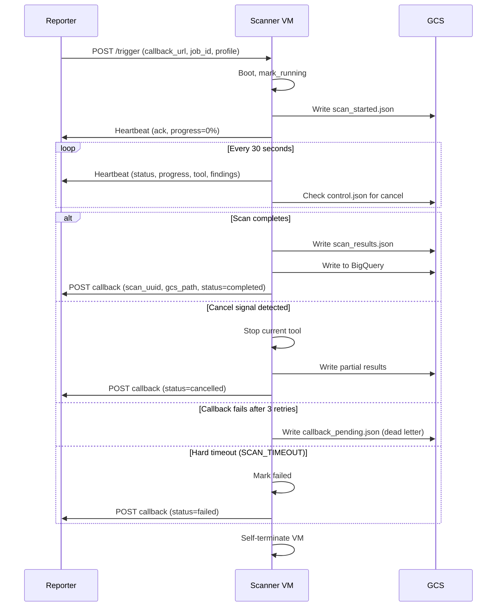
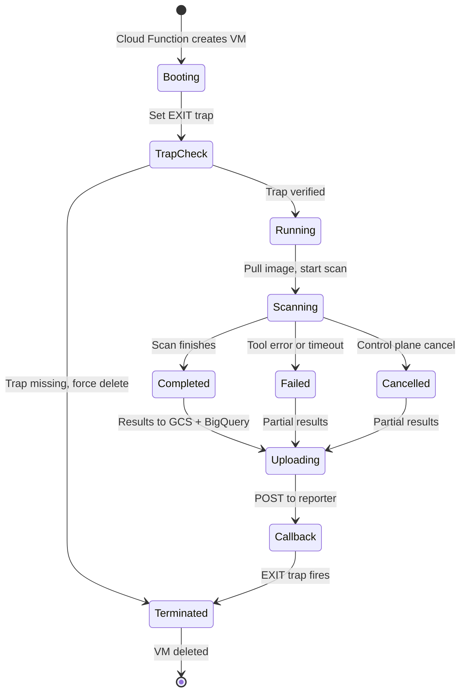
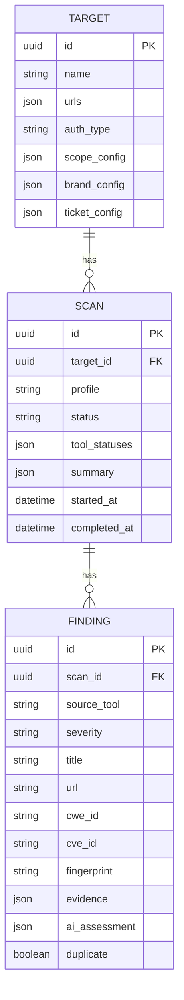
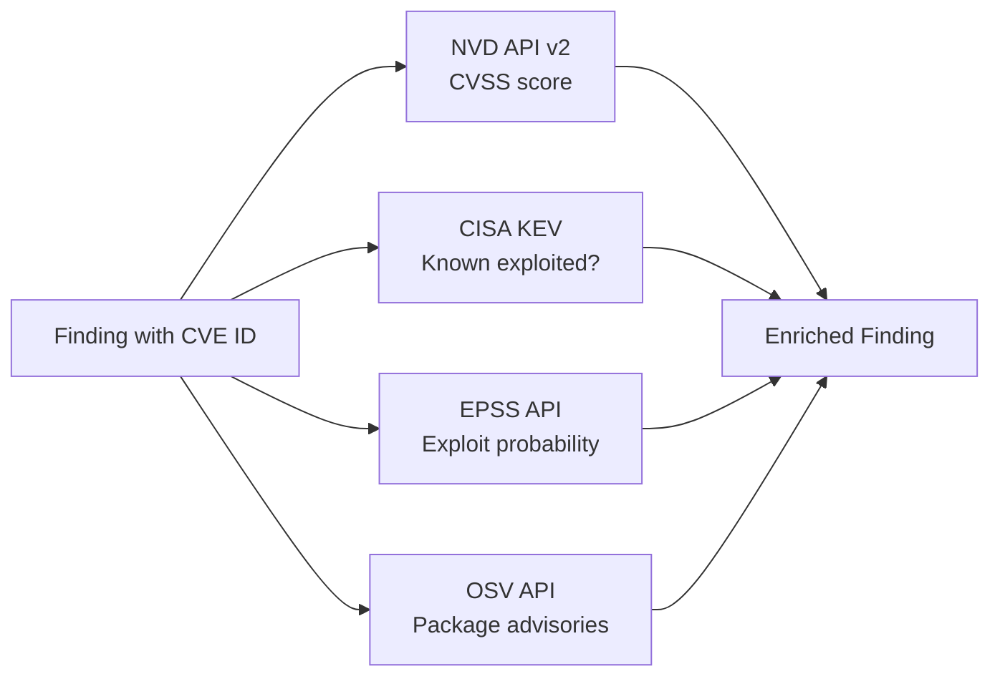
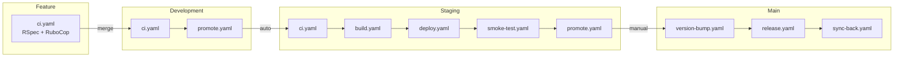

# Architecture

## System Context

The Peregrine Penetrator Scanner is one component of a three-service security scanning platform. Each service has a focused responsibility:



| Service | Repo | Responsibility |
|---------|------|---------------|
| **Scanner** | `peregrine-penetrator-scanner` | Run security tools, normalize findings, export JSON |
| **Reporter** | `peregrine-penetrator-reporter` | AI analysis, report generation, ticketing, notifications |
| **Backend** | `peregrine-penetrator-backend` | Orchestration API, scheduling, billing |

## Scanner Architecture

### Scan Execution Flow



### Control Plane Protocol

The scanner communicates with the reporter via a heartbeat/cancel protocol:



### VM Lifecycle



Scavenger safety net deletes orphans: 30min-4hr via SSH liveness check, >4hr force delete.

## Data Model



All models use UUID primary keys. JSON columns use Sequel's serialization plugin.

## Security Tools

| Tool | Phase | Purpose | Default Timeout |
|------|-------|---------|----------------|
| **ffuf** | Discovery | Directory/endpoint enumeration | 300s |
| **Nikto** | Discovery | Server misconfiguration detection | 300s |
| **OWASP ZAP** | Active | Full DAST scan (baseline or full) | 600s |
| **Nuclei** | Targeted | Template-based CVE scanning (11K+ templates) | 300s |
| **sqlmap** | Targeted | SQL injection detection | 300s |
| **Dawnscanner** | Targeted | Ruby dependency audit | 300s |

### Finding Normalization

Each tool produces findings in its own format. Result parsers (`app/services/result_parsers/`) normalize them into a common schema. The `FindingNormalizer` then deduplicates across tools using SHA256 fingerprints:

```
fingerprint = SHA256("source_tool:title:url:parameter:cwe_id")
```

Findings with identical fingerprints within the same scan are marked as `duplicate: true`.

## CVE Intelligence Enrichment

Findings with CVE IDs are enriched from four sources:



## JSON Export Schema (v1.0)

The scanner exports a versioned JSON envelope to GCS at `scan-results/{target_id}/{scan_id}/scan_results.json`:

```json
{
  "schema_version": "1.0",
  "metadata": {
    "scan_id": "uuid",
    "target_name": "...",
    "target_urls": ["..."],
    "profile": "standard",
    "started_at": "ISO8601",
    "completed_at": "ISO8601",
    "duration_seconds": 1800,
    "tool_statuses": {},
    "generated_at": "ISO8601"
  },
  "summary": {
    "total_findings": 42,
    "by_severity": {"critical": 2, "high": 8, "medium": 15, "low": 12, "info": 5},
    "tools_run": ["zap", "nuclei", "ffuf", "nikto"],
    "duration_seconds": 1800
  },
  "findings": [...]
}
```

See [docs/schema_versioning.md](schema_versioning.md) for the full contract specification.

## Scan Profiles

| Profile | Duration | Discovery | Active | Targeted |
|---------|----------|-----------|--------|----------|
| `quick` | ~10 min | -- | ZAP baseline | Nuclei critical/high |
| `standard` | ~30 min | ffuf + Nikto | ZAP full | Nuclei + sqlmap |
| `thorough` | ~2 hr | ffuf + Nikto | ZAP full (deep) | Nuclei + sqlmap + Dawn |
| `smoke` | <30s | -- | -- | -- (infra validation only) |
| `smoke-test` | <30s | -- | -- | -- (canned findings for deploy verification) |

## Reliability Guarantees

| Mechanism | What it prevents |
|-----------|-----------------|
| **SCAN_TIMEOUT** (default 3600s) | Hung scans running indefinitely |
| **Per-tool timeout** (default 600s) | Individual tool hangs |
| **ControlPlaneLoop tick timeout** (10s) | Hung heartbeat/cancel checks |
| **Heartbeat every 30s** | Reporter detects dead scanners (90s stale threshold) |
| **last_tool_started_at** in heartbeat | Reporter detects hung tools (5min stale threshold) |
| **scan_started.json marker** | Reporter detects started-but-never-completed scans |
| **callback_pending.json dead letter** | Reporter recovers when callback fails |
| **VM self-terminate trap** | No orphan VMs (EXIT trap + scavenger safety net) |
| **VM trap self-check** | VM aborts if trap setup fails |
| **Cancel via GCS control.json** | Reporter can stop stale/runaway scans |
| **Process liveness check** | ScannerBase detects dead tool processes |

## Docker Architecture

### Hybrid Model

- **Development**: Clone repo at VM boot, `bundle install`, run from source (fast iteration)
- **Staging**: Build baked `scanner:staging` image (immutable freeze point)
- **Production**: Re-tag `scanner:staging` as `scanner:production` (zero rebuild, identical bytes)

### Image Layers

| Layer | Contents | Rebuild Frequency |
|-------|----------|------------------|
| **scanner-base** | Ubuntu + ZAP + Nuclei + sqlmap + ffuf + Nikto + Python deps | Monthly |
| **scanner** (app) | Ruby 3.2.2 + bundle install + app code | Every staging build |

## CI/CD Pipeline



| Pipeline | Trigger | Purpose |
|----------|---------|---------|
| `ci.yaml` | Push (not main) | RSpec + RuboCop + check-release-notes |
| `build-base.yaml` | Dockerfile.base changes | Build scanner-base image |
| `build.yaml` | Push to staging | Build baked scanner:staging image |
| `deploy.yaml` | Push to staging/main | Tag image, trigger scan VM |
| `promote.yaml` | Push to dev/staging | Auto-promote to next branch |
| `smoke-test.yaml` | Push to staging | Verify scan outputs in GCS |
| `version-bump.yaml` | Push to main | Bump VERSION, update RELEASE_NOTES, tag |
| `sync-back.yaml` | Tag v* | Sync RELEASE_NOTES to dev/staging |

## Directory Structure

```
peregrine-penetrator-scanner/
  app/
    models/               Value objects (ScanProfile)
    services/             Core business logic
      scanners/           Tool-specific scanner classes
      result_parsers/     Normalize tool output formats
      cve_clients/        NVD, CISA KEV, EPSS, OSV
      notifiers/          Slack alerts
  bin/scan                CLI entry point
  config/scan_profiles/   YAML scan configs
  cloud/lib/              VM startup scripts
  db/sequel_migrations/   Sequel migrations
  docker/                 Dockerfile, docker-compose
  docs/                   Architecture and reference docs
  infra/                  Pulumi IaC for GCP
  lib/
    models/               Sequel models (Target, Scan, Finding)
    penetrator.rb         Boot module
    tasks/                Rake tasks
  scripts/woodpecker/     CI pipeline scripts
  spec/                   RSpec test suite
```
