# Architecture

Comprehensive architecture documentation for the Peregrine Penetrator Scanner -- the security scanning engine of the Peregrine pentest platform. This document covers the three-service platform, scan lifecycle, VM safety system, Cloud Functions, control plane, CI/CD pipeline, data flow, and reliability patterns.

## Table of Contents

- [1. System Architecture](#1-system-architecture)
- [2. Scan Lifecycle](#2-scan-lifecycle)
- [3. VM Safety System (6 Layers)](#3-vm-safety-system-6-layers)
- [4. Cloud Functions](#4-cloud-functions)
- [5. Control Plane](#5-control-plane)
- [6. CI/CD Pipeline](#6-cicd-pipeline)
- [7. Data Flow](#7-data-flow)
- [8. Reliability Patterns](#8-reliability-patterns)

---

## 1. System Architecture

### Platform Context (C4 Level 1)

The Peregrine Penetrator platform is a three-service system for automated web application security scanning. Each service owns a distinct responsibility.

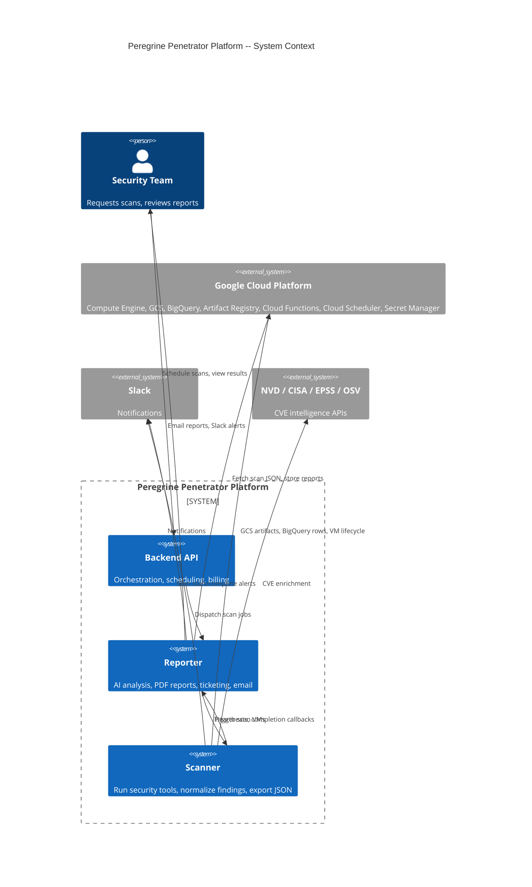

### Service Responsibilities

| Service | Repository | Stack | Responsibility |
|---------|-----------|-------|---------------|
| **Scanner** | `peregrine-penetrator-scanner` | Ruby + Sequel ORM, CLI | Run security tools on ephemeral GCP VMs, normalize findings, enrich with CVE data, export JSON to GCS and BigQuery |
| **Reporter** | `peregrine-penetrator-reporter` | Sinatra + Cloud Run | AI-powered analysis, PDF report generation, ticketing (GitHub/Linear/Jira), email notifications |
| **Backend** | `peregrine-penetrator-backend` | API | Orchestration, scan scheduling, billing, user management |

### GCP Infrastructure

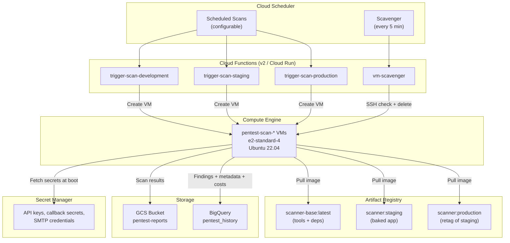

---

## 2. Scan Lifecycle

### End-to-End Sequence

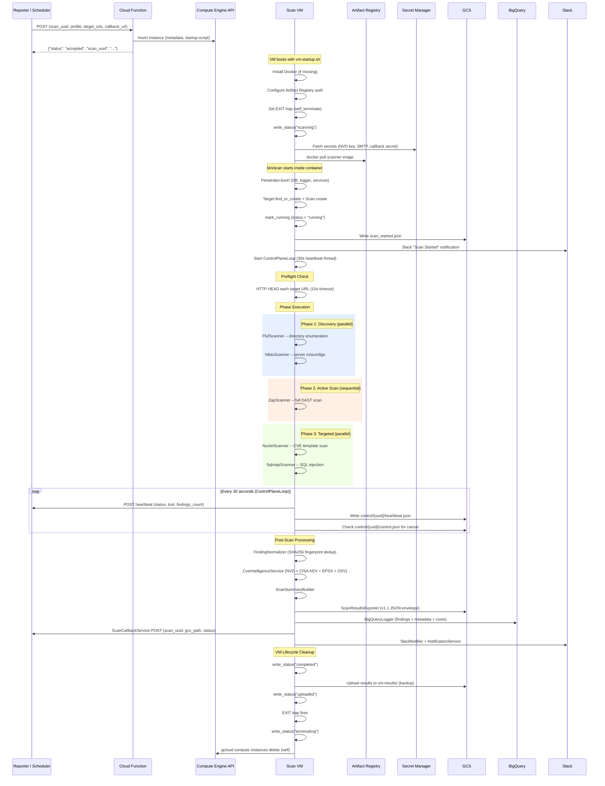

### Scan Execution Flow

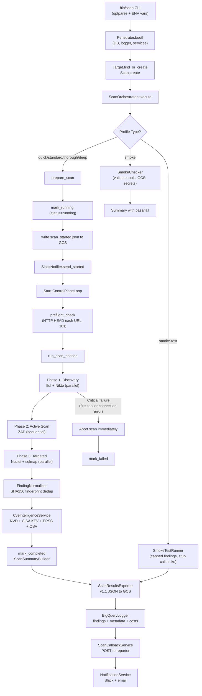

### Phase Execution Detail

Each scan profile defines phases in YAML. Phases execute sequentially; tools within a phase can run in parallel.

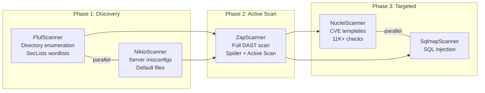

Discovered URLs from Phase 1 are fed into subsequent phases, expanding the scan surface.

---

## 3. VM Safety System (6 Layers)

The scanner runs on ephemeral GCP VMs that must self-terminate after the scan completes. Six layers prevent orphaned VMs from running indefinitely and incurring cost.

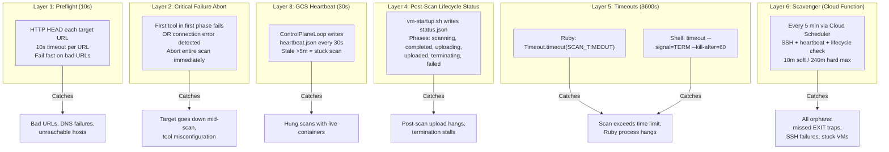

### Scavenger Decision Matrix

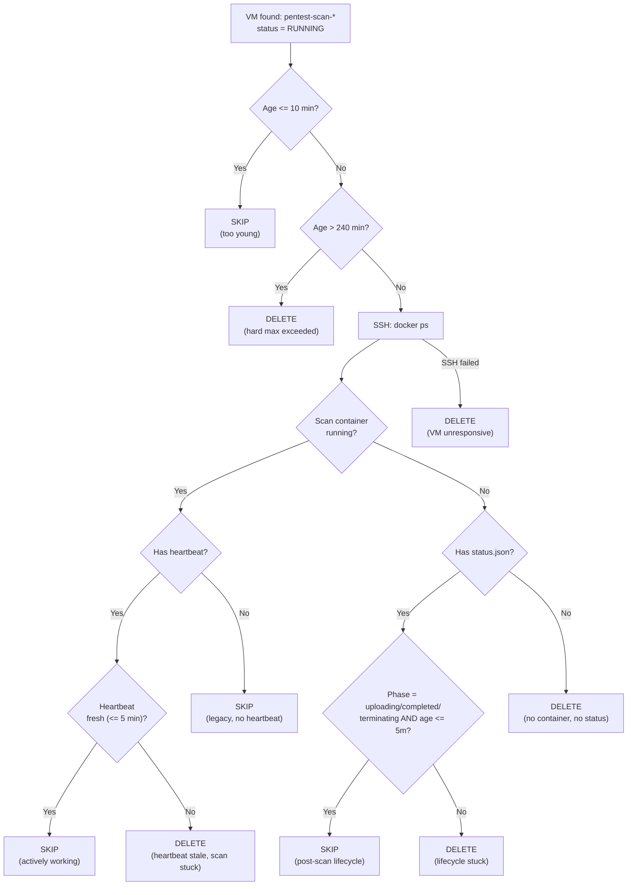

### VM Lifecycle State Machine

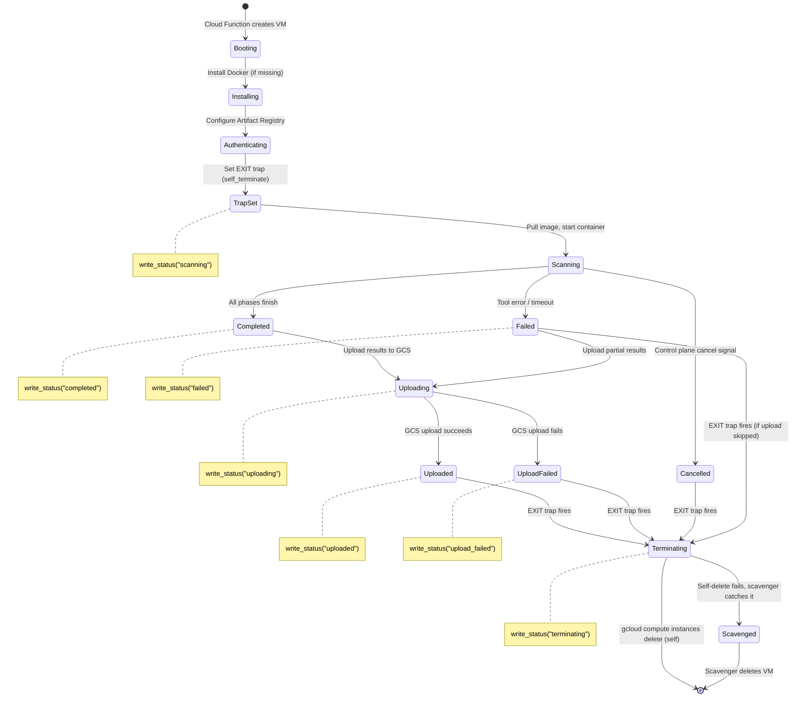

---

## 4. Cloud Functions

Four Cloud Functions in `cloud/scheduler/main.py` manage VM lifecycle.

### Function Overview

| Function | Entry Point | Trigger | Purpose |
|----------|------------|---------|---------|
| `vm-scavenger` | `scavenge_vms` | Cloud Scheduler (every 5 min) | Delete orphaned scan VMs |
| `trigger-scan-development` | `trigger_development` | Reporter / Cloud Scheduler | Launch dev VM (clone at boot) |
| `trigger-scan-staging` | `trigger_staging` | Reporter / Cloud Scheduler | Launch staging VM (baked image) |
| `trigger-scan-production` | `trigger_production` | Reporter / Cloud Scheduler | Launch production VM (baked image, SPOT pricing) |

### Health Guard Pattern

All four functions use a method-first health guard. GET requests always return health status. POST requests execute the actual logic.

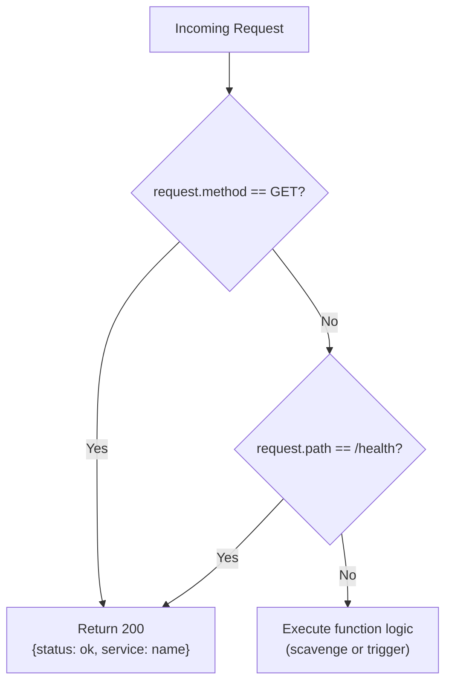

This guard prevents Cloud Scheduler health probes (which use GET) from accidentally triggering scans or scavenging operations.

### Trigger Function Flow

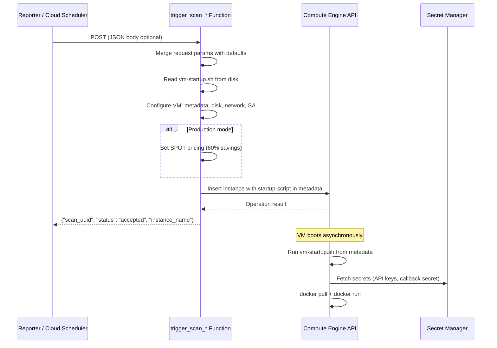

### VM Instance Configuration

The trigger function creates a VM with these specifications:

| Property | Value |
|----------|-------|
| Machine type | `e2-standard-4` (4 vCPU, 16GB RAM) |
| OS | Ubuntu 22.04 LTS |
| Disk | 30GB pd-standard, auto-delete |
| Service account | `pentest-scanner@{project}.iam.gserviceaccount.com` |
| Network | Default VPC with external NAT |
| Labels | `env`, `project=pentest`, `scan=true`, `profile` |
| Tags | `pentest-scan` |
| Scheduling (prod) | SPOT with instance_termination_action=DELETE |
| Metadata | SCAN_MODE, SCAN_PROFILE, TARGET_URLS, SCAN_UUID, CALLBACK_URL, JOB_ID, REGISTRY, IMAGE_TAG, GCS_BUCKET, startup-script |

### Scavenger Operation

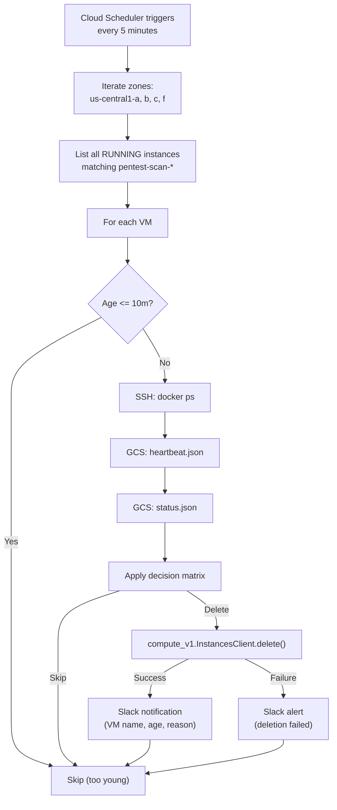

---

## 5. Control Plane

The control plane enables real-time monitoring and cancellation of running scans through a combination of GCS artifacts and HTTP callbacks.

### Control Plane Architecture

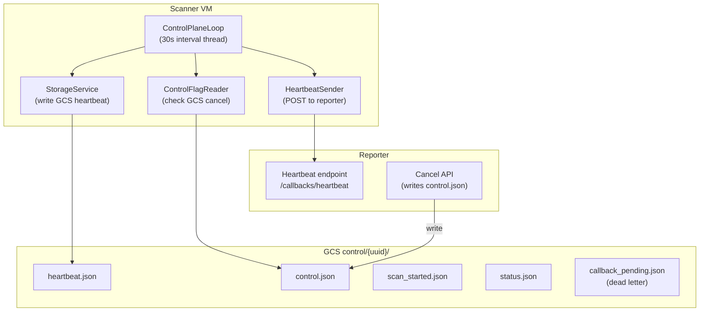

### Heartbeat Protocol

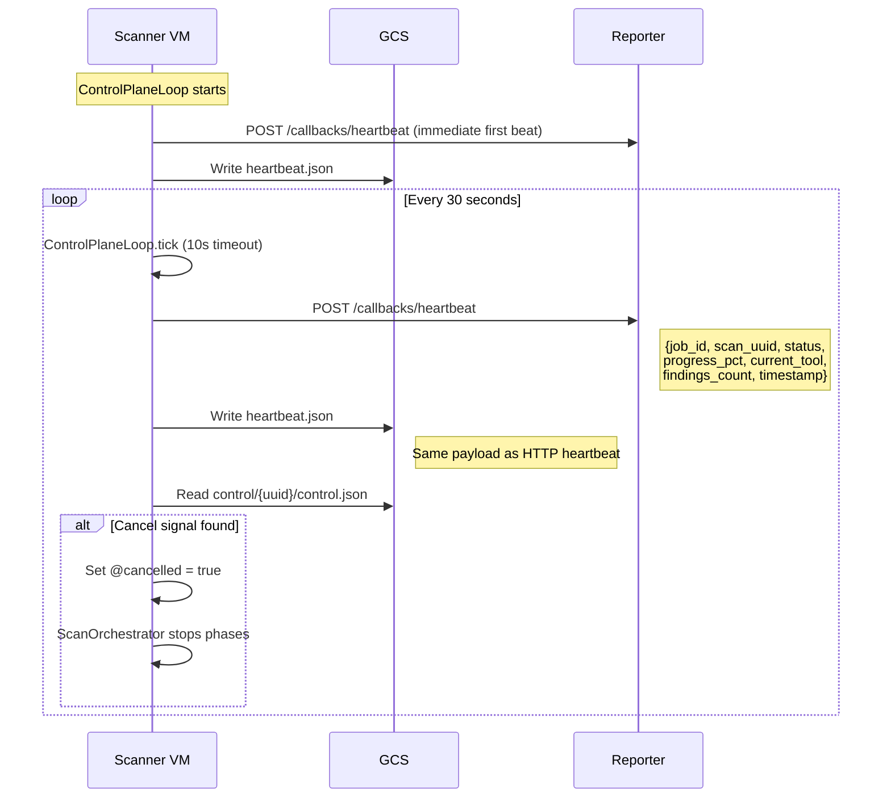

### Heartbeat Payload

```json
{
  "scan_uuid": "abc-123",
  "job_id": "job-456",
  "status": "running",
  "progress_pct": 45,
  "current_tool": "zap",
  "findings_count": 12,
  "last_tool_started_at": "2026-04-03T10:15:00Z",
  "timestamp": "2026-04-03T10:20:30Z"
}
```

### Cancel Signal

The reporter can cancel a running scan by writing a control flag to GCS:

```json
// GCS: control/{scan_uuid}/control.json
{
  "action": "cancel"
}
```

The `ControlFlagReader` checks this file every 30 seconds. When detected, the orchestrator stops executing phases and marks the scan as `cancelled`.

### GCS Control Artifacts

All control artifacts live under `control/{scan_uuid}/` in the GCS bucket:

| Artifact | Writer | Reader | Purpose |
|----------|--------|--------|---------|
| `scan_started.json` | ScanOrchestrator | Reporter | Detect started-but-never-completed scans |
| `heartbeat.json` | ControlPlaneLoop | Scavenger, Reporter | Track scan liveness and progress |
| `control.json` | Reporter (cancel API) | ControlFlagReader | Signal scan cancellation |
| `status.json` | vm-startup.sh | Scavenger | Track post-scan lifecycle (uploading, terminating) |
| `callback_pending.json` | ScanCallbackService | Reporter (recovery) | Dead letter when callback fails |

### Lifecycle Status Phases

The `status.json` artifact tracks the VM's post-scan lifecycle, written by `vm-startup.sh`:

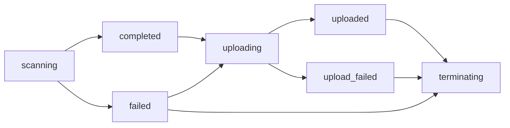

---

## 6. CI/CD Pipeline

### Branch Flow

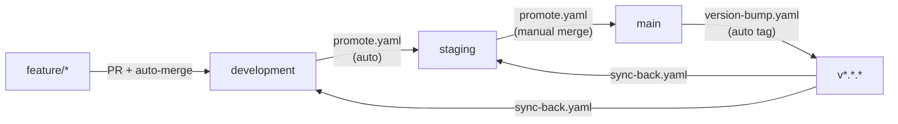

### Pipeline Dependency Chain

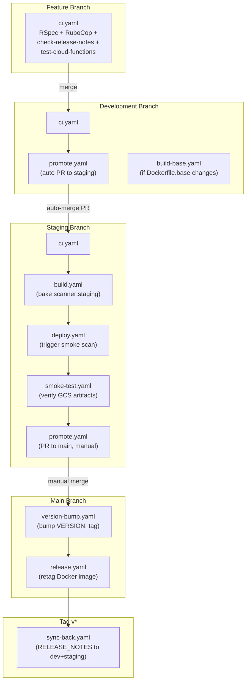

### Workflow Details

| Pipeline | File | Trigger | Steps | Depends On |
|----------|------|---------|-------|------------|
| **CI** | `ci.yaml` | Push (exclude main) | RSpec, RuboCop, check-release-notes, test-cloud-functions (parallel) | -- |
| **Build Base** | `build-base.yaml` | Push to development (Dockerfile.base changes) | Build + push scanner-base image | -- |
| **Build** | `build.yaml` | Push to staging | Build baked scanner:staging image | ci |
| **Deploy** | `deploy.yaml` | Push to staging | Trigger scan VM with baked image | build |
| **Smoke Test** | `smoke-test.yaml` | Push to staging | Validate scan outputs in GCS | deploy |
| **Promote** | `promote.yaml` | Push to dev/staging | Local merge branch, create PR, auto-merge (dev) or manual (staging) | -- |
| **Version Bump** | `version-bump.yaml` | Push to main | Bump VERSION, update RELEASE_NOTES, create git tag, tag Docker image | -- |
| **Release** | `release.yaml` | Push to main | Retag staging Docker image as production | version-bump |
| **Sync Back** | `sync-back.yaml` | Tag v* | Sync RELEASE_NOTES back to development/staging | -- |

### Docker Image Model

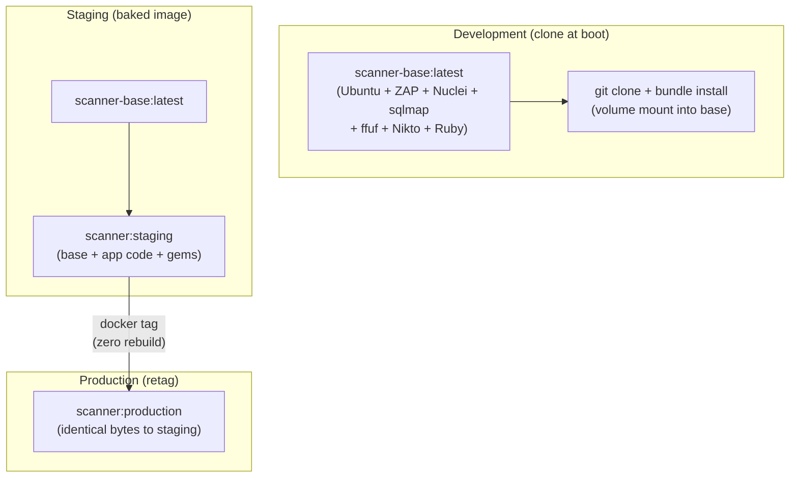

| Layer | Contents | Rebuild Frequency |
|-------|----------|------------------|
| **scanner-base** | Ubuntu + ZAP + Nuclei + sqlmap + ffuf + Nikto + Python + Ruby 3.2.2 | Monthly (or on tool updates) |
| **scanner** (app) | Base + bundled gems + application code | Every staging build |

**Key design decision**: `VERSION` is a runtime environment variable, not baked into the Docker image. This allows the same image bytes to serve multiple tagged releases. Read via `Penetrator::VERSION`.

### Deploy Verification (Smoke Test)

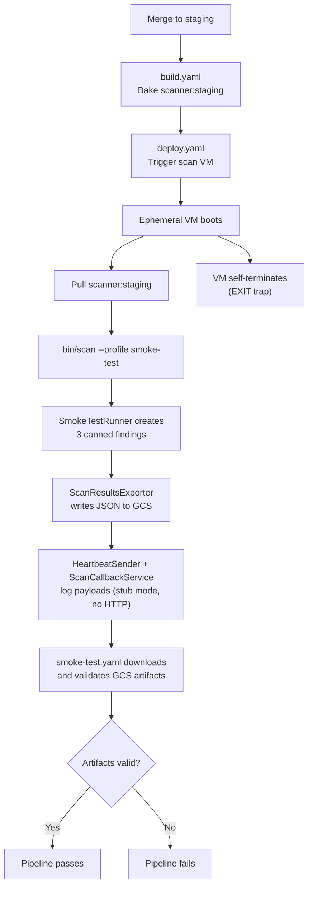

**Stub mode**: During smoke tests (`SCAN_PROFILE=smoke-test`), `HeartbeatSender` and `ScanCallbackService` log their payloads at INFO level but do not make HTTP calls. The reporter did not dispatch the scan, so there is no matching job record. GCS writes proceed normally -- that is the real verification.

---

## 7. Data Flow

### JSON Export Schema (v1.1)

The scanner exports a versioned JSON envelope to GCS at `scan-results/{target_id}/{scan_id}/scan_results.json`:

```json
{
  "schema_version": "1.1",
  "metadata": {
    "scan_id": "uuid",
    "target_name": "Example Corp",
    "target_urls": ["https://example.com"],
    "profile": "standard",
    "started_at": "2026-04-03T10:00:00Z",
    "completed_at": "2026-04-03T10:30:00Z",
    "duration_seconds": 1800,
    "tool_statuses": {
      "zap": {"status": "completed", "findings": 15},
      "nuclei": {"status": "completed", "findings": 8}
    },
    "generated_at": "2026-04-03T10:30:05Z"
  },
  "summary": {
    "total_findings": 42,
    "by_severity": {
      "critical": 2,
      "high": 8,
      "medium": 15,
      "low": 12,
      "info": 5
    },
    "tools_run": ["zap", "nuclei", "ffuf", "nikto"],
    "duration_seconds": 1800,
    "executive_summary": "..."
  },
  "findings": [
    {
      "id": "uuid",
      "source_tool": "zap",
      "severity": "high",
      "title": "SQL Injection",
      "url": "https://example.com/search",
      "parameter": "q",
      "cwe_id": "CWE-89",
      "cve_id": "CVE-2024-1234",
      "cvss_score": 8.6,
      "cvss_vector": "CVSS:3.1/AV:N/AC:L/PR:N/UI:N/S:C/C:H/I:N/A:N",
      "epss_score": 0.42,
      "kev_known_exploited": false,
      "evidence": {},
      "ai_assessment": null
    }
  ]
}
```

### GCS Artifact Layout

```
gs://{project}-pentest-reports/
  control/{scan_uuid}/
    scan_started.json          # Written at scan start
    heartbeat.json             # Updated every 30s
    control.json               # Cancel signal (written by reporter)
    status.json                # VM lifecycle phase
    callback_pending.json      # Dead letter (if callback fails)
  scan-results/{target_id}/{scan_id}/
    scan_results.json          # Versioned JSON envelope (v1.1)
  vm-results/{instance_name}/
    *.json                     # Backup copy from VM (gsutil)
```

### BigQuery Tables

All tables live in the `pentest_history` dataset. Table names are suffixed with the scan mode (`_development`, `_staging`, `_production`).

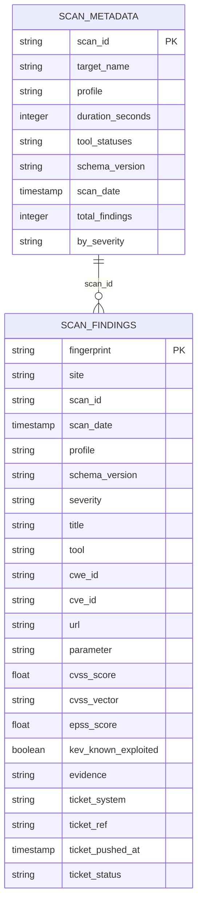

### Data Model (Sequel ORM)

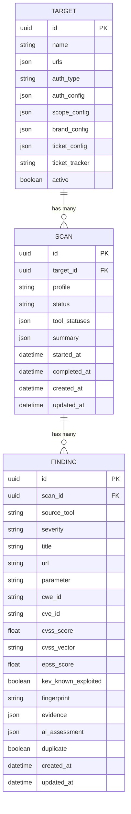

All models use UUID primary keys (`SecureRandom.uuid`). JSON columns use Sequel's serialization plugin. The `status` field on Scan cycles through: `pending`, `running`, `completed`, `failed`, `cancelled`.

### Finding Normalization Pipeline

```mermaid
flowchart LR
    subgraph "Tool Output"
        ZAP["ZAP alerts<br/>(XML/JSON)"]
        NUC["Nuclei matches<br/>(JSON)"]
        FFUF["ffuf responses<br/>(JSON)"]
        NIK["Nikto findings<br/>(XML)"]
        SQL["sqlmap results<br/>(JSON)"]
    end

    subgraph "Result Parsers"
        ZP["ZapResultParser"]
        NP["NucleiResultParser"]
        FP["FfufResultParser"]
        NKP["NiktoResultParser"]
        SP["SqlmapResultParser"]
    end

    subgraph "Normalization"
        FN["FindingNormalizer<br/>SHA256 fingerprint:<br/>title + url + param + cwe_id"]
        DEDUP["Mark duplicates<br/>(same fingerprint = duplicate: true)"]
    end

    subgraph "Enrichment"
        CVE["CveIntelligenceService"]
        NVD["NVD API v2<br/>(CVSS score + vector)"]
        KEV["CISA KEV<br/>(known exploited?)"]
        EPSS["EPSS API<br/>(exploit probability)"]
        OSV["OSV API<br/>(package advisories)"]
        SCVM["SeverityCvssMapper<br/>(non-CVE findings)"]
    end

    ZAP --> ZP --> FN
    NUC --> NP --> FN
    FFUF --> FP --> FN
    NIK --> NKP --> FN
    SQL --> SP --> FN

    FN --> DEDUP --> CVE
    CVE --> NVD & KEV & EPSS & OSV
    CVE --> SCVM
```

---

## 8. Reliability Patterns

### Dead Letter to GCS

When the completion callback to the reporter fails after 3 retries (with exponential backoff), the payload is written to GCS as a dead letter. The reporter can recover these on its next sweep.

```mermaid
sequenceDiagram
    participant VM as Scanner VM
    participant R as Reporter
    participant G as GCS

    VM->>R: POST callback (attempt 1)
    R-->>VM: 500 Server Error
    VM->>VM: Sleep 0.5s

    VM->>R: POST callback (attempt 2)
    R-->>VM: 500 Server Error
    VM->>VM: Sleep 1.0s

    VM->>R: POST callback (attempt 3)
    R-->>VM: 500 Server Error

    Note over VM: 3 retries exhausted

    VM->>G: Write control/{uuid}/callback_pending.json
    Note right of G: Dead letter contains:<br/>scan_uuid, job_id, status,<br/>gcs_path, cost_data, failed_at
```

### Callback Retry with Exponential Backoff

The `ScanCallbackService` retries up to 3 times with linear backoff (`0.5s * attempt`):

| Attempt | Delay Before | Total Elapsed |
|---------|-------------|---------------|
| 1 | 0s | 0s |
| 2 | 0.5s | 0.5s |
| 3 | 1.0s | 1.5s |
| Dead letter | -- | 1.5s |

### Self-Terminate EXIT Trap

The VM startup script sets a bash EXIT trap that fires regardless of how the scan process exits (success, failure, timeout, signal):

```mermaid
flowchart TD
    TRAP["EXIT trap set in vm-startup.sh"] --> Fire{"Process exits<br/>(any reason)"}
    Fire --> WS["write_status('terminating')"]
    WS --> Slack["Slack: VM self-terminating"]
    Slack --> Sleep["sleep 5 (allow I/O flush)"]
    Sleep --> Delete["gcloud compute instances delete<br/>(self, --quiet)"]
    Delete -->|Success| Done["VM deleted"]
    Delete -->|Failure| Log["Log error:<br/>'scavenger will clean up'"]
    Log --> Scavenger["Scavenger catches it<br/>within 5 minutes"]
```

The EXIT trap is only set for scan modes (`development`, `staging`, `production`), not for `dev` mode (interactive development VMs).

### Scan Timeout Layers

Two independent timeout mechanisms ensure no scan runs indefinitely:

```mermaid
flowchart TD
    subgraph "Layer 1: Shell timeout (vm-startup.sh)"
        ST["timeout --signal=TERM --kill-after=60 3600<br/>docker run ..."]
        ST -->|"3600s exceeded"| TERM["SIGTERM to docker run"]
        TERM -->|"60s grace"| KILL["SIGKILL (force kill)"]
    end

    subgraph "Layer 2: Ruby timeout (ScanOrchestrator)"
        RT["Timeout.timeout(SCAN_TIMEOUT)"]
        RT -->|"3600s exceeded"| Raise["Timeout::Error raised"]
        Raise --> Mark["scan.status = 'failed'<br/>error_message = 'timed out'"]
    end

    subgraph "Layer 3: ControlPlaneLoop tick timeout"
        TT["Timeout.timeout(10)"]
        TT -->|"10s exceeded"| SkipTick["Skip tick, log warning"]
    end
```

### Scan Profiles

| Profile | Estimated Duration | Discovery | Active Scan | Targeted | Use Case |
|---------|-------------------|-----------|-------------|----------|----------|
| `quick` | ~10 min | -- | ZAP baseline (300s) | Nuclei critical+high (300s) | Quick assessment |
| `standard` | ~30 min | ffuf + Nikto (300s, parallel) | ZAP full (900s) | Nuclei crit+high+med (600s) | Regular scans |
| `thorough` | ~2 hr | ffuf + Nikto (600s, parallel, extended) | ZAP full + ajax spider (1800s) | Nuclei all + sqlmap (1200s, parallel) | Deep assessment |
| `deep` | ~2 hr | (alias for thorough) | Same as thorough | Same as thorough | Compliance scans |
| `smoke` | <30s | -- | -- | -- | Infrastructure validation (tools, GCS, secrets) |
| `smoke-test` | <30s | -- | -- | -- | Deploy verification (canned findings, GCS export) |

### Security Tools

| Tool | Phase | Purpose | Output Format |
|------|-------|---------|--------------|
| **ffuf** | Discovery | Directory and endpoint enumeration using SecLists wordlists | JSON |
| **Nikto** | Discovery | Server misconfiguration and default file detection | XML |
| **OWASP ZAP** | Active Scan | Full DAST scanning (spider + active scan, optional ajax spider) | XML/JSON |
| **Nuclei** | Targeted | Template-based vulnerability scanning (11K+ templates) | JSON |
| **sqlmap** | Targeted | SQL injection detection and exploitation testing | JSON |
| **Dawnscanner** | Targeted | Ruby dependency audit (thorough profile only) | JSON |

### Critical Failure Detection

The orchestrator aborts the entire scan when a critical failure occurs:

| Condition | Why It Is Critical |
|-----------|-------------------|
| First tool in first phase fails | Likely a target issue (unreachable, auth failure) |
| Connection-related error patterns | Target went down mid-scan |

Connection error patterns detected: `unreachable`, `connection refused`, `name.*resolution`, `ECONNREFUSED`, `EHOSTUNREACH`.

Non-critical tool failures (later phases, non-connection errors) are logged but the scan continues with remaining tools.

---

## Directory Structure

```
peregrine-penetrator-scanner/
  app/
    models/                   Value objects (ScanProfile)
    services/                 Core business logic
      scanners/               Tool-specific: ZapScanner, NucleiScanner, etc.
      result_parsers/         Normalize each tool's output format
      cve_clients/            NVD, CISA KEV, EPSS, OSV API clients
      notifiers/              Slack notifications
  bin/scan                    CLI entry point
  cloud/scheduler/            Cloud Functions (Python)
    main.py                   4 function entry points
    vm-startup.sh             VM lifecycle script
    test_main.py              pytest tests (Flask test client)
  config/scan_profiles/       YAML scan profiles (quick, standard, thorough, etc.)
  db/sequel_migrations/       Sequel migrations
  docker/                     Dockerfile, Dockerfile.base, docker-compose
  docs/                       Architecture and reference documentation
  infra/                      Pulumi Ruby IaC for GCP
  lib/
    models/                   Sequel models (Target, Scan, Finding)
    penetrator.rb             Boot module (.root, .logger, .env, .db, .boot!)
    tasks/                    Rake tasks
  scripts/woodpecker/         CI pipeline scripts
  spec/                       RSpec test suite
  .woodpecker/                Woodpecker CI pipeline configs
```
