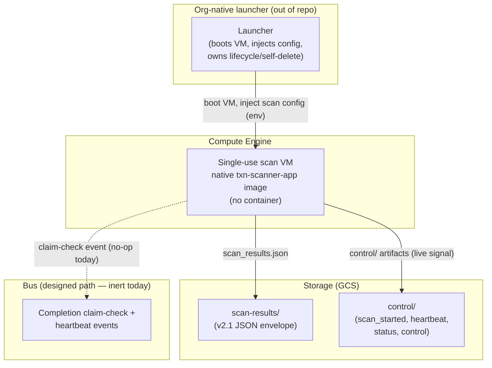
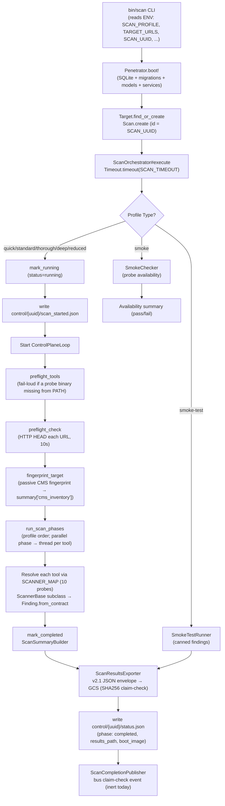
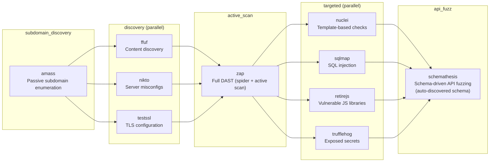
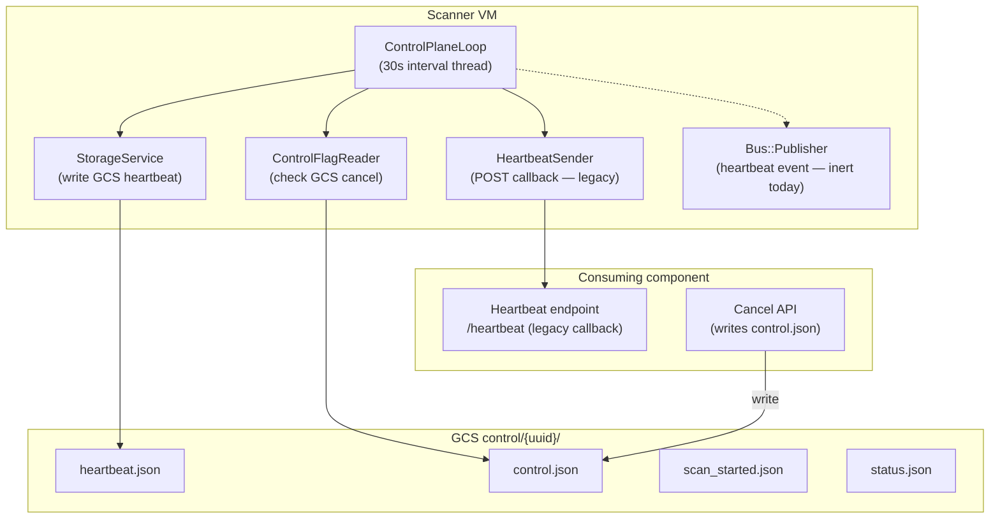
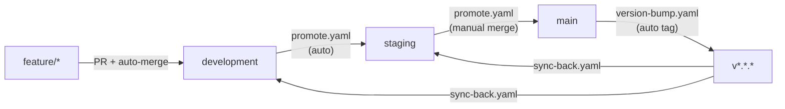
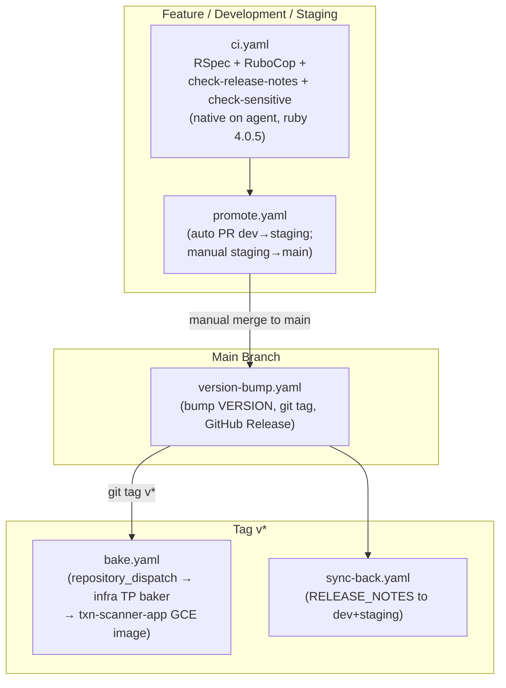
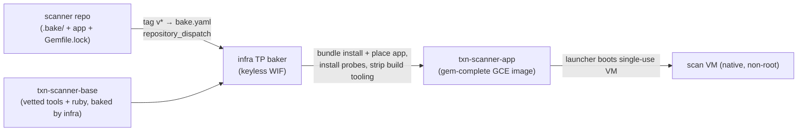
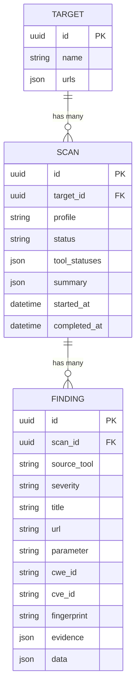
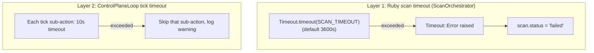

# Architecture

Architecture documentation for the Peregrine Penetrator Scanner — the **scanning engine** component of the Peregrine Penetrator product. This document covers the **scanner only**: its scan lifecycle, control plane, CI/CD pipeline, data flow, and reliability patterns. Other components of the product (orchestration, reporting, delivery) and how the product is wired together are out of scope.

## Table of Contents

- [1. System Architecture](#1-system-architecture)
- [2. Scan Lifecycle](#2-scan-lifecycle)
- [3. Control Plane](#3-control-plane)
- [4. CI/CD Pipeline](#4-cicd-pipeline)
- [5. Data Flow](#5-data-flow)
- [6. Reliability Patterns](#6-reliability-patterns)

---

## 1. System Architecture

### This component in context

The scanner is **one component** of the Peregrine Penetrator product. Its job is bounded: it runs security probes against an **authorized** target, records the findings, and **exports a structured result** (a JSON envelope to object storage plus a claim-check pointer).

Those results are **consumed by other components of the Penetrator product** (orchestration, reporting, and delivery). Those components — and how the product is wired together — are intentionally **out of scope for this document**; this file covers the scanner only. In particular, VM lifecycle (booting the single-use scan VM, injecting scan config, and self-deleting the VM after the run) is owned by a **separate org-native launcher**, an infrastructure component **not in this repository**. `bin/scan` runs as a native process on the VM the launcher provides; it does not create or delete VMs.

The rest of this document describes the scanner's own internals: scan lifecycle, control surface, data handling, and supply chain.

### Scanner Infrastructure


```mermaid
graph TB
    subgraph "Org-native launcher (out of repo)"
        LNCH["Launcher<br/>(boots VM, injects config,<br/>owns lifecycle/self-delete)"]
    end

    subgraph "Compute Engine"
        VM1["Single-use scan VM<br/>native txn-scanner-app image<br/>(no container)"]
    end

    subgraph "Storage (GCS)"
        GCS1["scan-results/<br/>(v2.1 JSON envelope)"]
        GCS2["control/<br/>(scan_started, heartbeat,<br/>status, control)"]
    end

    subgraph "Bus (designed path — inert today)"
        BUS["Completion claim-check +<br/>heartbeat events"]
    end

    LNCH -->|"boot VM, inject scan config (env)"| VM1
    VM1 -->|"scan_results.json"| GCS1
    VM1 -->|"control/ artifacts (live signal)"| GCS2
    VM1 -.->|"claim-check event (no-op today)"| BUS
```

The launcher injects scan config — including the callback secret (`SCAN_CALLBACK_SECRET`) — into the VM's environment; `bin/scan` reads it from there. The scanner itself does not call Secret Manager.

The scanner boots natively from the pre-baked `txn-scanner-app` GCE image — **no container runtime, no Artifact Registry pull, no image download at scan time**. GCS `control/` writes are the live completion/liveness mechanism; the bus is the designed path but is **inert today** (see §3).

---

## 2. Scan Lifecycle

### End-to-End Sequence

```mermaid
sequenceDiagram
    participant L as Org-native launcher
    participant VM as Scan VM (native)
    participant G as GCS
    participant B as Bus (inert today)

    L->>VM: Boot single-use VM, inject scan config (env)
    Note over VM: .bake/run.sh → exec bundle exec bin/scan (cwd /opt/app)

    VM->>VM: Penetrator.boot! (SQLite + migrations + models + services)
    VM->>VM: Target.find_or_create + Scan.create (id = SCAN_UUID)
    VM->>VM: ScanOrchestrator#execute (wrapped in Timeout.timeout(SCAN_TIMEOUT))
    VM->>VM: mark_running (status = running)
    VM->>G: Write control/{uuid}/scan_started.json
    VM->>VM: Start ControlPlaneLoop (30s thread)

    Note over VM: Non-smoke path

    VM->>VM: preflight_tools (fail-loud if a probe binary is missing from PATH)
    VM->>VM: preflight_check (HTTP HEAD each URL, 10s)
    VM->>VM: fingerprint_target (passive CMS fingerprint → summary['cms_inventory'])

    Note over VM: Phase Execution (profile order; parallel phase = one thread per tool)

    VM->>VM: Run probes via SCANNER_MAP; Finding.from_contract per result

    loop Every 30 seconds (ControlPlaneLoop)
        VM->>G: Write control/{uuid}/heartbeat.json (durable liveness)
        VM-->>B: Publish heartbeat event (no-op today)
        VM->>G: Read control/{uuid}/control.json (cancel check)
    end

    Note over VM: Completion

    VM->>G: ScanResultsExporter → scan-results/{target}/{scan}/scan_results.json (v2.1, SHA256)
    VM->>G: Write control/{uuid}/status.json (phase: completed, results_path, boot_image)
    VM-->>B: ScanCompletionPublisher → claim-check event (no-op today)
```

> **Note (org-native cutover):** the launch/packaging path is native. `.bake/run.sh` does `exec bundle exec bin/scan` directly on the VM — no container, no Artifact Registry, no image pull. The single-use VM's lifecycle (boot and self-delete) is owned by the **org-native launcher**, not this repo; `bin/scan` itself does not self-delete. See §4 → Image Model / Execution Model for the current supply chain.

### Scan Execution Flow


```mermaid
flowchart TD
    A["bin/scan CLI<br/>(reads ENV: SCAN_PROFILE, TARGET_URLS, SCAN_UUID, ...)"] --> B["Penetrator.boot!<br/>(SQLite + migrations + models + services)"]
    B --> C["Target.find_or_create<br/>Scan.create (id = SCAN_UUID)"]
    C --> D["ScanOrchestrator#execute<br/>Timeout.timeout(SCAN_TIMEOUT)"]

    D --> E{Profile Type?}
    E -->|"smoke-test"| F["SmokeTestRunner<br/>(canned findings)"]
    E -->|"smoke"| G["SmokeChecker<br/>(probe availability)"]
    E -->|"quick/standard/thorough/deep/reduced"| H["mark_running (status=running)"]

    H --> H2["write control/{uuid}/scan_started.json"]
    H2 --> H4["Start ControlPlaneLoop"]
    H4 --> PT["preflight_tools<br/>(fail-loud if a probe binary missing from PATH)"]
    PT --> I["preflight_check<br/>(HTTP HEAD each URL, 10s)"]
    I --> FP["fingerprint_target<br/>(passive CMS fingerprint → summary['cms_inventory'])"]
    FP --> J["run_scan_phases<br/>(profile order; parallel phase → thread per tool)"]

    J --> SM["Resolve each tool via SCANNER_MAP (10 probes)<br/>ScannerBase subclass → Finding.from_contract"]

    SM --> P["mark_completed<br/>ScanSummaryBuilder"]
    P --> Q["ScanResultsExporter<br/>v2.1 JSON envelope → GCS (SHA256 claim-check)"]
    Q --> ST["write control/{uuid}/status.json<br/>(phase: completed, results_path, boot_image)"]
    ST --> B2["ScanCompletionPublisher<br/>bus claim-check event (inert today)"]

    F --> Q
    G --> U["Availability summary (pass/fail)"]
```

### Phase Execution Detail

Each scan profile defines phases in YAML. Phases execute in profile order; a phase marked `parallel: true` runs one thread per tool. The `thorough`/`deep` profile exercises the full fleet:


```mermaid
flowchart LR
    subgraph "subdomain_discovery"
        A0["amass<br/>Passive subdomain enumeration"]
    end

    subgraph "discovery (parallel)"
        F1["ffuf<br/>Content discovery"]
        F2["nikto<br/>Server misconfigs"]
        F3["testssl<br/>TLS configuration"]
    end

    subgraph "active_scan"
        Z1["zap<br/>Full DAST (spider + active scan)"]
    end

    subgraph "targeted (parallel)"
        N1["nuclei<br/>Template-based checks"]
        S1["sqlmap<br/>SQL injection"]
        R1["retirejs<br/>Vulnerable JS libraries"]
        T1["trufflehog<br/>Exposed secrets"]
    end

    subgraph "api_fuzz"
        SC1["schemathesis<br/>Schema-driven API fuzzing<br/>(auto-discovered schema)"]
    end

    A0 --> F1 & F2 & F3
    F1 & F2 & F3 --> Z1
    Z1 --> N1 & S1 & R1 & T1
    N1 & S1 & R1 & T1 --> SC1
```

The scanner runs **ten probes** in total (`SCANNER_MAP`): `zap`, `nuclei`, `sqlmap`, `ffuf`, `nikto`, `testssl`, `retirejs`, `trufflehog`, `amass`, `schemathesis`. Each has a `app/services/scanners/<tool>_scanner.rb` (a `ScannerBase` subclass) and a `app/services/result_parsers/<tool>_parser.rb`; parsers emit the shared probe-output contract via `ResultParsers::Contract.finding(...)`. The tool→phase mapping is defined per profile (see §6 → Scan Profiles) and in [docs/probe_categories.md](probe_categories.md).

**Black-box, unauthenticated by policy.** No phase authenticates to the target — every probe runs as an unauthenticated external party would. The **api_fuzz** phase stays inside that boundary: `schemathesis` *discovers* a publicly reachable OpenAPI/GraphQL schema (a schema URL is data, not a credential) and is honestly **not-applicable** — empty findings, logged — when no schema is reachable without logging in, rather than fabricating a pass.

---

## 3. Control Plane

The control plane enables real-time monitoring and cancellation of running scans through GCS artifacts (the live mechanism today) and, as the designed path, bus events (inert until the substrate is wired at deploy). A legacy HTTP callback heartbeat also runs when a callback URL is configured; it is scheduled for removal at the bus cutover.

### Control Plane Architecture


```mermaid
graph TB
    subgraph "Scanner VM"
        CPL["ControlPlaneLoop<br/>(30s interval thread)"]
        HBS["HeartbeatSender<br/>(POST callback — legacy)"]
        CFR["ControlFlagReader<br/>(check GCS cancel)"]
        SS["StorageService<br/>(write GCS heartbeat)"]
        BUS["Bus::Publisher<br/>(heartbeat event — inert today)"]
    end

    subgraph "GCS control/{uuid}/"
        HB["heartbeat.json"]
        CF["control.json"]
        SS2["scan_started.json"]
        ST["status.json"]
    end

    subgraph "Consuming component"
        API["Heartbeat endpoint<br/>/heartbeat (legacy callback)"]
        Cancel["Cancel API<br/>(writes control.json)"]
    end

    CPL --> HBS --> API
    CPL --> SS --> HB
    CPL --> CFR --> CF
    CPL -.-> BUS
    Cancel -->|"write"| CF
```

### Heartbeat Protocol

Each `ControlPlaneLoop` tick (30s interval, 10s timeout per sub-action) performs three heartbeats and one cancel check:

```mermaid
sequenceDiagram
    participant VM as Scanner VM
    participant G as GCS
    participant R as Callback endpoint (legacy)
    participant B as Bus (inert today)

    Note over VM: ControlPlaneLoop starts (first tick immediately)

    loop Every 30 seconds (each sub-action: 10s timeout)
        VM->>R: POST {CALLBACK_URL}/heartbeat (Bearer SCAN_CALLBACK_SECRET)
        Note right of R: no-op if CALLBACK_URL empty; legacy, removed at bus cutover
        VM->>G: Write control/{uuid}/heartbeat.json (durable liveness)
        VM-->>B: Publish peregrine.telemetry.penetrator.scan.heartbeat (tp_id in the VALUE)
        Note right of B: no-op today (adapter nil)
        VM->>G: Read control/{uuid}/control.json (cancel check)
        alt Cancel signal found
            VM->>VM: ScanOrchestrator stops remaining phases → status = cancelled
        end
    end
```

### Cancel Signal

The orchestration/control plane can cancel a running scan by writing a control flag to GCS:

```json
// GCS: control/{scan_uuid}/control.json
{
  "action": "cancel"
}
```

`ControlFlagReader` checks this file every 30 seconds. When detected, the orchestrator stops executing further phases and marks the scan as `cancelled`.

### GCS Control Artifacts

All control artifacts live under `control/{scan_uuid}/` in the GCS bucket:

| Artifact | Writer | Reader | Purpose |
|----------|--------|--------|---------|
| `scan_started.json` | ScanOrchestrator | Consumer | Detect started-but-never-completed scans |
| `heartbeat.json` | ControlPlaneLoop | Consumer | Track scan liveness and progress (durable) |
| `control.json` | Control plane (cancel) | ControlFlagReader | Signal scan cancellation |
| `status.json` | bin/scan | Consumer | Authoritative completion signal (phase, results_path, boot_image) |

### Completion Signal

Two completion signals exist; the GCS one is authoritative today:

- **GCS `control/{uuid}/status.json`** (authoritative) — written by `bin/scan` at the end of the run with `phase: completed`, `results_path`, and `boot_image`. This is the durable, polled completion marker.
- **Bus claim-check event** (designed path, inert today) — `ScanCompletionPublisher#emit` publishes to subject `peregrine.data.task.penetrator.scan.{completed,failed}` (via `Subjects::Penetrator.stage_state`). The payload is a **claim-check** (identity + `schema_version` + `scanner_result_uri` {bucket, object, sha256} + `completed_at`) — never the report bytes. The bus adapter returns `nil` today, so `Bus::Publisher` no-ops; the GCS `status.json` write is the live mechanism until the bus substrate and keyset are wired at deploy.

---

## 4. CI/CD Pipeline

### Branch Flow


```mermaid
flowchart LR
    FE["feature/*"] -->|"PR + auto-merge"| DEV["development"]
    DEV -->|"promote.yaml<br/>(auto)"| STG["staging"]
    STG -->|"promote.yaml<br/>(manual merge)"| MAIN["main"]
    MAIN -->|"version-bump.yaml<br/>(auto tag)"| TAG["v*.*.*"]
    TAG -->|"sync-back.yaml"| DEV
    TAG -->|"sync-back.yaml"| STG
```

### Pipeline Dependency Chain


```mermaid
flowchart TD
    subgraph "Feature / Development / Staging"
        CI["ci.yaml<br/>RSpec + RuboCop +<br/>check-release-notes + check-sensitive<br/>(native on agent, ruby 4.0.5)"]
        PROM["promote.yaml<br/>(auto PR dev→staging;<br/>manual staging→main)"]
    end

    subgraph "Main Branch"
        VB["version-bump.yaml<br/>(bump VERSION, git tag, GitHub Release)"]
    end

    subgraph "Tag v*"
        BAKE["bake.yaml<br/>(repository_dispatch → infra TP baker<br/>→ txn-scanner-app GCE image)"]
        SB["sync-back.yaml<br/>(RELEASE_NOTES to dev+staging)"]
    end

    CI --> PROM
    PROM -->|"manual merge to main"| VB
    VB -->|"git tag v*"| BAKE
    VB --> SB
```

### Workflow Details

| Pipeline | File | Trigger | Steps | Depends On |
|----------|------|---------|-------|------------|
| **CI** | `ci.yaml` | Push (exclude main + promotion artifacts) | RSpec, RuboCop, check-release-notes, check-sensitive — **native on the agent (ruby 4.0.5)** | -- |
| **Promote** | `promote.yaml` | Push to dev/staging | Local merge branch, create PR, auto-merge (dev) or manual (staging→main) | -- |
| **Version Bump** | `version-bump.yaml` | Push to main | Bump VERSION, update RELEASE_NOTES, create git tag + GitHub Release | -- |
| **Bake** | `bake.yaml` | Tag v* | `repository_dispatch` → infra TP baker → bake `txn-scanner-app` FROM `txn-scanner-base` | -- |
| **Sync Back** | `sync-back.yaml` | Tag v* | Sync RELEASE_NOTES back to development/staging | -- |

### Image Model (org-native)

The scanner is **not packaged as a container image**. A release **bakes a GCE image** — `txn-scanner-app`, built `FROM` the vetted `txn-scanner-base` base via the infra TP baker — with the runtime, security tools, **and the application's gems already placed** (build tooling stripped; nothing installed or compiled at scan time). `.bake/install.sh` vendors the gems and installs the ten probe binaries at bake time. The launcher boots a single-use VM from the `txn-scanner-app` family.


```mermaid
flowchart LR
    SRC["scanner repo<br/>(.bake/ + app + Gemfile.lock)"] -->|"tag v* → bake.yaml<br/>repository_dispatch"| BAKER["infra TP baker<br/>(keyless WIF)"]
    BASE["txn-scanner-base<br/>(vetted tools + ruby, baked by infra)"] --> BAKER
    BAKER -->|"bundle install + place app,<br/>install probes, strip build tooling"| APP["txn-scanner-app<br/>(gem-complete GCE image)"]
    APP -->|"launcher boots single-use VM"| VM["scan VM (native, non-root)"]
```

**Key design decision**: `VERSION` is a runtime environment variable, not baked into the image — the same image serves multiple tagged releases. Read via `Penetrator::VERSION`.

### Execution Model (native VMs)

Scans run via **native execution on a single-use VM booted from the pre-baked, gem-complete `txn-scanner-app` image** (the prior containerized model has been removed):

- **Baked, vetted image.** A build pipeline produces an image with the runtime, the security tools, **and the application's gems already placed** — every tool/dependency pinned and content-verified, build tooling (compilers, package managers) stripped from the result. **Nothing is installed or compiled at scan time** — the VM boots ready to run. `.bake/run.sh` does `exec bundle exec bin/scan` from `/opt/app`.
- **Native, non-container, non-root.** The scanner runs as a process under a dedicated, least-privilege (non-root) service identity — no container layer.
- **Single-use VM, launcher-owned lifecycle.** Each scan gets a fresh VM that holds no standing state. The **org-native launcher** (not this repo) owns booting the VM and self-deleting it on success *and* failure; `bin/scan` does not delete VMs.
- **Dispatched, not self-served.** The VM is launched on behalf of the engine by the **orchestration layer**, which has already authorized the target/scope before dispatch (the engine is a worker; see `SECURITY_ARCHITECTURE.md` → Scope & Authorization). The launch and image-build paths use **short-lived, federated credentials** — no static service-account keys are issued or held for them.

Net effect on this repo: the scan-runner image is **consumed**, not built here as a container; `bin/scan` runs against tools and gems that are already present; the runtime never reaches out to install dependencies.

### Deploy Verification (Smoke Test)

The `smoke-test` profile runs `SmokeTestRunner`, which produces canned findings and exercises the export path end-to-end. The `smoke` profile runs `SmokeChecker`, which verifies probe availability. Both let CI confirm the baked image can boot, resolve its probes, and write a well-formed result to GCS without hitting a real target.

---

## 5. Data Flow

### JSON Export Schema (v2.1)

`ScanResultsExporter#export` builds a versioned JSON envelope (`SCHEMA_VERSION = '2.1'`), writes it to a local temp file, uploads it to GCS at `scan-results/{target_id}/{scan_id}/scan_results.json`, and computes its SHA256 for the completion claim-check. The envelope has four top-level members: `schema_version`, `tool_chain` (profile + planned vs. executed tools + explicit per-probe run/not-run accounting), `metadata`, `summary`, and `findings`. Each finding is the stored probe-output **contract document** (`Finding#data`) stamped with the DB-owned provenance (`id`, `scan_id`, `detected_at`).

`tool_chain.planned[]`/`executed[]` entries carry a durable `probe_id` (`Probes::Catalog`, `app/services/probes/catalog.rb`) — the stable identifier scan-profile consumers select/weight probes by, independent of the profile YAML `tool` key (#1068). `tool_chain.probe_accounting[]` makes coverage explicit: one entry per planned probe with `executed: true|false` and a `skip_reason` when not attempted, rather than requiring a consumer to diff `planned` against `executed`.

```json
{
  "schema_version": "2.1",
  "tool_chain": {
    "profile": {
      "name": "standard",
      "description": "Standard scan - ...",
      "estimated_duration_minutes": 40
    },
    "planned": [
      {"tool": "zap", "probe_id": "zap", "phase": "active_scan", "parallel": false, "config": {}}
    ],
    "executed": [
      {"tool": "zap", "probe_id": "zap", "phase": "active_scan", "status": "completed",
       "started_at": "...", "completed_at": "...", "duration_seconds": 900,
       "exit_code": 0, "findings_count": 15, "error": null}
    ],
    "probe_accounting": [
      {"probe_id": "zap", "tool": "zap", "executed": true, "skip_reason": null}
    ]
  },
  "metadata": {
    "scan_id": "uuid",
    "scanner_version": "1.6.0",
    "scanner_commit": "abc1234",
    "target_name": "Example Corp",
    "target_urls": ["https://example.com"],
    "profile": "standard",
    "started_at": "2026-04-03T10:00:00Z",
    "completed_at": "2026-04-03T10:30:00Z",
    "duration_seconds": 1800,
    "tool_statuses": { "zap": {"status": "completed", "findings_count": 15} },
    "generated_at": "2026-04-03T10:30:05Z"
  },
  "summary": {
    "total_findings": 42,
    "by_severity": {"critical": 2, "high": 8, "medium": 15, "low": 12, "info": 5},
    "tools_run": ["zap", "nuclei", "ffuf", "nikto"],
    "duration_seconds": 1800,
    "executive_summary": null,
    "cms_inventory": {}
  },
  "findings": [
    {
      "source_tool": "zap",
      "probe": "zap",
      "finding_type": "sql_injection",
      "title": "SQL Injection",
      "severity": "high",
      "location": {"kind": "web", "url": "https://example.com/search", "parameter": "q"},
      "identifiers": [{"type": "cwe", "value": "CWE-89"}],
      "evidence": {},
      "id": "uuid",
      "scan_id": "uuid",
      "detected_at": "2026-04-03T10:20:00Z"
    }
  ]
}
```

Each finding contract carries the identifiers (CWE/CVE) **provided by the probe itself** — the scanner does no external CVE/NVD/KEV/EPSS/OSV lookups. Only non-duplicate findings are exported. The only enrichment performed in-repo is passive CMS fingerprinting (recorded under `summary['cms_inventory']`).

### GCS Artifact Layout

```
gs://{bucket}/
  control/{scan_uuid}/
    scan_started.json          # Written at scan start
    heartbeat.json             # Updated every 30s (durable liveness)
    control.json               # Cancel signal (written by the control plane)
    status.json                # Authoritative completion signal (phase, results_path, boot_image)
  scan-results/{target_id}/{scan_id}/
    scan_results.json          # Versioned JSON envelope (v2.1)
```

`StorageService` writes to GCS when `GCS_BUCKET` is set (otherwise a local fallback for development). A **failed GCS upload raises** — there is no silent local fallback in the scan path. The scanner does **not** write to BigQuery; any downstream warehouse load happens out-of-repo from the exported envelope.

### Data Model (Sequel ORM)

Persistence is an **ephemeral per-VM SQLite database** at `storage/{APP_ENV}.sqlite3` (Sequel, WAL mode) — not a shared or Postgres database. Migrations live in `db/sequel_migrations/` (`001`..`006`, latest `006_finding_contract_document.rb`). The Sequel models live in `lib/models/`:


```mermaid
erDiagram
    TARGET ||--o{ SCAN : "has many"
    SCAN ||--o{ FINDING : "has many"

    TARGET {
        uuid id PK
        string name
        json urls
    }

    SCAN {
        uuid id PK
        uuid target_id FK
        string profile
        string status
        json tool_statuses
        json summary
        datetime started_at
        datetime completed_at
    }

    FINDING {
        uuid id PK
        uuid scan_id FK
        string source_tool
        string severity
        string title
        string url
        string parameter
        string cwe_id
        string cve_id
        string fingerprint
        json evidence
        json data
    }
```

`Scan` takes its `id` from `SCAN_UUID`; its `tool_statuses` and `summary` are JSON columns. `Finding.from_contract` stores the full probe-output contract in the JSON `data` column (the **source of truth**, and what the exporter emits) and derives a `fingerprint`. The flat `url`/`parameter`/`cwe_id`/`cve_id` columns remain only as nullable **index fallbacks** (migration `006`), not the authoritative representation. There is **no report model** — `app/models/` contains only `scan_profile.rb`, a plain value object (not a Sequel model). The scanner is headless: there are no controllers or views.

### Finding Contract & Dedup

Each probe's parser emits the shared probe-output contract via `ResultParsers::Contract.finding(...)`; `Finding.from_contract` persists it. Findings carry the probe-provided CWE/CVE identifiers and a computed domain fingerprint. Cross-scan deduplication and correlation are the concern of **downstream** consumers, not this repo.

---

## 6. Reliability Patterns

### Scan Timeout Layers

Two independent timeout mechanisms bound how long any part of a scan can run:


```mermaid
flowchart TD
    subgraph "Layer 1: Ruby scan timeout (ScanOrchestrator)"
        RT["Timeout.timeout(SCAN_TIMEOUT)<br/>(default 3600s)"]
        RT -->|"exceeded"| Raise["Timeout::Error raised"]
        Raise --> Mark["scan.status = 'failed'"]
    end

    subgraph "Layer 2: ControlPlaneLoop tick timeout"
        TT["Each tick sub-action: 10s timeout"]
        TT -->|"exceeded"| SkipTick["Skip that sub-action, log warning"]
    end
```

### Probe Preflight (fail-loud)

Before any phase runs, `preflight_tools` resolves every tool the profile references through `SCANNER_MAP` and verifies its binary is present on `PATH`. A missing probe binary **fails the scan loudly** rather than silently skipping the tool — the baked image is expected to carry every probe the profile names.

### Scan Profiles

Profiles live in `config/scan_profiles/`. `deep.yml` is a **symlink to `thorough.yml`**.

| Profile | Phases (tools) | Use Case |
|---------|----------------|----------|
| `quick` | discovery (testssl, retirejs, trufflehog ∥) → active_scan (zap baseline) → targeted (nuclei, nikto ∥) | Fast baseline (~10 min) |
| `standard` | subdomain_discovery (amass) → discovery (ffuf, nikto, testssl ∥) → active_scan (zap full) → targeted (nuclei, retirejs, trufflehog ∥) | Regular scans (~40 min) |
| `thorough` / `deep` | subdomain_discovery (amass) → discovery (ffuf, nikto, testssl ∥) → active_scan (zap full + ajax spider) → targeted (nuclei, sqlmap, retirejs, trufflehog ∥) → api_fuzz (schemathesis) | Deep assessment (~2.5 hr) |
| `reduced` | discovery (testssl) → active_scan (zap baseline) → targeted (nuclei, trufflehog ∥) | Baked-tools-only pilot |
| `smoke` | SmokeChecker probe availability | Infrastructure validation |
| `smoke-test` | SmokeTestRunner canned findings | Deploy verification |

### Security Tools (the ten probes)

| Tool | Typical Phase | Purpose |
|------|---------------|---------|
| **amass** | subdomain_discovery | Passive subdomain enumeration |
| **ffuf** | discovery | Content / directory discovery |
| **nikto** | discovery | Server misconfiguration and default-file detection |
| **testssl** | discovery | TLS/SSL configuration analysis |
| **zap** | active_scan | Full DAST scanning (spider + active scan, optional ajax spider) |
| **nuclei** | targeted | Template-based vulnerability checks |
| **sqlmap** | targeted | SQL injection detection |
| **retirejs** | targeted | Vulnerable JavaScript library detection |
| **trufflehog** | targeted | Exposed-secret detection |
| **schemathesis** | api_fuzz | Unauthenticated, schema-driven API fuzzing |

### Critical Failure Detection

The orchestrator can abort a scan early when a probe failure indicates the target itself is unusable (e.g. unreachable host, connection refused mid-scan). Non-critical, tool-specific failures are logged and the scan continues with the remaining tools.

---

## Directory Structure

```
peregrine-penetrator-scanner/
  bin/scan                      Native CLI entry point (no self-delete)
  lib/
    penetrator.rb               Boot module (.root, .logger, .env, .db, .boot!)
    models/                     Sequel models: scan.rb, finding.rb, target.rb
    tasks/scan.rake             Rake tasks
  app/
    models/scan_profile.rb      Plain value object (not Sequel)
    services/
      scan_orchestrator.rb      Phase routing + SCANNER_MAP (10 probes)
      scan_results_exporter.rb  v2.1 JSON envelope → GCS (SHA256 claim-check)
      scan_completion_publisher.rb  Bus completion claim-check (inert today)
      control_plane_loop.rb     30s heartbeat + cancel-check thread
      heartbeat_sender.rb       Legacy HTTP callback heartbeat
      control_flag_reader.rb    Reads GCS control.json (cancel)
      storage_service.rb        GCS writes (raises on failure)
      scanner_base.rb           Base class for probe scanners
      scanners/                 10 probe wrappers (zap, nuclei, sqlmap, ffuf,
                                nikto, testssl, retirejs, trufflehog, amass, schemathesis)
      result_parsers/           10 parsers + contract.rb (shared probe-output contract)
      fingerprinters/           Passive CMS fingerprinting
      bus/                      adapter_env.rb + publisher.rb (inert today)
  config/scan_profiles/         7 YAML profiles (deep.yml → thorough.yml symlink)
  db/sequel_migrations/         Sequel migrations (001..006)
  .bake/                        install.sh / run.sh / verify.sh (image bake + native entrypoint)
  infra/                        Pulumi Ruby IaC for GCP
  scripts/woodpecker/           CI pipeline scripts
  spec/                         RSpec test suite
  .woodpecker/                  Woodpecker CI pipeline configs
```
