# Architecture

Architecture documentation for the Peregrine Penetrator Scanner — the **scanning engine** component of the Peregrine Penetrator product. This document covers the **scanner only**: its scan lifecycle, VM safety system, Cloud Functions, control plane, CI/CD pipeline, data flow, and reliability patterns. Other components of the product (orchestration, reporting, delivery) and how the product is wired together are out of scope.

## Table of Contents

- [1. System Architecture](#1-system-architecture)
- [2. Scan Lifecycle](#2-scan-lifecycle)
- [3. VM Safety System (6 Layers)](#3-vm-safety-system-6-layers)
- [4. Cloud Functions](#4-cloud-functions)
- [5. Control Plane](#5-control-plane)
- [6. CI/CD Pipeline](#6-cicd-pipeline)
- [7. Data Flow](#7-data-flow)
- [8. Reliability Patterns](#8-reliability-patterns)

---

## 1. System Architecture

### This component in context

The scanner is **one component** of the Peregrine Penetrator product. Its job is bounded: it runs security tools against an **authorized** target, normalizes and deduplicates the findings, enriches them with CVE intelligence, and **exports structured results** (a JSON envelope to object storage; rows to the data warehouse).

Those results are **consumed by other components of the Penetrator product** (orchestration, reporting, and delivery). Those components — and how the product is wired together — are intentionally **out of scope for this document**; this file covers the scanner only.

The rest of this document describes the scanner's own internals: scan lifecycle, VM safety system, control surface, data handling, and supply chain.

### Scanner Infrastructure

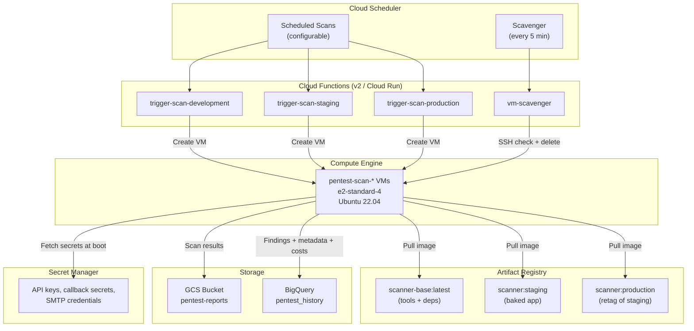
```mermaid
graph TB
    subgraph "Cloud Scheduler"
        CS1["Scavenger<br/>(every 5 min)"]
        CS2["Scheduled Scans<br/>(configurable)"]
    end

    subgraph "Cloud Functions (v2 / Cloud Run)"
        CF1["vm-scavenger"]
        CF2["trigger-scan-development"]
        CF3["trigger-scan-staging"]
        CF4["trigger-scan-production"]
    end

    subgraph "Compute Engine"
        VM1["pentest-scan-* VMs<br/>e2-standard-4<br/>Ubuntu 22.04"]
    end

    subgraph "Artifact Registry"
        AR1["scanner-base:latest<br/>(tools + deps)"]
        AR2["scanner:staging<br/>(baked app)"]
        AR3["scanner:production<br/>(retag of staging)"]
    end

    subgraph "Storage"
        GCS["GCS Bucket<br/>pentest-reports"]
        BQ["BigQuery<br/>pentest_history"]
    end

    subgraph "Secret Manager"
        SM["API keys, callback secrets,<br/>SMTP credentials"]
    end

    CS1 --> CF1
    CS2 --> CF2 & CF3 & CF4
    CF2 & CF3 & CF4 -->|"Create VM"| VM1
    CF1 -->|"SSH check + delete"| VM1
    VM1 -->|"Pull image"| AR1 & AR2 & AR3
    VM1 -->|"Scan results"| GCS
    VM1 -->|"Findings + metadata + costs"| BQ
    VM1 -->|"Fetch secrets at boot"| SM
```

---

## 2. Scan Lifecycle

> **Note (org-native cutover):** the diagrams in §2–§4 below depict the **retired** containerized launch model (generic VM → `docker pull`/`docker run`, the legacy GCP Cloud Functions, the in-repo scavenger). That entire launch path has been **removed from this repository**. Scans now run **natively** on a single-use VM booted from the pre-baked `txn-scanner-app` image, **launched by a separate org-native launcher** (an infrastructure component, not in this repo). The scan *phases, normalization, enrichment, export, and self-delete* still apply; only the launch/packaging mechanism changed. See §6 → Image Model / Execution Model for the current model.

### End-to-End Sequence

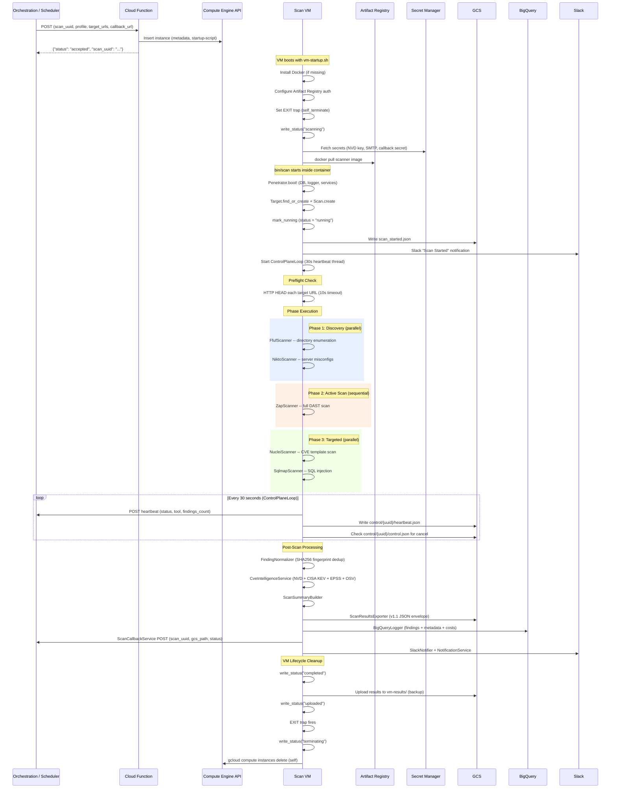
```mermaid
sequenceDiagram
    participant R as Orchestration / Scheduler
    participant CF as Cloud Function
    participant GCE as Compute Engine API
    participant VM as Scan VM
    participant AR as Artifact Registry
    participant SM as Secret Manager
    participant G as GCS
    participant BQ as BigQuery
    participant S as Slack

    R->>CF: POST (scan_uuid, profile, target_urls, callback_url)
    CF->>GCE: Insert instance (metadata, startup-script)
    CF-->>R: {"status": "accepted", "scan_uuid": "..."}

    Note over VM: VM boots with vm-startup.sh

    VM->>VM: Install Docker (if missing)
    VM->>VM: Configure Artifact Registry auth
    VM->>VM: Set EXIT trap (self_terminate)
    VM->>VM: write_status("scanning")
    VM->>SM: Fetch secrets (NVD key, SMTP, callback secret)
    VM->>AR: docker pull scanner image

    Note over VM: bin/scan starts inside container

    VM->>VM: Penetrator.boot! (DB, logger, services)
    VM->>VM: Target.find_or_create + Scan.create
    VM->>VM: mark_running (status = "running")
    VM->>G: Write scan_started.json
    VM->>S: Slack "Scan Started" notification
    VM->>VM: Start ControlPlaneLoop (30s heartbeat thread)

    Note over VM: Preflight Check

    VM->>VM: HTTP HEAD each target URL (10s timeout)

    Note over VM: Phase Execution

    rect rgb(230, 240, 255)
        Note right of VM: Phase 1: Discovery (parallel)
        VM->>VM: FfufScanner -- directory enumeration
        VM->>VM: NiktoScanner -- server misconfigs
    end

    rect rgb(255, 240, 230)
        Note right of VM: Phase 2: Active Scan (sequential)
        VM->>VM: ZapScanner -- full DAST scan
    end

    rect rgb(240, 255, 230)
        Note right of VM: Phase 3: Targeted (parallel)
        VM->>VM: NucleiScanner -- CVE template scan
        VM->>VM: SqlmapScanner -- SQL injection
    end

    loop Every 30 seconds (ControlPlaneLoop)
        VM->>R: POST heartbeat (status, tool, findings_count)
        VM->>G: Write control/{uuid}/heartbeat.json
        VM->>G: Check control/{uuid}/control.json for cancel
    end

    Note over VM: Post-Scan Processing

    VM->>VM: FindingNormalizer (SHA256 fingerprint dedup)
    VM->>VM: CveIntelligenceService (NVD + CISA KEV + EPSS + OSV)
    VM->>VM: ScanSummaryBuilder
    VM->>G: ScanResultsExporter (v1.1 JSON envelope)
    VM->>BQ: BigQueryLogger (findings + metadata + costs)
    VM->>R: ScanCallbackService POST (scan_uuid, gcs_path, status)
    VM->>S: SlackNotifier + NotificationService

    Note over VM: VM Lifecycle Cleanup

    VM->>VM: write_status("completed")
    VM->>G: Upload results to vm-results/ (backup)
    VM->>VM: write_status("uploaded")
    VM->>VM: EXIT trap fires
    VM->>VM: write_status("terminating")
    VM->>GCE: gcloud compute instances delete (self)
```

### Scan Execution Flow

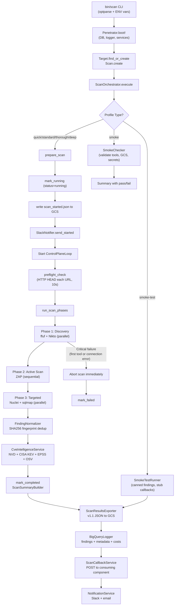
```mermaid
flowchart TD
    A["bin/scan CLI<br/>(optparse + ENV vars)"] --> B["Penetrator.boot!<br/>(DB, logger, services)"]
    B --> C["Target.find_or_create<br/>Scan.create"]
    C --> D["ScanOrchestrator.execute"]

    D --> E{Profile Type?}
    E -->|"smoke-test"| F["SmokeTestRunner<br/>(canned findings, stub callbacks)"]
    E -->|"smoke"| G["SmokeChecker<br/>(validate tools, GCS, secrets)"]
    E -->|"quick/standard/thorough/deep"| H["prepare_scan"]

    H --> H1["mark_running (status=running)"]
    H1 --> H2["write scan_started.json to GCS"]
    H2 --> H3["SlackNotifier.send_started"]
    H3 --> H4["Start ControlPlaneLoop"]
    H4 --> I["preflight_check<br/>(HTTP HEAD each URL, 10s)"]
    I --> J["run_scan_phases"]

    J --> K["Phase 1: Discovery<br/>ffuf + Nikto (parallel)"]
    K --> L["Phase 2: Active Scan<br/>ZAP (sequential)"]
    L --> M["Phase 3: Targeted<br/>Nuclei + sqlmap (parallel)"]

    M --> N["FindingNormalizer<br/>SHA256 fingerprint dedup"]
    N --> O["CveIntelligenceService<br/>NVD + CISA KEV + EPSS + OSV"]
    O --> P["mark_completed<br/>ScanSummaryBuilder"]

    P --> Q["ScanResultsExporter<br/>v1.1 JSON to GCS"]
    Q --> R["BigQueryLogger<br/>findings + metadata + costs"]
    R --> S["ScanCallbackService<br/>POST to consuming component"]
    S --> T["NotificationService<br/>Slack + email"]

    F --> Q
    G --> U["Summary with pass/fail"]

    K -->|"Critical failure<br/>(first tool or connection error)"| V["Abort scan immediately"]
    V --> W["mark_failed"]
```

### Phase Execution Detail

Each scan profile defines phases in YAML. Phases execute sequentially; tools within a phase can run in parallel.

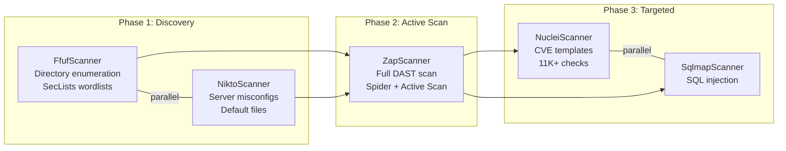
```mermaid
flowchart LR
    subgraph "Phase 1: Discovery"
        direction TB
        F1["FfufScanner<br/>Directory enumeration<br/>SecLists wordlists"]
        F2["NiktoScanner<br/>Server misconfigs<br/>Default files"]
        F1 ---|parallel| F2
    end

    subgraph "Phase 2: Active Scan"
        direction TB
        Z1["ZapScanner<br/>Full DAST scan<br/>Spider + Active Scan"]
    end

    subgraph "Phase 3: Targeted"
        direction TB
        N1["NucleiScanner<br/>CVE templates<br/>11K+ checks"]
        S1["SqlmapScanner<br/>SQL injection"]
        N1 ---|parallel| S1
    end

    F1 & F2 --> Z1
    Z1 --> N1 & S1
```

Discovered URLs from Phase 1 are fed into subsequent phases, expanding the scan surface.

---

## 3. VM Safety System (6 Layers)

The scanner runs on ephemeral GCP VMs that must self-terminate after the scan completes. Six layers prevent orphaned VMs from running indefinitely and incurring cost.

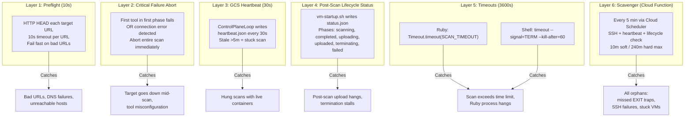
```mermaid
flowchart TD
    subgraph "Layer 1: Preflight (10s)"
        L1["HTTP HEAD each target URL<br/>10s timeout per URL<br/>Fail fast on bad URLs"]
    end

    subgraph "Layer 2: Critical Failure Abort"
        L2["First tool in first phase fails<br/>OR connection error detected<br/>Abort entire scan immediately"]
    end

    subgraph "Layer 3: GCS Heartbeat (30s)"
        L3["ControlPlaneLoop writes<br/>heartbeat.json every 30s<br/>Stale >5m = stuck scan"]
    end

    subgraph "Layer 4: Post-Scan Lifecycle Status"
        L4["vm-startup.sh writes status.json<br/>Phases: scanning, completed, uploading,<br/>uploaded, terminating, failed"]
    end

    subgraph "Layer 5: Timeouts (3600s)"
        L5A["Ruby: Timeout.timeout(SCAN_TIMEOUT)"]
        L5B["Shell: timeout --signal=TERM --kill-after=60"]
    end

    subgraph "Layer 6: Scavenger (Cloud Function)"
        L6["Every 5 min via Cloud Scheduler<br/>SSH + heartbeat + lifecycle check<br/>10m soft / 240m hard max"]
    end

    L1 -->|"Catches"| C1["Bad URLs, DNS failures,<br/>unreachable hosts"]
    L2 -->|"Catches"| C2["Target goes down mid-scan,<br/>tool misconfiguration"]
    L3 -->|"Catches"| C3["Hung scans with live containers"]
    L4 -->|"Catches"| C4["Post-scan upload hangs,<br/>termination stalls"]
    L5A & L5B -->|"Catches"| C5["Scan exceeds time limit,<br/>Ruby process hangs"]
    L6 -->|"Catches"| C6["All orphans:<br/>missed EXIT traps,<br/>SSH failures, stuck VMs"]
```

### Scavenger Decision Matrix

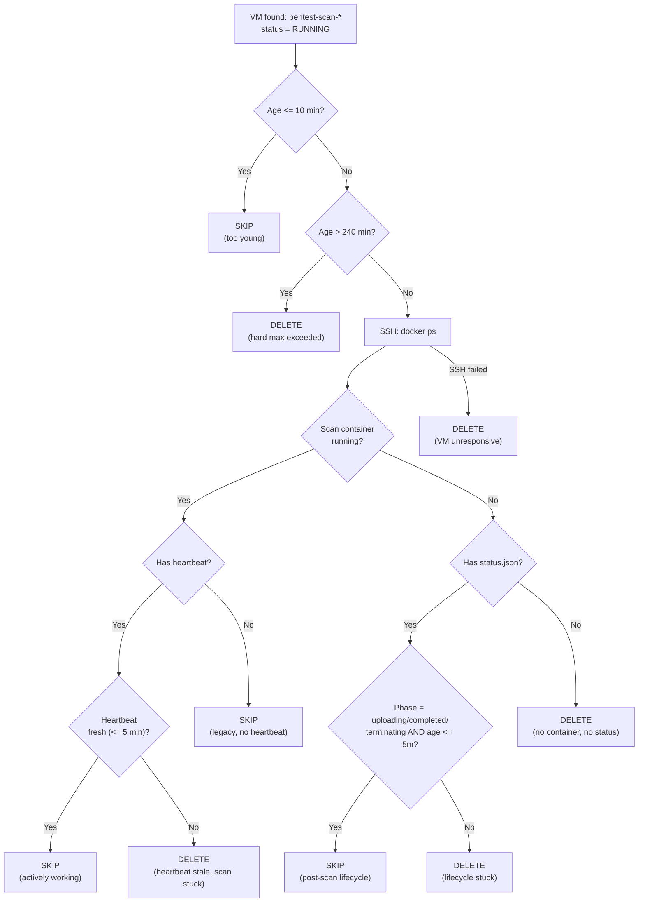
```mermaid
flowchart TD
    Start["VM found: pentest-scan-*<br/>status = RUNNING"] --> Age{"Age <= 10 min?"}
    Age -->|Yes| Skip1["SKIP<br/>(too young)"]
    Age -->|No| HardMax{"Age > 240 min?"}
    HardMax -->|Yes| Delete1["DELETE<br/>(hard max exceeded)"]
    HardMax -->|No| SSH["SSH: docker ps"]
    SSH --> Container{"Scan container<br/>running?"}

    Container -->|Yes| HB{"Has heartbeat?"}
    HB -->|Yes| Fresh{"Heartbeat<br/>fresh (<= 5 min)?"}
    Fresh -->|Yes| Skip2["SKIP<br/>(actively working)"]
    Fresh -->|No| Delete2["DELETE<br/>(heartbeat stale, scan stuck)"]
    HB -->|No| Skip3["SKIP<br/>(legacy, no heartbeat)"]

    Container -->|No| Lifecycle{"Has status.json?"}
    Lifecycle -->|Yes| Phase{"Phase = uploading/completed/<br/>terminating AND age <= 5m?"}
    Phase -->|Yes| Skip4["SKIP<br/>(post-scan lifecycle)"]
    Phase -->|No| Delete3["DELETE<br/>(lifecycle stuck)"]
    Lifecycle -->|No| Delete4["DELETE<br/>(no container, no status)"]

    SSH -->|"SSH failed"| Delete5["DELETE<br/>(VM unresponsive)"]
```

### VM Lifecycle State Machine

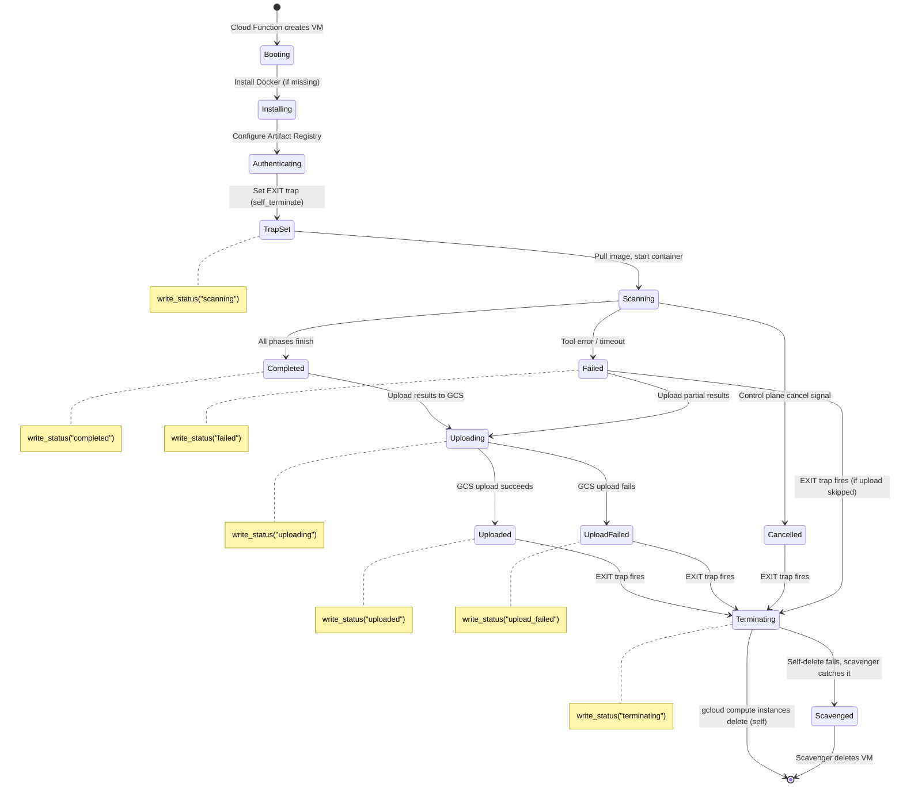
```mermaid
stateDiagram-v2
    [*] --> Booting: Cloud Function creates VM

    Booting --> Installing: Install Docker (if missing)
    Installing --> Authenticating: Configure Artifact Registry
    Authenticating --> TrapSet: Set EXIT trap (self_terminate)

    TrapSet --> Scanning: Pull image, start container
    note right of TrapSet: write_status("scanning")

    Scanning --> Completed: All phases finish
    Scanning --> Failed: Tool error / timeout
    Scanning --> Cancelled: Control plane cancel signal

    note right of Completed: write_status("completed")
    note right of Failed: write_status("failed")

    Completed --> Uploading: Upload results to GCS
    Failed --> Uploading: Upload partial results

    note right of Uploading: write_status("uploading")

    Uploading --> Uploaded: GCS upload succeeds
    Uploading --> UploadFailed: GCS upload fails

    note right of Uploaded: write_status("uploaded")
    note right of UploadFailed: write_status("upload_failed")

    Uploaded --> Terminating: EXIT trap fires
    UploadFailed --> Terminating: EXIT trap fires
    Cancelled --> Terminating: EXIT trap fires
    Failed --> Terminating: EXIT trap fires (if upload skipped)

    note right of Terminating: write_status("terminating")

    Terminating --> [*]: gcloud compute instances delete (self)
    Terminating --> Scavenged: Self-delete fails, scavenger catches it
    Scavenged --> [*]: Scavenger deletes VM
```

---

## 4. Cloud Functions

Four Cloud Functions in `cloud/scheduler/main.py` manage VM lifecycle.

### Function Overview

| Function | Entry Point | Trigger | Purpose |
|----------|------------|---------|---------|
| `vm-scavenger` | `scavenge_vms` | Cloud Scheduler (every 5 min) | Delete orphaned scan VMs |
| `trigger-scan-development` | `trigger_development` | Orchestration / Scheduler | Launch dev VM (clone at boot) |
| `trigger-scan-staging` | `trigger_staging` | Orchestration / Scheduler | Launch staging VM (baked image) |
| `trigger-scan-production` | `trigger_production` | Orchestration / Scheduler | Launch production VM (baked image, on-demand) |

> **On-demand, not SPOT** — a scan is non-recoverable work, so scan VMs use standard (on-demand) provisioning; a mid-run preemption is not acceptable. (The legacy Cloud Function launch shown here is retired — see the §2 note and §6 Execution Model; the org-native launcher applies the same on-demand principle.)

### Health Guard Pattern

All four functions use a method-first health guard. GET requests always return health status. POST requests execute the actual logic.

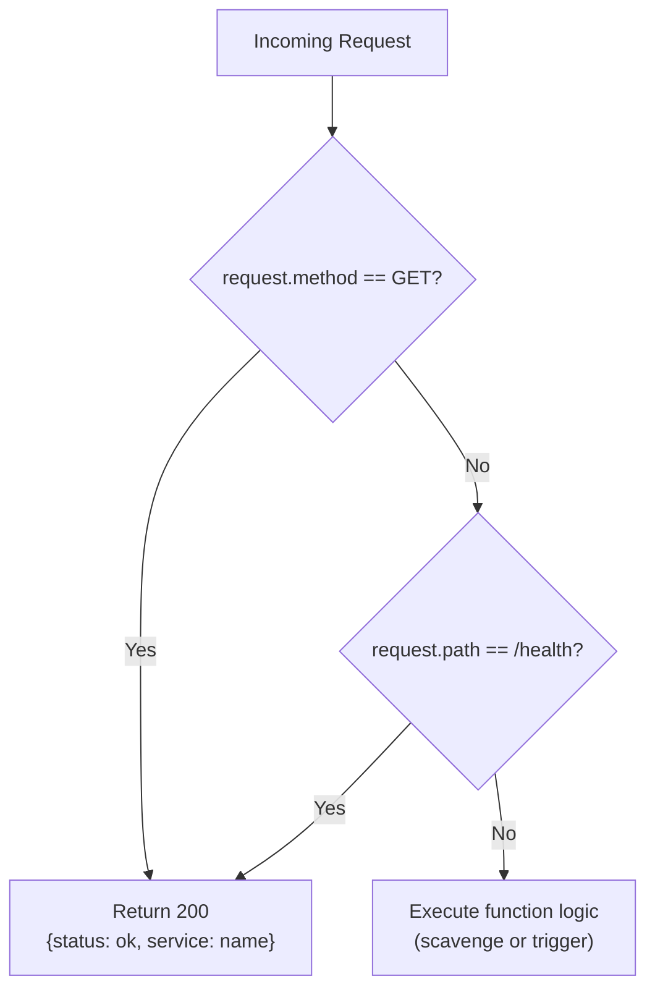
```mermaid
flowchart TD
    REQ["Incoming Request"] --> Method{"request.method == GET?"}
    Method -->|Yes| Health["Return 200<br/>{status: ok, service: name}"]
    Method -->|No| Path{"request.path == /health?"}
    Path -->|Yes| Health
    Path -->|No| Action["Execute function logic<br/>(scavenge or trigger)"]
```

This guard prevents Cloud Scheduler health probes (which use GET) from accidentally triggering scans or scavenging operations.

### Trigger Function Flow

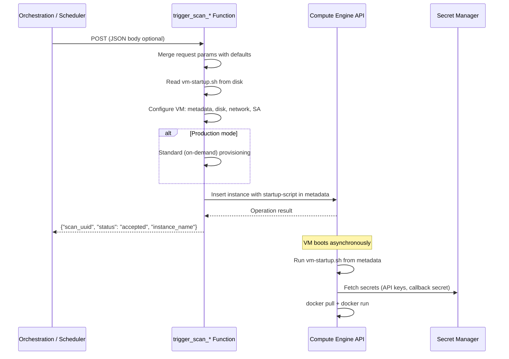
```mermaid
sequenceDiagram
    participant Caller as Orchestration / Scheduler
    participant CF as trigger_scan_* Function
    participant GCE as Compute Engine API
    participant SM as Secret Manager

    Caller->>CF: POST (JSON body optional)
    CF->>CF: Merge request params with defaults
    CF->>CF: Read vm-startup.sh from disk
    CF->>CF: Configure VM: metadata, disk, network, SA

    alt Production mode
        CF->>CF: Standard (on-demand) provisioning
    end

    CF->>GCE: Insert instance with startup-script in metadata
    GCE-->>CF: Operation result
    CF-->>Caller: {"scan_uuid", "status": "accepted", "instance_name"}

    Note over GCE: VM boots asynchronously
    GCE->>GCE: Run vm-startup.sh from metadata
    GCE->>SM: Fetch secrets (API keys, callback secret)
    GCE->>GCE: docker pull + docker run
```

### VM Instance Configuration

The trigger function creates a VM with these specifications:

| Property | Value |
|----------|-------|
| Machine type | `e2-standard-4` (4 vCPU, 16GB RAM) |
| OS | Ubuntu 22.04 LTS |
| Disk | 30GB pd-standard, auto-delete |
| Service account | `pentest-scanner@{project}.iam.gserviceaccount.com` |
| Network | Default VPC with external NAT |
| Labels | `env`, `project=pentest`, `scan=true`, `profile` |
| Tags | `pentest-scan` |
| Scheduling (prod) | On-demand (standard) with instance_termination_action=DELETE |
| Metadata | SCAN_MODE, SCAN_PROFILE, TARGET_URLS, SCAN_UUID, CALLBACK_URL, JOB_ID, REGISTRY, IMAGE_TAG, GCS_BUCKET, startup-script |

### Scavenger Operation

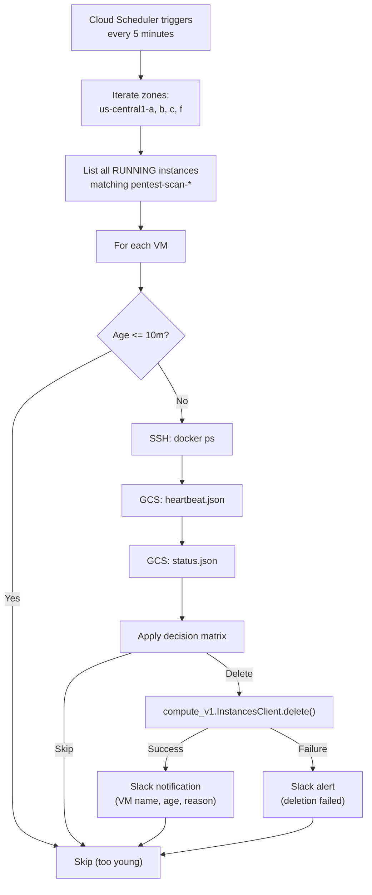
```mermaid
flowchart TD
    Start["Cloud Scheduler triggers<br/>every 5 minutes"] --> Zones["Iterate zones:<br/>us-central1-a, b, c, f"]
    Zones --> List["List all RUNNING instances<br/>matching pentest-scan-*"]
    List --> Each["For each VM"]

    Each --> AgeCheck{"Age <= 10m?"}
    AgeCheck -->|Yes| NextVM["Skip (too young)"]
    AgeCheck -->|No| SSHCheck["SSH: docker ps"]
    SSHCheck --> HBCheck["GCS: heartbeat.json"]
    HBCheck --> StatusCheck["GCS: status.json"]
    StatusCheck --> Decision["Apply decision matrix"]

    Decision -->|Delete| Delete["compute_v1.InstancesClient.delete()"]
    Decision -->|Skip| NextVM
    Delete -->|Success| Notify["Slack notification<br/>(VM name, age, reason)"]
    Delete -->|Failure| Alert["Slack alert<br/>(deletion failed)"]

    Notify --> NextVM
    Alert --> NextVM
```

---

## 5. Control Plane

The control plane enables real-time monitoring and cancellation of running scans through a combination of GCS artifacts and HTTP callbacks.

### Control Plane Architecture

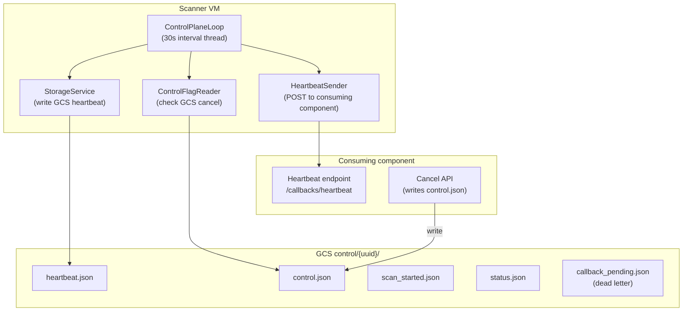
```mermaid
graph TB
    subgraph "Scanner VM"
        CPL["ControlPlaneLoop<br/>(30s interval thread)"]
        HBS["HeartbeatSender<br/>(POST to consuming component)"]
        CFR["ControlFlagReader<br/>(check GCS cancel)"]
        SS["StorageService<br/>(write GCS heartbeat)"]
    end

    subgraph "GCS control/{uuid}/"
        HB["heartbeat.json"]
        CF["control.json"]
        SS2["scan_started.json"]
        ST["status.json"]
        DL["callback_pending.json<br/>(dead letter)"]
    end

    subgraph "Consuming component"
        API["Heartbeat endpoint<br/>/callbacks/heartbeat"]
        Cancel["Cancel API<br/>(writes control.json)"]
    end

    CPL --> HBS --> API
    CPL --> SS --> HB
    CPL --> CFR --> CF
    Cancel -->|"write"| CF
```

### Heartbeat Protocol

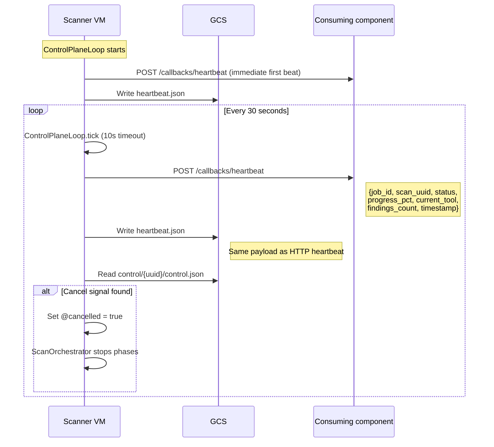
```mermaid
sequenceDiagram
    participant VM as Scanner VM
    participant G as GCS
    participant R as Consuming component

    Note over VM: ControlPlaneLoop starts

    VM->>R: POST /callbacks/heartbeat (immediate first beat)
    VM->>G: Write heartbeat.json

    loop Every 30 seconds
        VM->>VM: ControlPlaneLoop.tick (10s timeout)
        VM->>R: POST /callbacks/heartbeat
        Note right of R: {job_id, scan_uuid, status,<br/>progress_pct, current_tool,<br/>findings_count, timestamp}
        VM->>G: Write heartbeat.json
        Note right of G: Same payload as HTTP heartbeat
        VM->>G: Read control/{uuid}/control.json
        alt Cancel signal found
            VM->>VM: Set @cancelled = true
            VM->>VM: ScanOrchestrator stops phases
        end
    end
```

### Heartbeat Payload

```json
{
  "scan_uuid": "abc-123",
  "job_id": "job-456",
  "status": "running",
  "progress_pct": 45,
  "current_tool": "zap",
  "findings_count": 12,
  "last_tool_started_at": "2026-04-03T10:15:00Z",
  "timestamp": "2026-04-03T10:20:30Z"
}
```

### Cancel Signal

The orchestration/control plane can cancel a running scan by writing a control flag to GCS:

```json
// GCS: control/{scan_uuid}/control.json
{
  "action": "cancel"
}
```

The `ControlFlagReader` checks this file every 30 seconds. When detected, the orchestrator stops executing phases and marks the scan as `cancelled`.

### GCS Control Artifacts

All control artifacts live under `control/{scan_uuid}/` in the GCS bucket:

| Artifact | Writer | Reader | Purpose |
|----------|--------|--------|---------|
| `scan_started.json` | ScanOrchestrator | Consumer | Detect started-but-never-completed scans |
| `heartbeat.json` | ControlPlaneLoop | Scavenger, consumer | Track scan liveness and progress |
| `control.json` | Control plane (cancel) | ControlFlagReader | Signal scan cancellation |
| `status.json` | vm-startup.sh | Scavenger | Track post-scan lifecycle (uploading, terminating) |
| `callback_pending.json` | ScanCallbackService | Consumer (recovery) | Dead letter when callback fails |

### Lifecycle Status Phases

The `status.json` artifact tracks the VM's post-scan lifecycle, written by `vm-startup.sh`:

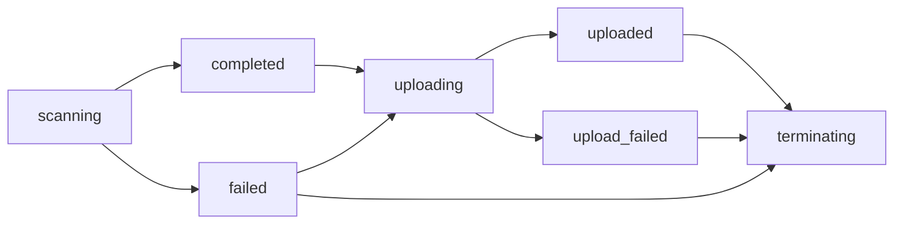
```mermaid
flowchart LR
    scanning["scanning"] --> completed["completed"]
    scanning --> failed["failed"]
    completed --> uploading["uploading"]
    failed --> uploading
    uploading --> uploaded["uploaded"]
    uploading --> upload_failed["upload_failed"]
    uploaded --> terminating["terminating"]
    upload_failed --> terminating
    failed --> terminating
```

---

## 6. CI/CD Pipeline

### Branch Flow

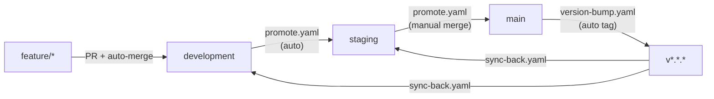
```mermaid
flowchart LR
    FE["feature/*"] -->|"PR + auto-merge"| DEV["development"]
    DEV -->|"promote.yaml<br/>(auto)"| STG["staging"]
    STG -->|"promote.yaml<br/>(manual merge)"| MAIN["main"]
    MAIN -->|"version-bump.yaml<br/>(auto tag)"| TAG["v*.*.*"]
    TAG -->|"sync-back.yaml"| DEV
    TAG -->|"sync-back.yaml"| STG
```

### Pipeline Dependency Chain

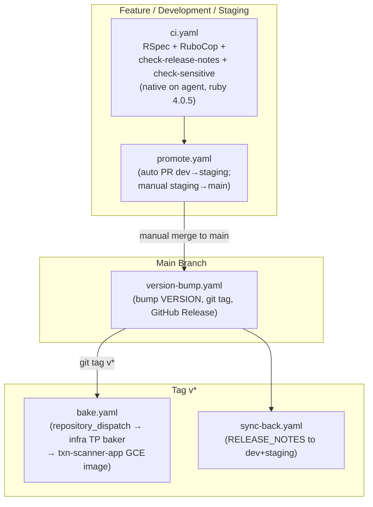
```mermaid
flowchart TD
    subgraph "Feature / Development / Staging"
        CI["ci.yaml<br/>RSpec + RuboCop +<br/>check-release-notes + check-sensitive<br/>(native on agent, ruby 4.0.5)"]
        PROM["promote.yaml<br/>(auto PR dev→staging;<br/>manual staging→main)"]
    end

    subgraph "Main Branch"
        VB["version-bump.yaml<br/>(bump VERSION, git tag, GitHub Release)"]
    end

    subgraph "Tag v*"
        BAKE["bake.yaml<br/>(repository_dispatch → infra TP baker<br/>→ txn-scanner-app GCE image)"]
        SB["sync-back.yaml<br/>(RELEASE_NOTES to dev+staging)"]
    end

    CI --> PROM
    PROM -->|"manual merge to main"| VB
    VB -->|"git tag v*"| BAKE
    VB --> SB
```

### Workflow Details

| Pipeline | File | Trigger | Steps | Depends On |
|----------|------|---------|-------|------------|
| **CI** | `ci.yaml` | Push (exclude main + promotion artifacts) | RSpec, RuboCop, check-release-notes, check-sensitive — **native on the agent (ruby 4.0.5)** | -- |
| **Promote** | `promote.yaml` | Push to dev/staging | Local merge branch, create PR, auto-merge (dev) or manual (staging→main) | -- |
| **Version Bump** | `version-bump.yaml` | Push to main | Bump VERSION, update RELEASE_NOTES, create git tag + GitHub Release | -- |
| **Bake** | `bake.yaml` | Tag v* | `repository_dispatch` → infra TP baker → bake `txn-scanner-app` FROM `txn-scanner-base` | -- |
| **Sync Back** | `sync-back.yaml` | Tag v* | Sync RELEASE_NOTES back to development/staging | -- |

### Image Model (org-native)

The scanner is **not packaged as a Docker image**. A release **bakes a GCE image** — `txn-scanner-app`, built `FROM` the vetted `txn-scanner-base` base via the infra TP baker — with the runtime, security tools, **and the application's gems already placed** (build tooling stripped; nothing installed or compiled at scan time). The launcher boots a single-use VM from the `txn-scanner-app` family.

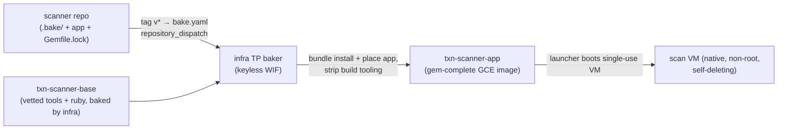
```mermaid
flowchart LR
    SRC["scanner repo<br/>(.bake/ + app + Gemfile.lock)"] -->|"tag v* → bake.yaml<br/>repository_dispatch"| BAKER["infra TP baker<br/>(keyless WIF)"]
    BASE["txn-scanner-base<br/>(vetted tools + ruby, baked by infra)"] --> BAKER
    BAKER -->|"bundle install + place app,<br/>strip build tooling"| APP["txn-scanner-app<br/>(gem-complete GCE image)"]
    APP -->|"launcher boots single-use VM"| VM["scan VM (native, non-root,<br/>self-deleting)"]
```

**Key design decision**: `VERSION` is a runtime environment variable, not baked into the image — the same image serves multiple tagged releases. Read via `Penetrator::VERSION`.

### Execution Model (native VMs)

Scans run via **native execution on a single-use VM booted from the pre-baked, gem-complete `txn-scanner-app` image** (the prior containerized model has been removed):

- **Baked, vetted image.** A build pipeline produces an image with the runtime, the security tools, **and the application's gems already placed** — every tool/dependency pinned and content-verified, build tooling (compilers, package managers) stripped from the result. **Nothing is installed or compiled at scan time** — the VM boots ready to run.
- **Native, non-container, non-root.** The scanner runs as a process under a dedicated, least-privilege (non-root) service identity — no container layer.
- **Single-use & self-deleting.** Each scan gets a fresh VM that holds no standing state and deletes itself on success *and* failure (exit-trap teardown), with an independent backstop for orphans.
- **Dispatched, not self-served.** The VM is launched on behalf of the engine by the **orchestration layer**, which has already authorized the target/scope before dispatch (the engine is a worker; see `SECURITY_ARCHITECTURE.md` → Scope & Authorization). The launch and image-build paths use **short-lived, federated credentials** — no static service-account keys are issued or held for them.

Net effect on this repo: the scan-runner image is **consumed**, not built here as a container; `bin/scan` runs against tools and gems that are already present; the runtime never reaches out to install dependencies.

### Deploy Verification (Smoke Test)

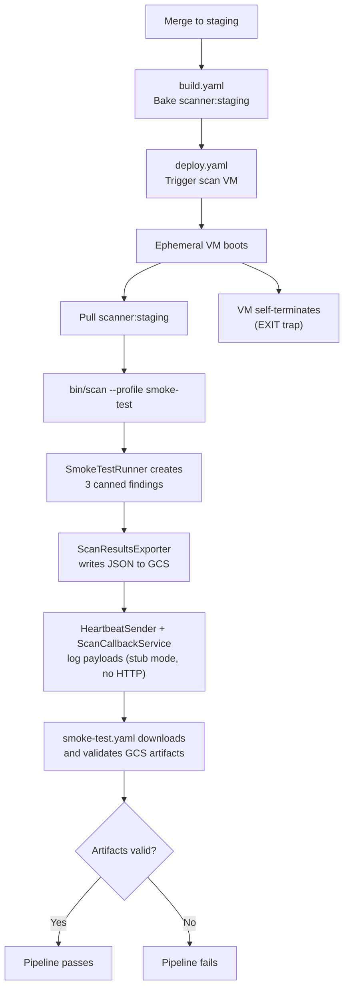
```mermaid
flowchart TD
    M["Merge to staging"] --> B["build.yaml<br/>Bake scanner:staging"]
    B --> D["deploy.yaml<br/>Trigger scan VM"]
    D --> VM["Ephemeral VM boots"]
    VM --> Pull["Pull scanner:staging"]
    Pull --> Run["bin/scan --profile smoke-test"]
    Run --> Findings["SmokeTestRunner creates<br/>3 canned findings"]
    Findings --> Export["ScanResultsExporter<br/>writes JSON to GCS"]
    Export --> Stub["HeartbeatSender + ScanCallbackService<br/>log payloads (stub mode, no HTTP)"]
    Stub --> Validate["smoke-test.yaml downloads<br/>and validates GCS artifacts"]
    Validate --> Result{"Artifacts valid?"}
    Result -->|Yes| Pass["Pipeline passes"]
    Result -->|No| Fail["Pipeline fails"]
    VM --> Term["VM self-terminates<br/>(EXIT trap)"]
```

**Stub mode**: During smoke tests (`SCAN_PROFILE=smoke-test`), `HeartbeatSender` and `ScanCallbackService` log their payloads at INFO level but do not make HTTP calls. The orchestration layer did not dispatch the scan, so there is no matching job record. GCS writes proceed normally -- that is the real verification.

---

## 7. Data Flow

### JSON Export Schema (v1.1)

The scanner exports a versioned JSON envelope to GCS at `scan-results/{target_id}/{scan_id}/scan_results.json`:

```json
{
  "schema_version": "1.1",
  "metadata": {
    "scan_id": "uuid",
    "target_name": "Example Corp",
    "target_urls": ["https://example.com"],
    "profile": "standard",
    "started_at": "2026-04-03T10:00:00Z",
    "completed_at": "2026-04-03T10:30:00Z",
    "duration_seconds": 1800,
    "tool_statuses": {
      "zap": {"status": "completed", "findings": 15},
      "nuclei": {"status": "completed", "findings": 8}
    },
    "generated_at": "2026-04-03T10:30:05Z"
  },
  "summary": {
    "total_findings": 42,
    "by_severity": {
      "critical": 2,
      "high": 8,
      "medium": 15,
      "low": 12,
      "info": 5
    },
    "tools_run": ["zap", "nuclei", "ffuf", "nikto"],
    "duration_seconds": 1800,
    "executive_summary": "..."
  },
  "findings": [
    {
      "id": "uuid",
      "source_tool": "zap",
      "severity": "high",
      "title": "SQL Injection",
      "url": "https://example.com/search",
      "parameter": "q",
      "cwe_id": "CWE-89",
      "cve_id": "CVE-2024-1234",
      "cvss_score": 8.6,
      "cvss_vector": "CVSS:3.1/AV:N/AC:L/PR:N/UI:N/S:C/C:H/I:N/A:N",
      "epss_score": 0.42,
      "kev_known_exploited": false,
      "evidence": {},
      "ai_assessment": null
    }
  ]
}
```

### GCS Artifact Layout

```
gs://{project}-pentest-reports/
  control/{scan_uuid}/
    scan_started.json          # Written at scan start
    heartbeat.json             # Updated every 30s
    control.json               # Cancel signal (written by the control plane)
    status.json                # VM lifecycle phase
    callback_pending.json      # Dead letter (if callback fails)
  scan-results/{target_id}/{scan_id}/
    scan_results.json          # Versioned JSON envelope (v1.1)
  vm-results/{instance_name}/
    *.json                     # Backup copy from VM (gsutil)
```

### BigQuery Tables

All tables live in the `pentest_history` dataset. Table names are suffixed with the scan mode (`_development`, `_staging`, `_production`).

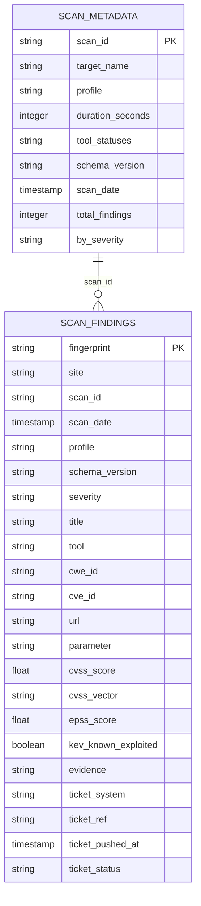
```mermaid
erDiagram
    SCAN_FINDINGS {
        string fingerprint PK
        string site
        string scan_id
        timestamp scan_date
        string profile
        string schema_version
        string severity
        string title
        string tool
        string cwe_id
        string cve_id
        string url
        string parameter
        float cvss_score
        string cvss_vector
        float epss_score
        boolean kev_known_exploited
        string evidence
        string ticket_system
        string ticket_ref
        timestamp ticket_pushed_at
        string ticket_status
    }

    SCAN_METADATA {
        string scan_id PK
        string target_name
        string profile
        integer duration_seconds
        string tool_statuses
        string schema_version
        timestamp scan_date
        integer total_findings
        string by_severity
    }

    SCAN_METADATA ||--o{ SCAN_FINDINGS : "scan_id"
```

### Data Model (Sequel ORM)

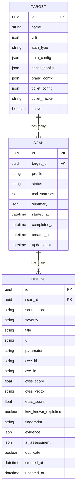
```mermaid
erDiagram
    TARGET ||--o{ SCAN : "has many"
    SCAN ||--o{ FINDING : "has many"

    TARGET {
        uuid id PK
        string name
        json urls
        string auth_type
        json auth_config
        json scope_config
        json brand_config
        json ticket_config
        string ticket_tracker
        boolean active
    }

    SCAN {
        uuid id PK
        uuid target_id FK
        string profile
        string status
        json tool_statuses
        json summary
        datetime started_at
        datetime completed_at
        datetime created_at
        datetime updated_at
    }

    FINDING {
        uuid id PK
        uuid scan_id FK
        string source_tool
        string severity
        string title
        string url
        string parameter
        string cwe_id
        string cve_id
        float cvss_score
        string cvss_vector
        float epss_score
        boolean kev_known_exploited
        string fingerprint
        json evidence
        json ai_assessment
        boolean duplicate
        datetime created_at
        datetime updated_at
    }
```

All models use UUID primary keys (`SecureRandom.uuid`). JSON columns use Sequel's serialization plugin. The `status` field on Scan cycles through: `pending`, `running`, `completed`, `failed`, `cancelled`.

### Finding Normalization Pipeline

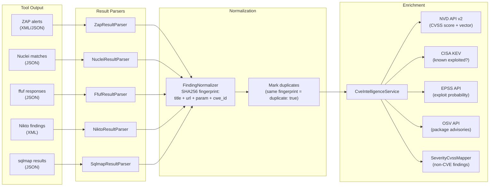
```mermaid
flowchart LR
    subgraph "Tool Output"
        ZAP["ZAP alerts<br/>(XML/JSON)"]
        NUC["Nuclei matches<br/>(JSON)"]
        FFUF["ffuf responses<br/>(JSON)"]
        NIK["Nikto findings<br/>(XML)"]
        SQL["sqlmap results<br/>(JSON)"]
    end

    subgraph "Result Parsers"
        ZP["ZapResultParser"]
        NP["NucleiResultParser"]
        FP["FfufResultParser"]
        NKP["NiktoResultParser"]
        SP["SqlmapResultParser"]
    end

    subgraph "Normalization"
        FN["FindingNormalizer<br/>SHA256 fingerprint:<br/>title + url + param + cwe_id"]
        DEDUP["Mark duplicates<br/>(same fingerprint = duplicate: true)"]
    end

    subgraph "Enrichment"
        CVE["CveIntelligenceService"]
        NVD["NVD API v2<br/>(CVSS score + vector)"]
        KEV["CISA KEV<br/>(known exploited?)"]
        EPSS["EPSS API<br/>(exploit probability)"]
        OSV["OSV API<br/>(package advisories)"]
        SCVM["SeverityCvssMapper<br/>(non-CVE findings)"]
    end

    ZAP --> ZP --> FN
    NUC --> NP --> FN
    FFUF --> FP --> FN
    NIK --> NKP --> FN
    SQL --> SP --> FN

    FN --> DEDUP --> CVE
    CVE --> NVD & KEV & EPSS & OSV
    CVE --> SCVM
```

---

## 8. Reliability Patterns

### Dead Letter to GCS

When the completion callback to the consuming component fails after 3 retries (with exponential backoff), the payload is written to GCS as a dead letter. The consuming component can recover these on its next sweep.

```mermaid
sequenceDiagram
    participant VM as Scanner VM
    participant R as Consuming component
    participant G as GCS

    VM->>R: POST callback (attempt 1)
    R-->>VM: 500 Server Error
    VM->>VM: Sleep 0.5s

    VM->>R: POST callback (attempt 2)
    R-->>VM: 500 Server Error
    VM->>VM: Sleep 1.0s

    VM->>R: POST callback (attempt 3)
    R-->>VM: 500 Server Error

    Note over VM: 3 retries exhausted

    VM->>G: Write control/{uuid}/callback_pending.json
    Note right of G: Dead letter contains:<br/>scan_uuid, job_id, status,<br/>gcs_path, cost_data, failed_at
```

### Callback Retry with Exponential Backoff

The `ScanCallbackService` retries up to 3 times with linear backoff (`0.5s * attempt`):

| Attempt | Delay Before | Total Elapsed |
|---------|-------------|---------------|
| 1 | 0s | 0s |
| 2 | 0.5s | 0.5s |
| 3 | 1.0s | 1.5s |
| Dead letter | -- | 1.5s |

### Self-Terminate EXIT Trap

The VM startup script sets a bash EXIT trap that fires regardless of how the scan process exits (success, failure, timeout, signal):

```mermaid
flowchart TD
    TRAP["EXIT trap set in vm-startup.sh"] --> Fire{"Process exits<br/>(any reason)"}
    Fire --> WS["write_status('terminating')"]
    WS --> Slack["Slack: VM self-terminating"]
    Slack --> Sleep["sleep 5 (allow I/O flush)"]
    Sleep --> Delete["gcloud compute instances delete<br/>(self, --quiet)"]
    Delete -->|Success| Done["VM deleted"]
    Delete -->|Failure| Log["Log error:<br/>'scavenger will clean up'"]
    Log --> Scavenger["Scavenger catches it<br/>within 5 minutes"]
```

The EXIT trap is only set for scan modes (`development`, `staging`, `production`), not for `dev` mode (interactive development VMs).

### Scan Timeout Layers

Two independent timeout mechanisms ensure no scan runs indefinitely:

```mermaid
flowchart TD
    subgraph "Layer 1: Shell timeout (vm-startup.sh)"
        ST["timeout --signal=TERM --kill-after=60 3600<br/>docker run ..."]
        ST -->|"3600s exceeded"| TERM["SIGTERM to docker run"]
        TERM -->|"60s grace"| KILL["SIGKILL (force kill)"]
    end

    subgraph "Layer 2: Ruby timeout (ScanOrchestrator)"
        RT["Timeout.timeout(SCAN_TIMEOUT)"]
        RT -->|"3600s exceeded"| Raise["Timeout::Error raised"]
        Raise --> Mark["scan.status = 'failed'<br/>error_message = 'timed out'"]
    end

    subgraph "Layer 3: ControlPlaneLoop tick timeout"
        TT["Timeout.timeout(10)"]
        TT -->|"10s exceeded"| SkipTick["Skip tick, log warning"]
    end
```

### Scan Profiles

| Profile | Estimated Duration | Discovery | Active Scan | Targeted | Use Case |
|---------|-------------------|-----------|-------------|----------|----------|
| `quick` | ~10 min | -- | ZAP baseline (300s) | Nuclei critical+high (300s) | Quick assessment |
| `standard` | ~30 min | ffuf + Nikto (300s, parallel) | ZAP full (900s) | Nuclei crit+high+med (600s) | Regular scans |
| `thorough` | ~2 hr | ffuf + Nikto (600s, parallel, extended) | ZAP full + ajax spider (1800s) | Nuclei all + sqlmap (1200s, parallel) | Deep assessment |
| `deep` | ~2 hr | (alias for thorough) | Same as thorough | Same as thorough | Compliance scans |
| `smoke` | <30s | -- | -- | -- | Infrastructure validation (tools, GCS, secrets) |
| `smoke-test` | <30s | -- | -- | -- | Deploy verification (canned findings, GCS export) |

### Security Tools

| Tool | Phase | Purpose | Output Format |
|------|-------|---------|--------------|
| **ffuf** | Discovery | Directory and endpoint enumeration using SecLists wordlists | JSON |
| **Nikto** | Discovery | Server misconfiguration and default file detection | XML |
| **OWASP ZAP** | Active Scan | Full DAST scanning (spider + active scan, optional ajax spider) | XML/JSON |
| **Nuclei** | Targeted | Template-based vulnerability scanning (11K+ templates) | JSON |
| **sqlmap** | Targeted | SQL injection detection and exploitation testing | JSON |

### Critical Failure Detection

The orchestrator aborts the entire scan when a critical failure occurs:

| Condition | Why It Is Critical |
|-----------|-------------------|
| First tool in first phase fails | Likely a target issue (unreachable, auth failure) |
| Connection-related error patterns | Target went down mid-scan |

Connection error patterns detected: `unreachable`, `connection refused`, `name.*resolution`, `ECONNREFUSED`, `EHOSTUNREACH`.

Non-critical tool failures (later phases, non-connection errors) are logged but the scan continues with remaining tools.

---

## Directory Structure

```
peregrine-penetrator-scanner/
  app/
    models/                   Value objects (ScanProfile)
    services/                 Core business logic
      scanners/               Tool-specific: ZapScanner, NucleiScanner, etc.
      result_parsers/         Normalize each tool's output format
      cve_clients/            NVD, CISA KEV, EPSS, OSV API clients
      notifiers/              Slack notifications
  bin/scan                    CLI entry point
  cloud/scheduler/            Cloud Functions (Python)
    main.py                   4 function entry points
    vm-startup.sh             VM lifecycle script
    test_main.py              pytest tests (Flask test client)
  config/scan_profiles/       YAML scan profiles (quick, standard, thorough, etc.)
  db/sequel_migrations/       Sequel migrations
  docker/                     Dockerfile, Dockerfile.base, docker-compose
  docs/                       Architecture and reference documentation
  infra/                      Pulumi Ruby IaC for GCP
  lib/
    models/                   Sequel models (Target, Scan, Finding)
    penetrator.rb             Boot module (.root, .logger, .env, .db, .boot!)
    tasks/                    Rake tasks
  scripts/woodpecker/         CI pipeline scripts
  spec/                       RSpec test suite
  .woodpecker/                Woodpecker CI pipeline configs
```
