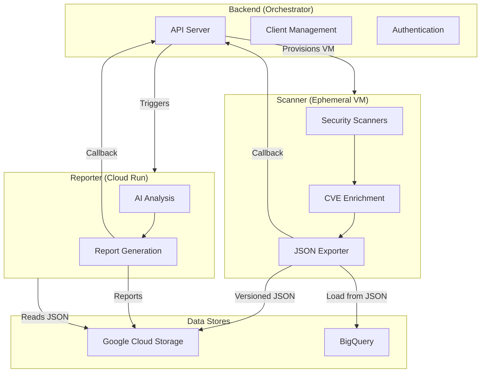
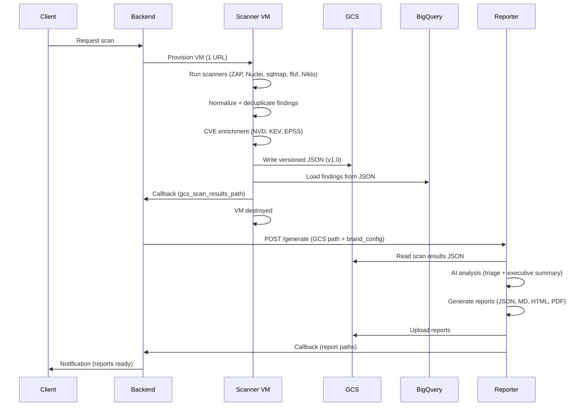
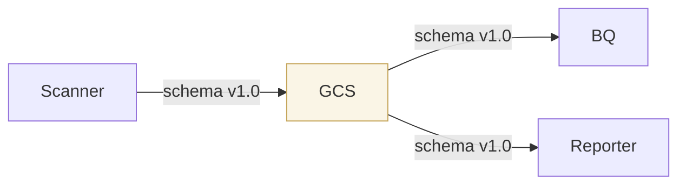
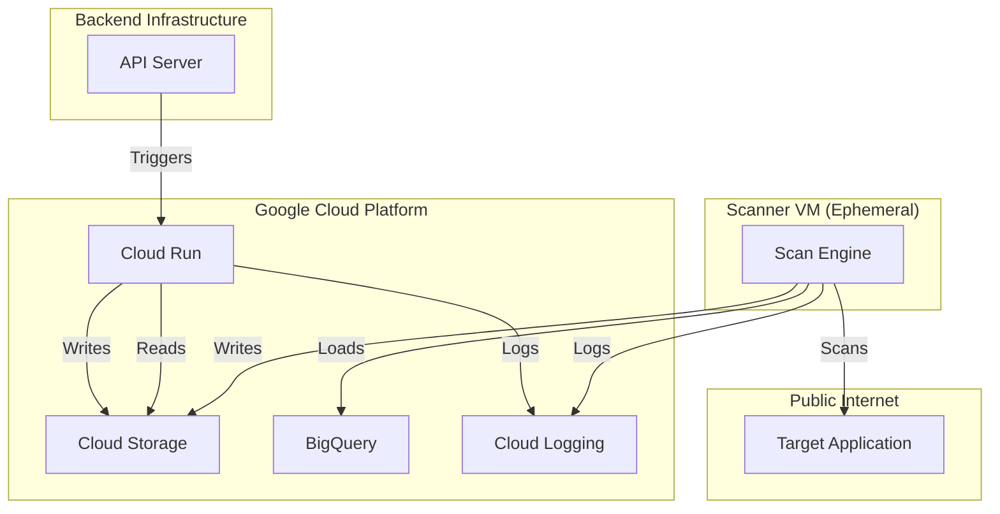

# System Architecture

| | |
|---|---|
| **Document** | Peregrine Penetrator Scanner — System Architecture |
| **Classification** | CONFIDENTIAL |
| **Version** | 1.0 |
| **Date** | 2026-03-22 |
| **Author** | Peregrine Technology Systems |

## Version History

| Version | Date | Author | Changes |
|---------|------|--------|---------|
| 1.0 | 2026-03-22 | Peregrine Technology Systems | Initial architecture document |

---

## Overview

The Peregrine Penetration Testing Platform is a three-service architecture that automates web application security assessments. Each service has a single, clearly defined responsibility.

## Services

### Scanner (`peregrine-penetrator-scanner`)

**Role:** Execute security scans against a single target URL, enrich findings with CVE intelligence, and output a versioned JSON artifact.

**Deployment:** Ephemeral DigitalOcean VMs, one per URL. Destroyed after scan completes.

**Technology:** Ruby + Sequel ORM + SQLite (ephemeral state)

**Responsibilities:**
- Run security scanning tools (OWASP ZAP, Nuclei, sqlmap, ffuf, Nikto)
- Parse and normalize tool output
- Deduplicate findings via SHA256 fingerprinting
- Enrich with CVE intelligence (NVD, CISA KEV, EPSS)
- Export versioned JSON artifact to GCS
- Load findings into BigQuery from JSON
- Callback to backend with GCS path

**Does NOT:**
- Generate reports (moved to Reporter)
- Run AI analysis (moved to Reporter)
- Serve HTTP (CLI tool, not web server)
- Handle multiple URLs (one VM per URL)

### Reporter (`peregrine-penetrator-reporter`)

**Role:** Perform AI-driven security analysis and generate professional penetration test reports.

**Deployment:** Cloud Run (scales to zero, HTTP-triggered)

**Technology:** Ruby + Sinatra

**Responsibilities:**
- Read scan results JSON from GCS
- Run AI analysis (multi-provider: Claude, Gemini, Grok)
- Triage findings with AI assessment
- Generate executive summary
- Produce reports: JSON, Markdown, HTML, PDF
- Upload reports to GCS
- Callback to backend with report paths

### Backend (`peregrine-penetrator-backend`)

**Role:** API server and orchestrator. Manages clients, authentication, and dispatches scan/report jobs.

**Deployment:** Persistent server (Rails API)

**Technology:** Ruby on Rails

**Responsibilities:**
- Client and user management
- Authentication (JWT, OAuth2)
- Provision scanner VMs (DigitalOcean)
- Receive scan callbacks, trigger reporter
- Receive report callbacks, notify clients
- Webhook event delivery
- Compliance document generation

## Data Flow

## JSON Contract

The versioned JSON artifact is the contract between Scanner and Reporter.

**Schema versioning rules:**
- Every JSON artifact carries a `schema_version` field
- Every BQ row stamped with the same version
- Field additions/removals/renames require a version bump
- Version changes tracked in GitHub issues and release notes

## Security Boundaries

**Key security properties:**
- Scanner VMs are ephemeral — destroyed after each scan, no persistent state
- Scanner has no inbound ports — it initiates all connections
- Reporter runs on Cloud Run with no persistent state
- All data in transit is encrypted (TLS)
- All data at rest is encrypted (GCS, BQ default encryption)
- Audit logs captured via Cloud Logging, sunk to BQ for long-term retention
- 18-month data retention with automated purge
