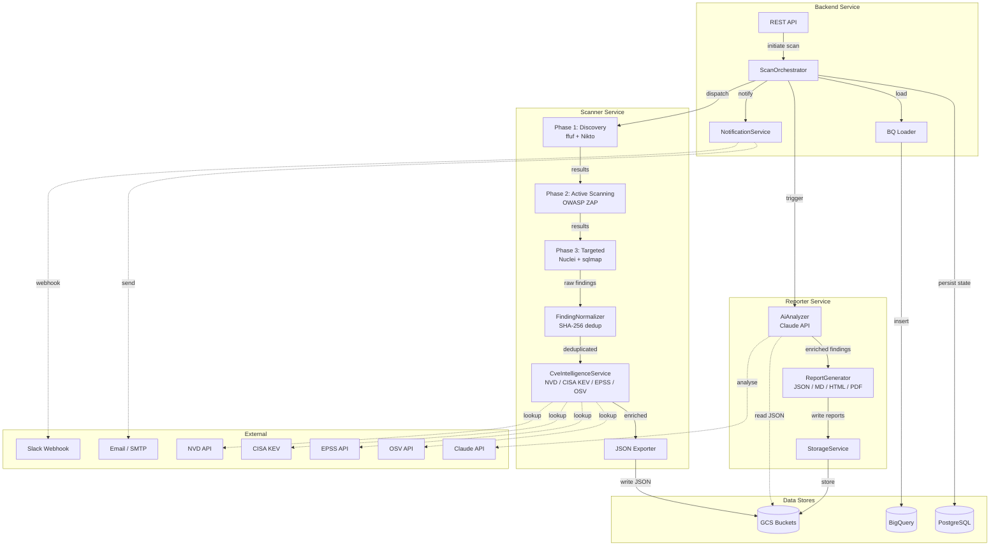
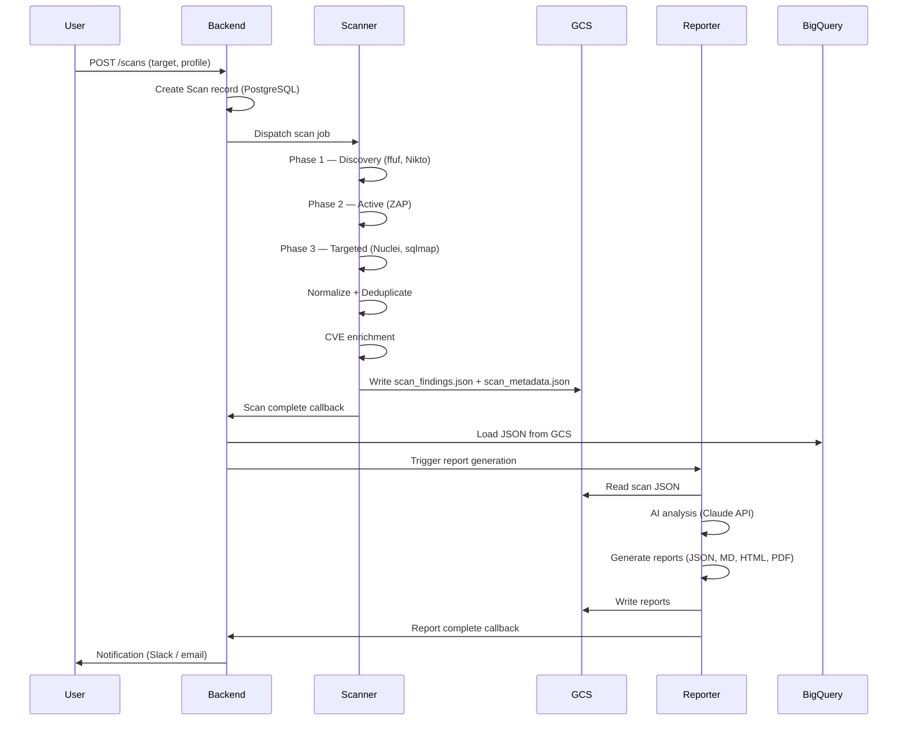

# Architecture Overview

| | |
|---|---|
| **Document** | Peregrine Penetrator Scanner — Architecture Overview |
| **Classification** | CONFIDENTIAL |
| **Version** | 1.0 |
| **Date** | 2026-03-22 |
| **Author** | Peregrine Technology Systems |

## Version History

| Version | Date | Author | Changes |
|---------|------|--------|---------|
| 1.0 | 2026-03-22 | Peregrine Technology Systems | Initial document |

---

## 1. Purpose

This document describes the three-service architecture of the Peregrine Penetrator platform. It is maintained as an audit-grade reference for SOC 2 Type II and ISO 27001 compliance assessments.

## 2. Architecture Principles

- **Separation of Duties** — Each service has a single, well-defined responsibility with distinct access boundaries.
- **JSON-first Data Contract** — All inter-service communication uses versioned JSON schemas stored in GCS.
- **Immutable Audit Trail** — Every scan produces timestamped, fingerprinted artifacts that cannot be modified after creation.
- **Least Privilege** — Services access only the resources required for their function.

## 3. Service Descriptions

### 3.1 Scanner Service

The Scanner service orchestrates security scanning tools against authorized targets. It executes discovery, active scanning, and targeted testing phases, normalises findings with SHA-256 fingerprints, enriches with CVE intelligence (NVD, CISA KEV, EPSS, OSV), and exports structured JSON to GCS.

**Tools orchestrated:** OWASP ZAP, Nuclei, sqlmap, ffuf, Nikto.

### 3.2 Reporter Service

The Reporter service reads scan JSON from GCS, applies AI analysis via the Claude API for triage and executive summaries, and generates professional reports in JSON, Markdown, HTML, and PDF formats. Reports are stored back to GCS and metadata is written to BigQuery.

### 3.3 Backend Service

The Backend service is the central orchestrator and API surface. It manages targets, initiates scans, tracks scan lifecycle state, triggers the Scanner and Reporter services, loads results into BigQuery, and dispatches notifications (Slack, email).

## 4. Component Diagram

## 5. Service Interaction Flow

## 6. Technology Stack

| Component | Technology |
|-----------|-----------|
| Backend | Ruby on Rails 7 |
| Database | PostgreSQL (UUID primary keys) |
| Object Storage | Google Cloud Storage (GCS) |
| Data Warehouse | BigQuery |
| Scanner Tools | OWASP ZAP, Nuclei, sqlmap, ffuf, Nikto |
| AI Analysis | Anthropic Claude API |
| Report Rendering | pandoc + XeLaTeX (PDF) |
| Infrastructure | Pulumi (Ruby) on GCP |
| CI/CD | Buildkite |
| Containerisation | Docker / Docker Compose |

## 7. Compliance Mapping

| Control | Framework | How This Architecture Addresses It |
|---------|-----------|-------------------------------------|
| CC6.1 | SOC 2 | Logical access boundaries between services; each service has distinct GCP IAM roles |
| CC6.5 | SOC 2 | Data retention enforced via GCS lifecycle rules and BQ scheduled queries |
| CC7.2 | SOC 2 | Structured audit events emitted at every lifecycle stage |
| CC7.3 | SOC 2 | Immutable JSON artifacts in GCS provide tamper-evident chain of custody |
| A.8.3 | ISO 27001 | Separation of duties enforced by service boundaries and IAM |
| A.8.10 | ISO 27001 | 18-month rolling retention with automated deletion |
| A.8.15 | ISO 27001 | Comprehensive audit logging with structured JSON events |
| A.14.2.5 | ISO 27001 | Versioned JSON schema contract between services |

## 8. Related Documents

- [Data Flow](data_flow.md)
- [Data Retention Policy](data_retention_policy.md)
- [Audit Logging](audit_logging.md)
- [Separation of Duties](separation_of_duties.md)
- [Schema Versioning](schema_versioning.md)
