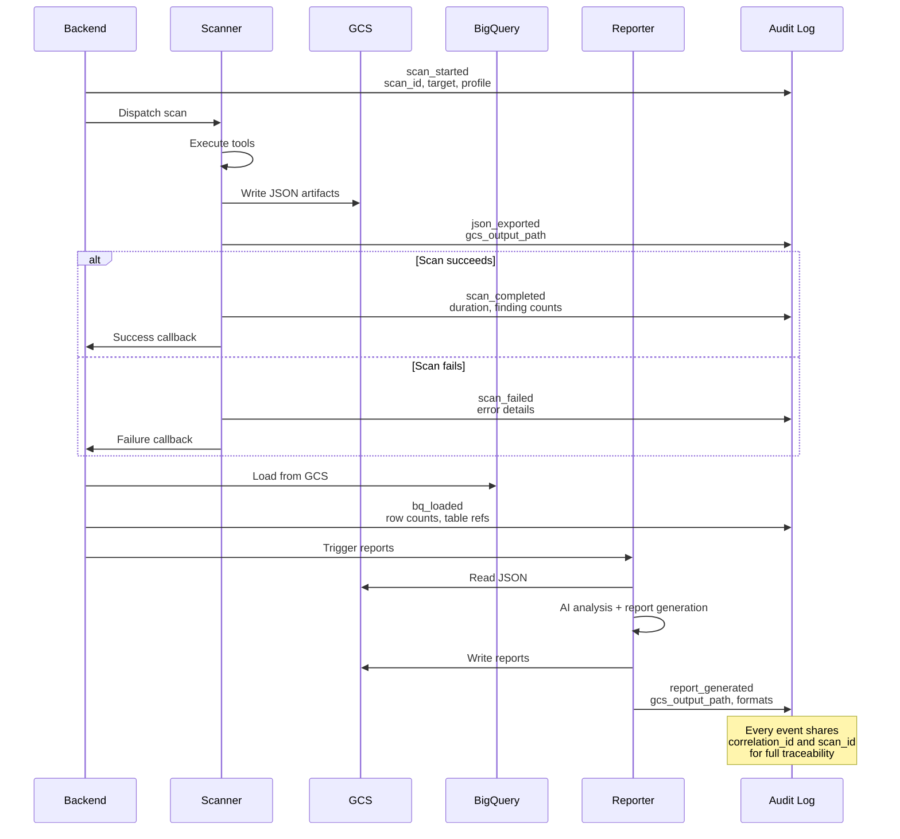

# Audit Logging

| | |
|---|---|
| **Document** | Peregrine Penetrator Scanner — Audit Logging |
| **Classification** | CONFIDENTIAL |
| **Version** | 1.0 |
| **Date** | 2026-03-22 |
| **Author** | Peregrine Technology Systems |

## Version History

| Version | Date | Author | Changes |
|---------|------|--------|---------|
| 1.0 | 2026-03-22 | Peregrine Technology Systems | Initial document |

---

## 1. Purpose

This document defines the structured audit logging strategy for the Peregrine Penetrator platform. Every security-relevant action is recorded as a structured JSON event, providing a tamper-evident chain of custody for all scan data. This supports SOC 2 CC7.2/CC7.3 and ISO 27001 A.8.15 compliance requirements.

## 2. Audit Event Types

| Event Type | Emitted By | Trigger |
|---|---|---|
| `scan_started` | Backend | Scan job dispatched to Scanner service |
| `scan_completed` | Scanner | All scan phases finished successfully |
| `scan_failed` | Scanner | Scan terminated due to error or timeout |
| `json_exported` | Scanner | Findings and metadata JSON written to GCS |
| `bq_loaded` | Backend | BigQuery load job completed |
| `report_generated` | Reporter | Report artifacts written to GCS |
| `report_failed` | Reporter | Report generation failed |
| `data_purged` | Backend | Retention policy deleted expired records |
| `scan_cancelled` | Scanner | Scan stopped via GCS control.json cancel signal |
| `heartbeat_sent` | Scanner | Liveness heartbeat POSTed to reporter (every 30s) |
| `callback_failed` | Scanner | Completion callback failed after 3 retries — dead letter written |
| `legal_hold_set` | Backend | Scan placed under legal hold |
| `legal_hold_released` | Backend | Legal hold removed from scan |

## 3. Event Schema

Every audit event conforms to the following JSON structure:

```json
{
  "event_id": "uuid-v4",
  "event_type": "scan_completed",
  "timestamp": "2026-03-22T14:30:00.000Z",
  "service": "scanner",
  "scan_id": "uuid-of-scan",
  "target_name": "example-app",
  "actor": "system",
  "details": {
    "profile": "standard",
    "duration_seconds": 1847,
    "total_findings": 42,
    "by_severity": {
      "critical": 2,
      "high": 8,
      "medium": 15,
      "low": 12,
      "info": 5
    },
    "tool_statuses": {
      "zap": "completed",
      "nuclei": "completed",
      "sqlmap": "completed",
      "ffuf": "completed",
      "nikto": "completed"
    },
    "schema_version": "1.0"
  },
  "gcs_output_path": "gs://bucket/scans/scan-uuid/",
  "correlation_id": "uuid-linking-related-events",
  "environment": "production"
}
```

### Field Reference

| Field | Type | Required | Description |
|-------|------|----------|-------------|
| `event_id` | UUID | Yes | Unique identifier for this event |
| `event_type` | String | Yes | One of the defined event types |
| `timestamp` | ISO 8601 | Yes | When the event occurred (UTC) |
| `service` | String | Yes | Emitting service (scanner / backend / reporter) |
| `scan_id` | UUID | Yes | Associated scan identifier |
| `target_name` | String | Yes | Human-readable target name |
| `actor` | String | Yes | Who initiated the action (system / user email) |
| `details` | Object | Yes | Event-specific payload |
| `gcs_output_path` | String | Conditional | GCS path for data-producing events |
| `correlation_id` | UUID | Yes | Links related events across services |
| `environment` | String | Yes | Deployment environment |

## 4. Chain of Custody

The `gcs_output_path` field creates an unbroken chain of custody from scan execution to report delivery:



## 5. Event Examples

### 5.1 `scan_started`

```json
{
  "event_id": "a1b2c3d4-e5f6-7890-abcd-ef1234567890",
  "event_type": "scan_started",
  "timestamp": "2026-03-22T10:00:00.000Z",
  "service": "backend",
  "scan_id": "f1e2d3c4-b5a6-7890-fedc-ba0987654321",
  "target_name": "customer-portal",
  "actor": "operator@peregrine.tech",
  "details": {
    "profile": "thorough",
    "target_urls": ["https://portal.example.com"],
    "schema_version": "1.0"
  },
  "correlation_id": "11223344-5566-7788-99aa-bbccddeeff00",
  "environment": "production"
}
```

### 5.2 `json_exported`

```json
{
  "event_id": "b2c3d4e5-f6a7-8901-bcde-f12345678901",
  "event_type": "json_exported",
  "timestamp": "2026-03-22T10:31:47.000Z",
  "service": "scanner",
  "scan_id": "f1e2d3c4-b5a6-7890-fedc-ba0987654321",
  "target_name": "customer-portal",
  "actor": "system",
  "details": {
    "files_written": [
      "scan_findings.json",
      "scan_metadata.json"
    ],
    "total_findings": 42,
    "schema_version": "1.0"
  },
  "gcs_output_path": "gs://pentest-scans/scans/f1e2d3c4-b5a6-7890-fedc-ba0987654321/",
  "correlation_id": "11223344-5566-7788-99aa-bbccddeeff00",
  "environment": "production"
}
```

### 5.3 `bq_loaded`

```json
{
  "event_id": "c3d4e5f6-a7b8-9012-cdef-123456789012",
  "event_type": "bq_loaded",
  "timestamp": "2026-03-22T10:32:15.000Z",
  "service": "backend",
  "scan_id": "f1e2d3c4-b5a6-7890-fedc-ba0987654321",
  "target_name": "customer-portal",
  "actor": "system",
  "details": {
    "tables_loaded": ["scan_findings", "scan_metadata"],
    "rows_inserted": {
      "scan_findings": 42,
      "scan_metadata": 1
    },
    "source_path": "gs://pentest-scans/scans/f1e2d3c4-b5a6-7890-fedc-ba0987654321/"
  },
  "gcs_output_path": "gs://pentest-scans/scans/f1e2d3c4-b5a6-7890-fedc-ba0987654321/",
  "correlation_id": "11223344-5566-7788-99aa-bbccddeeff00",
  "environment": "production"
}
```

## 6. Log Storage and Access

| Aspect | Implementation |
|--------|----------------|
| Primary sink | Google Cloud Logging (structured JSON) |
| Retention | 18 months (matches data retention policy) |
| Access control | IAM roles; read access limited to security and compliance teams |
| Export | Optional BigQuery export for analytics |
| Immutability | Cloud Logging entries are append-only and cannot be modified |
| Alerting | Cloud Monitoring alerts on `scan_failed` and `report_failed` events |

## 7. Compliance Mapping

| Control | Framework | How Audit Logging Addresses It |
|---------|-----------|--------------------------------|
| CC7.2 | SOC 2 | Structured audit events emitted for all security-relevant actions; monitoring and alerting on failures |
| CC7.3 | SOC 2 | Immutable, append-only log entries with `gcs_output_path` providing chain of custody for all scan artifacts |
| CC7.4 | SOC 2 | `scan_failed` and `report_failed` events trigger alerts for incident response |
| A.8.15 | ISO 27001 | Comprehensive logging of all scan lifecycle events; 18-month retention; access restricted by IAM |
| A.8.16 | ISO 27001 | Cloud Monitoring alerts on anomalous events support continuous monitoring |

## 8. Related Documents

- [Architecture Overview](architecture.md)
- [Data Flow](data_flow.md)
- [Data Retention Policy](data_retention_policy.md)
- [Separation of Duties](separation_of_duties.md)
