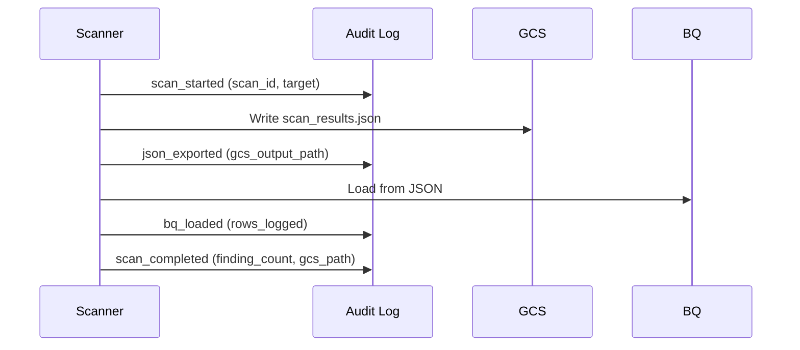

# Audit Logging

| | |
|---|---|
| **Document** | Peregrine Penetrator Scanner — Audit Logging |
| **Classification** | CONFIDENTIAL |
| **Version** | 1.0 |
| **Date** | 2026-03-22 |
| **Author** | Peregrine Technology Systems |

## Version History

| Version | Date | Author | Changes |
|---------|------|--------|---------|
| 1.0 | 2026-03-22 | Peregrine Technology Systems | Initial audit logging specification |

---

## Overview

The scanner emits structured JSON audit events to stdout, captured by Cloud Logging and sunk to BigQuery for long-term retention. Audit logs provide an immutable record of scan lifecycle events for SOC 2 Type II and ISO 27001 compliance.

## Audit Event Schema

```json
{
  "event": "audit",
  "event_id": "UUID",
  "timestamp": "ISO8601",
  "action": "scan_started|scan_completed|scan_failed|json_exported|bq_loaded",
  "scan_id": "UUID",
  "actor": {
    "vm_name": "string",
    "service_account": "string",
    "scan_mode": "dev|staging|production"
  },
  "schema_version": "1.0",
  "target_name": "string",
  "profile": "string",
  "finding_count": 0,
  "duration_seconds": 0,
  "status": "string",
  "gcs_output_path": "string",
  "rows_logged": 0,
  "error": "string (max 500 chars)"
}
```

## Events

| Action | When | Key Fields |
|--------|------|------------|
| `scan_started` | Scan begins | target_name, profile |
| `scan_completed` | Scan finishes successfully | finding_count, duration_seconds, gcs_output_path |
| `scan_failed` | Scan errors out | error, duration_seconds |
| `json_exported` | JSON artifact written to GCS | gcs_output_path, finding_count |
| `bq_loaded` | Findings loaded into BigQuery | rows_logged |
| `retention_purge_completed` | Data retention purge ran | results (per-table counts) |

## Chain of Custody

The `gcs_output_path` in audit events establishes chain of custody:



An auditor can trace: scan X started at time T1, produced artifact at GCS path P, loaded N rows into BQ, completed at time T2.

## What is NOT Logged

- API keys or credentials
- Raw vulnerability evidence or finding content
- Authentication tokens
- Target application responses
- PII of any kind

## Retention

Audit logs follow the same 18-month retention policy as all scan data. See [Data Retention Policy](data_retention_policy.md).

## Compliance Mapping

| Requirement | Standard | How Met |
|-------------|----------|---------|
| Audit trail | SOC 2 CC7.2 | Structured JSON events for all scan lifecycle actions |
| Access logging | ISO 27001 A.8.15 | Actor identity (VM, service account) in every event |
| Non-repudiation | SOC 2 CC7.3 | Immutable Cloud Logging → BQ sink |
| Event correlation | ISO 27001 A.8.15 | event_id (UUID) and scan_id for cross-referencing |
