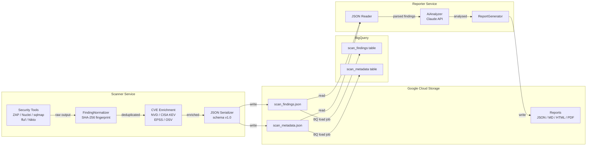
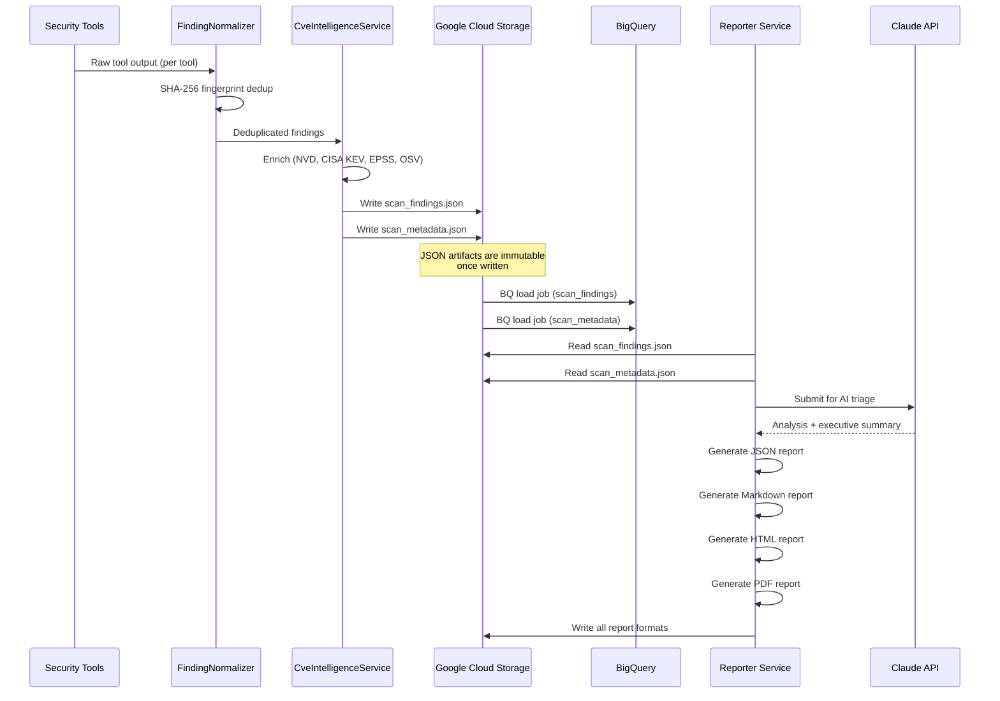

# Data Flow

| | |
|---|---|
| **Document** | Peregrine Penetrator Scanner — Data Flow |
| **Classification** | CONFIDENTIAL |
| **Version** | 1.0 |
| **Date** | 2026-03-22 |
| **Author** | Peregrine Technology Systems |

## Version History

| Version | Date | Author | Changes |
|---------|------|--------|---------|
| 1.0 | 2026-03-22 | Peregrine Technology Systems | Initial document |

---

## 1. Purpose

This document describes the JSON-first data pipeline that moves security scan data from tool execution through storage, analysis, and reporting. It serves as the authoritative reference for data lineage audits under SOC 2 and ISO 27001.

## 2. Pipeline Overview

The platform follows a strict JSON-first pipeline:

1. **Scanner** executes tools, normalises findings, enriches with CVE intelligence, and writes versioned JSON to GCS.
2. **Backend** loads JSON from GCS into BigQuery for analytics and long-term querying.
3. **Reporter** reads JSON from GCS, applies AI analysis, and generates reports back to GCS.

All inter-service data exchange happens through GCS JSON files. There is no direct service-to-service data transfer.

## 3. Data Flow Diagram

## 4. Sequence Diagram

## 5. GCS Bucket Paths

| Path Pattern | Content | Lifecycle |
|---|---|---|
| `gs://{bucket}/scans/{scan_id}/scan_findings.json` | Normalised, enriched findings | 18-month retention |
| `gs://{bucket}/scans/{scan_id}/scan_metadata.json` | Scan execution metadata | 18-month retention |
| `gs://{bucket}/scans/{scan_id}/reports/report.json` | Machine-readable report | 18-month retention |
| `gs://{bucket}/scans/{scan_id}/reports/report.md` | Markdown report | 18-month retention |
| `gs://{bucket}/scans/{scan_id}/reports/report.html` | HTML report | 18-month retention |
| `gs://{bucket}/scans/{scan_id}/reports/report.pdf` | PDF report | 18-month retention |
| `gs://{bucket}/scans/{scan_id}/raw/{tool_name}/` | Raw tool output (debug) | 90-day retention |

## 6. BigQuery Schema

### 6.1 `scan_findings` Table

| Column | Type | Description |
|--------|------|-------------|
| `fingerprint` | STRING | SHA-256 deduplication fingerprint |
| `site` | STRING | Target site URL |
| `scan_id` | STRING | UUID of the parent scan |
| `scan_date` | TIMESTAMP | When the scan was executed |
| `profile` | STRING | Scan profile (quick / standard / thorough) |
| `schema_version` | STRING | JSON schema version (e.g., "1.0") |
| `severity` | STRING | Finding severity (critical / high / medium / low / info) |
| `title` | STRING | Finding title |
| `tool` | STRING | Source tool (zap / nuclei / sqlmap / ffuf / nikto) |
| `cwe_id` | STRING | CWE identifier (e.g., "CWE-79") |
| `cve_id` | STRING | CVE identifier (e.g., "CVE-2024-1234"), nullable |
| `url` | STRING | Affected URL |
| `parameter` | STRING | Affected parameter, nullable |
| `cvss_score` | FLOAT | CVSS v3.1 base score, nullable |
| `epss_score` | FLOAT | EPSS probability score (0.0 - 1.0), nullable |
| `kev_known_exploited` | BOOLEAN | Whether listed in CISA KEV catalogue |
| `evidence` | JSON | Structured evidence blob (request, response, etc.) |

**Partitioning:** `scan_date` (DAY)
**Clustering:** `severity`, `tool`

### 6.2 `scan_metadata` Table

| Column | Type | Description |
|--------|------|-------------|
| `scan_id` | STRING | UUID of the scan |
| `target_name` | STRING | Human-readable target name |
| `profile` | STRING | Scan profile used |
| `duration_seconds` | INTEGER | Total scan duration |
| `tool_statuses` | JSON | Per-tool status and timing |
| `schema_version` | STRING | JSON schema version |
| `scan_date` | TIMESTAMP | When the scan was executed |
| `total_findings` | INTEGER | Total finding count |
| `by_severity` | JSON | Finding counts by severity level |

**Partitioning:** `scan_date` (DAY)

## 7. Data Transformations

| Stage | Input | Output | Transformation |
|-------|-------|--------|----------------|
| Tool Execution | Target URL + config | Raw tool output | Tool-specific scan |
| Normalisation | Raw output (per tool) | Unified finding JSON | Schema mapping + SHA-256 fingerprint |
| Deduplication | All normalised findings | Deduplicated set | Fingerprint-based dedup across tools |
| CVE Enrichment | Deduplicated findings | Enriched findings | NVD / CISA KEV / EPSS / OSV lookups |
| JSON Export | Enriched findings | GCS JSON files | Serialisation with schema version |
| BQ Load | GCS JSON | BigQuery rows | BQ load job (no transformation) |
| AI Analysis | GCS JSON | Triaged findings + summary | Claude API analysis |
| Report Generation | Analysed findings | Multi-format reports | Template rendering |

## 8. Data Integrity Controls

| Control | Implementation |
|---------|----------------|
| Deduplication | SHA-256 fingerprint across tool, CWE, URL, parameter |
| Schema Validation | JSON schema version embedded in every artifact |
| Immutability | GCS objects are write-once; no in-place updates |
| Lineage | Every finding traces back to source tool and scan_id |
| Completeness | scan_metadata.total_findings cross-checked against actual count |

## 9. Compliance Mapping

| Control | Framework | How This Data Flow Addresses It |
|---------|-----------|----------------------------------|
| CC6.5 | SOC 2 | Data classified and retained per policy; lifecycle rules enforce deletion |
| CC7.3 | SOC 2 | Immutable JSON artifacts provide tamper-evident data lineage |
| A.8.10 | ISO 27001 | Retention periods enforced via GCS lifecycle and BQ scheduled queries |
| A.8.12 | ISO 27001 | Data classification embedded in document headers and GCS metadata |

## 10. Related Documents

- [Architecture Overview](architecture.md)
- [Data Retention Policy](data_retention_policy.md)
- [Schema Versioning](schema_versioning.md)
- [Audit Logging](audit_logging.md)
