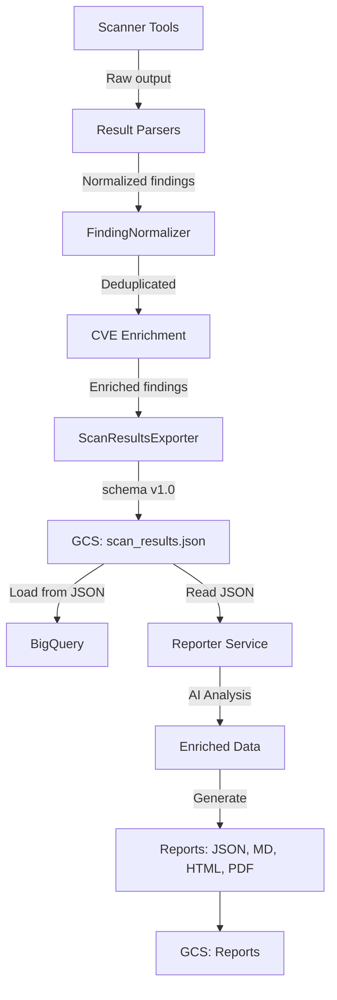
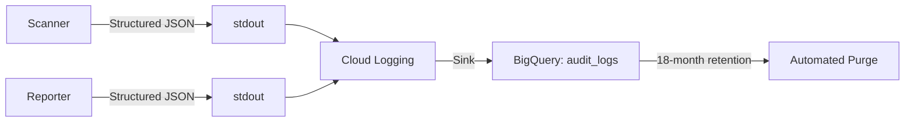

# Data Flow

| | |
|---|---|
| **Document** | Peregrine Penetrator Scanner — Data Flow |
| **Classification** | CONFIDENTIAL |
| **Version** | 1.0 |
| **Date** | 2026-03-22 |
| **Author** | Peregrine Technology Systems |

## Version History

| Version | Date | Author | Changes |
|---------|------|--------|---------|
| 1.0 | 2026-03-22 | Peregrine Technology Systems | Initial data flow document |

---

## JSON-First Pipeline

The scanner produces a single canonical output: a versioned JSON artifact stored in GCS. All downstream consumers (BigQuery, Reporter) read from this artifact.



## Scan Results JSON Schema (v1.0)

```json
{
  "schema_version": "1.0",
  "metadata": {
    "scan_id": "UUID",
    "target_name": "string",
    "target_urls": ["string"],
    "profile": "quick|standard|thorough",
    "started_at": "ISO8601",
    "completed_at": "ISO8601",
    "duration_seconds": 1234,
    "tool_statuses": {},
    "generated_at": "ISO8601"
  },
  "summary": {
    "total_findings": 12,
    "by_severity": {"critical": 1, "high": 3, "medium": 5, "low": 2, "info": 1},
    "tools_run": ["zap", "nuclei", "sqlmap"],
    "duration_seconds": 1234
  },
  "findings": [{
    "id": "UUID",
    "source_tool": "zap",
    "severity": "high",
    "title": "SQL Injection",
    "url": "https://target.com/login",
    "parameter": "username",
    "cwe_id": "CWE-89",
    "cve_id": "CVE-2024-1234",
    "cvss_score": 9.8,
    "epss_score": 0.95,
    "kev_known_exploited": true,
    "evidence": {}
  }]
}
```

## BigQuery Tables

### `scan_findings_{mode}`

One row per non-duplicate finding, loaded from the JSON artifact.

| Column | Type | Source |
|--------|------|--------|
| fingerprint | STRING | finding.id |
| site | STRING | metadata.target_urls[0] |
| scan_id | STRING | metadata.scan_id |
| scan_date | TIMESTAMP | metadata.started_at |
| profile | STRING | metadata.profile |
| schema_version | STRING | schema_version |
| severity | STRING | finding.severity |
| title | STRING | finding.title |
| tool | STRING | finding.source_tool |
| cwe_id | STRING | finding.cwe_id |
| cve_id | STRING | finding.cve_id |
| url | STRING | finding.url |
| parameter | STRING | finding.parameter |
| cvss_score | FLOAT | finding.cvss_score |
| epss_score | FLOAT | finding.epss_score |
| kev_known_exploited | BOOLEAN | finding.kev_known_exploited |
| evidence | STRING (JSON) | finding.evidence |

### `scan_metadata_{mode}`

One row per scan.

| Column | Type | Source |
|--------|------|--------|
| scan_id | STRING | metadata.scan_id |
| target_name | STRING | metadata.target_name |
| profile | STRING | metadata.profile |
| duration_seconds | INTEGER | summary.duration_seconds |
| tool_statuses | STRING (JSON) | metadata.tool_statuses |
| schema_version | STRING | schema_version |
| scan_date | TIMESTAMP | metadata.started_at |
| total_findings | INTEGER | summary.total_findings |
| by_severity | STRING (JSON) | summary.by_severity |

## GCS Storage Paths

| Artifact | Path | Retention |
|----------|------|-----------|
| Scan results JSON | `scan-results/{target_id}/{scan_id}/scan_results.json` | 18 months |
| JSON report | `reports/{target_id}/{scan_id}/scan_{id}_report.json` | 18 months |
| Markdown report | `reports/{target_id}/{scan_id}/scan_{id}_report.md` | 18 months |
| HTML report | `reports/{target_id}/{scan_id}/scan_{id}_report.html` | 18 months |
| PDF report | `reports/{target_id}/{scan_id}/scan_{id}_report.pdf` | 18 months |

## Audit Log Flow


