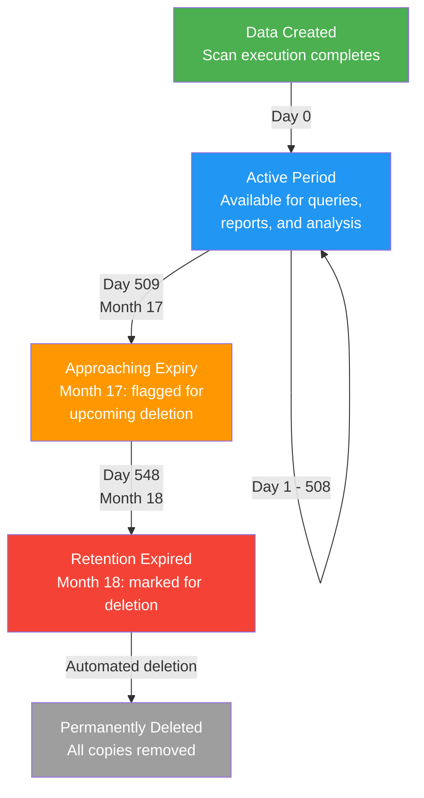

# Data Retention Policy

| | |
|---|---|
| **Document** | Peregrine Penetrator Scanner — Data Retention Policy |
| **Classification** | CONFIDENTIAL |
| **Version** | 1.0 |
| **Date** | 2026-03-22 |
| **Author** | Peregrine Technology Systems |

## Version History

| Version | Date | Author | Changes |
|---------|------|--------|---------|
| 1.0 | 2026-03-22 | Peregrine Technology Systems | Initial document |

---

## 1. Purpose

This document defines the data retention and disposal policy for all scan data, findings, and reports produced by the Peregrine Penetrator platform. It ensures compliance with SOC 2 CC6.5 and ISO 27001 A.8.10 requirements for information retention and disposal.

## 2. Retention Schedule

| Data Category | Storage Location | Retention Period | Disposal Method |
|---|---|---|---|
| Scan findings JSON | GCS | 18 months (548 days) | GCS lifecycle deletion |
| Scan metadata JSON | GCS | 18 months (548 days) | GCS lifecycle deletion |
| Reports (JSON, MD, HTML, PDF) | GCS | 18 months (548 days) | GCS lifecycle deletion |
| Raw tool output | GCS | 90 days | GCS lifecycle deletion |
| Scan findings (analytics) | BigQuery | 18 months | BQ scheduled query deletion |
| Scan metadata (analytics) | BigQuery | 18 months | BQ scheduled query deletion |
| Scan records | PostgreSQL | 18 months | Application-level deletion job |
| Audit log events | Cloud Logging | 18 months | Log retention policy |

## 3. Data Lifecycle



## 4. GCS Lifecycle Rules

The following lifecycle configuration is applied to all scan data buckets:

```json
{
  "lifecycle": {
    "rule": [
      {
        "action": {
          "type": "Delete"
        },
        "condition": {
          "age": 548,
          "matchesPrefix": ["scans/"]
        }
      },
      {
        "action": {
          "type": "Delete"
        },
        "condition": {
          "age": 90,
          "matchesPrefix": ["scans/"],
          "matchesSuffix": ["/raw/"]
        }
      },
      {
        "action": {
          "type": "SetStorageClass",
          "storageClass": "NEARLINE"
        },
        "condition": {
          "age": 90,
          "matchesPrefix": ["scans/"]
        }
      }
    ]
  }
}
```

### Rule Summary

| Rule | Prefix | Condition | Action |
|------|--------|-----------|--------|
| Raw output deletion | `scans/*/raw/` | age >= 90 days | Delete |
| Nearline transition | `scans/` | age >= 90 days | Move to Nearline storage |
| Full data deletion | `scans/` | age >= 548 days | Delete |

## 5. BigQuery Scheduled Queries

Two scheduled queries run daily at 02:00 UTC to enforce retention in BigQuery:

### 5.1 Delete Expired Findings

```sql
-- Scheduled query: delete_expired_scan_findings
-- Schedule: daily at 02:00 UTC
DELETE FROM `project.dataset.scan_findings`
WHERE scan_date < TIMESTAMP_SUB(CURRENT_TIMESTAMP(), INTERVAL 548 DAY);
```

### 5.2 Delete Expired Metadata

```sql
-- Scheduled query: delete_expired_scan_metadata
-- Schedule: daily at 02:00 UTC
DELETE FROM `project.dataset.scan_metadata`
WHERE scan_date < TIMESTAMP_SUB(CURRENT_TIMESTAMP(), INTERVAL 548 DAY);
```

## 6. PostgreSQL Retention

A daily Rails task purges expired scan records and their associated findings and reports from PostgreSQL:

```ruby
# lib/tasks/retention.rake
# Schedule: daily at 03:00 UTC via cron / Cloud Scheduler
namespace :retention do
  desc "Delete scan data older than 18 months"
  task purge_expired: :environment do
    cutoff = 18.months.ago
    Scan.where("created_at < ?", cutoff).find_each do |scan|
      scan.findings.delete_all
      scan.reports.delete_all
      scan.destroy
    end
  end
end
```

## 7. Exceptions and Legal Holds

- **Legal hold:** If a scan is subject to a legal hold or active investigation, retention may be extended. Legal holds are tracked via a `legal_hold` boolean on the Scan record.
- **Regulatory extension:** Specific scans may require extended retention if mandated by a customer contract or regulatory requirement. These are flagged and excluded from automated deletion.
- **Early deletion:** Target owners may request early deletion of their scan data. Requests are processed within 30 days and logged as audit events.

## 8. Verification and Monitoring

| Check | Frequency | Method |
|-------|-----------|--------|
| GCS lifecycle rule execution | Daily | Cloud Monitoring alert on object count |
| BQ scheduled query success | Daily | Cloud Monitoring alert on query status |
| PostgreSQL purge job | Daily | Application health check log |
| Retention compliance audit | Quarterly | Manual review of oldest records across all stores |

## 9. Compliance Mapping

| Control | Framework | How This Policy Addresses It |
|---------|-----------|-------------------------------|
| CC6.5 | SOC 2 | Defines retention periods, automated disposal, and exception handling for all data categories |
| CC6.6 | SOC 2 | Logical access to data stores restricted by service identity; disposal removes all copies |
| A.8.10 | ISO 27001 | 18-month retention with automated lifecycle rules; quarterly compliance verification |
| A.8.11 | ISO 27001 | Data masking not required — findings contain URLs and parameters but no PII by design |

## 10. Related Documents

- [Architecture Overview](architecture.md)
- [Data Flow](data_flow.md)
- [Audit Logging](audit_logging.md)
- [Schema Versioning](schema_versioning.md)
