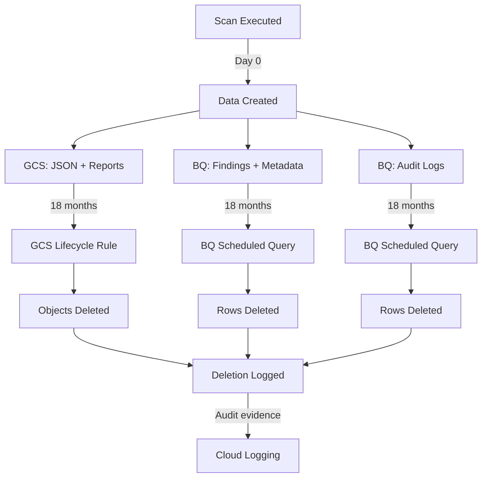

# Data Retention Policy

| | |
|---|---|
| **Document** | Peregrine Penetrator — Data Retention Policy |
| **Classification** | CONFIDENTIAL |
| **Version** | 1.0 |
| **Date** | 2026-03-22 |
| **Author** | Peregrine Technology Systems |
| **Review Frequency** | Annual |

## Version History

| Version | Date | Author | Changes |
|---------|------|--------|---------|
| 1.0 | 2026-03-22 | Peregrine Technology Systems | Initial retention policy |

---

## Policy Statement

All scan data, reports, and audit logs are retained for **18 months** from the date of creation. Data older than 18 months is automatically destroyed on a rolling basis. Destruction events are logged for audit evidence.

## Retention Period

| Data Type | Location | Retention | Destruction Method |
|-----------|----------|-----------|-------------------|
| Scan results JSON | GCS | 18 months | GCS lifecycle rule |
| Generated reports (PDF, HTML, etc.) | GCS | 18 months | GCS lifecycle rule |
| Finding rows | BigQuery | 18 months | Scheduled DELETE query |
| Scan metadata rows | BigQuery | 18 months | Scheduled DELETE query |
| Scan cost rows | BigQuery | 18 months | Scheduled DELETE query |
| Audit log rows | BigQuery | 18 months | Scheduled DELETE query |

## Lifecycle



## Enforcement

### GCS Lifecycle Rules

Applied at the bucket level to automatically delete objects older than 18 months:

```json
{
  "lifecycle": {
    "rule": [{
      "action": { "type": "Delete" },
      "condition": { "age": 548 }
    }]
  }
}
```

### BigQuery Scheduled Queries

Run monthly via `rake retention:purge`:

```sql
DELETE FROM `pentest_history.scan_findings_{mode}`
WHERE scan_date < TIMESTAMP_SUB(CURRENT_TIMESTAMP(), INTERVAL 548 DAY);

DELETE FROM `pentest_history.scan_metadata_{mode}`
WHERE scan_date < TIMESTAMP_SUB(CURRENT_TIMESTAMP(), INTERVAL 548 DAY);

DELETE FROM `audit_logs.penetrator_events`
WHERE timestamp < TIMESTAMP_SUB(CURRENT_TIMESTAMP(), INTERVAL 548 DAY);
```

### Dry Run

Preview what would be purged before executing:

```bash
rake retention:dry_run
```

## Destruction Evidence

Every purge operation logs:
- Timestamp of purge execution
- Tables affected
- Row counts deleted per table
- Cutoff date used
- Success/failure status

These logs are themselves subject to the 18-month retention policy.

## Compliance Mapping

| Requirement | Standard | How Met |
|-------------|----------|---------|
| Data retention policy | SOC 2 CC6.5 | This document + automated enforcement |
| Data destruction | SOC 2 CC6.5 | GCS lifecycle + BQ scheduled queries |
| Destruction evidence | ISO 27001 A.8.10 | Purge events logged to Cloud Logging |
| Policy review | ISO 27001 A.5.1 | Annual review (documented in version history) |
