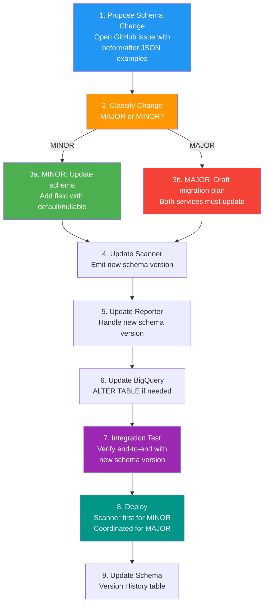

# Schema Versioning

| | |
|---|---|
| **Document** | Peregrine Penetrator Scanner — Schema Versioning |
| **Classification** | CONFIDENTIAL |
| **Version** | 1.0 |
| **Date** | 2026-03-22 |
| **Author** | Peregrine Technology Systems |

## Version History

| Version | Date | Author | Changes |
|---------|------|--------|---------|
| 1.0 | 2026-03-22 | Peregrine Technology Systems | Initial document |

---

## 1. Purpose

This document defines the JSON schema contract between the Scanner and Reporter services. The schema is the sole interface between these services — all data exchange happens via versioned JSON files in GCS. This contract ensures that changes to one service do not silently break the other.

## 2. Versioning Strategy

The schema follows **MAJOR.MINOR** semantic versioning:

| Version Component | When to Bump | Example |
|---|---|---|
| **MAJOR** | Breaking changes: removing fields, renaming fields, changing field types, restructuring the JSON | 1.0 -> 2.0 |
| **MINOR** | Additive changes: new optional fields, new enum values for existing fields | 1.0 -> 1.1 |

### Compatibility Rules

- **MINOR bumps are backward-compatible.** A Reporter built for schema 1.0 can read 1.1 data (it ignores unknown fields).
- **MAJOR bumps are breaking.** Both Scanner and Reporter must be updated before a major version is deployed.
- The `schema_version` field is embedded in every JSON artifact and every BigQuery row.

## 3. What Triggers a Version Bump

### 3.1 MINOR Bump (Backward-Compatible)

- Adding a new optional field to `scan_findings.json` (e.g., a new enrichment source)
- Adding a new optional field to `scan_metadata.json` (e.g., a new timing metric)
- Adding a new enum value to `severity` (e.g., adding "negligible" alongside existing values)
- Adding a new tool to `tool_statuses`

### 3.2 MAJOR Bump (Breaking)

- Removing or renaming any existing field
- Changing the type of an existing field (e.g., `cvss_score` from float to string)
- Restructuring the JSON hierarchy (e.g., flattening nested objects)
- Changing the meaning of an existing field
- Removing a supported severity level or tool enum value

## 4. Change Process



## 5. Current Schema Definition

### 5.1 `scan_findings.json`

```json
{
  "schema_version": "1.0",
  "scan_id": "uuid",
  "scan_date": "ISO-8601 timestamp",
  "site": "target URL",
  "profile": "quick | standard | thorough",
  "findings": [
    {
      "fingerprint": "SHA-256 string",
      "severity": "critical | high | medium | low | info",
      "title": "string",
      "tool": "zap | nuclei | sqlmap | ffuf | nikto",
      "cwe_id": "CWE-NNN | null",
      "cve_id": "CVE-YYYY-NNNN | null",
      "url": "affected URL",
      "parameter": "string | null",
      "cvss_score": "float | null",
      "epss_score": "float (0.0-1.0) | null",
      "kev_known_exploited": "boolean",
      "evidence": {
        "request": "string | null",
        "response": "string | null",
        "description": "string",
        "solution": "string | null",
        "references": ["URL array"]
      }
    }
  ]
}
```

### 5.2 `scan_metadata.json`

```json
{
  "schema_version": "1.0",
  "scan_id": "uuid",
  "target_name": "string",
  "profile": "quick | standard | thorough",
  "duration_seconds": "integer",
  "scan_date": "ISO-8601 timestamp",
  "total_findings": "integer",
  "by_severity": {
    "critical": "integer",
    "high": "integer",
    "medium": "integer",
    "low": "integer",
    "info": "integer"
  },
  "tool_statuses": {
    "zap": "completed | failed | skipped | timed_out",
    "nuclei": "completed | failed | skipped | timed_out",
    "sqlmap": "completed | failed | skipped | timed_out",
    "ffuf": "completed | failed | skipped | timed_out",
    "nikto": "completed | failed | skipped | timed_out"
  }
}
```

## 6. Schema Version History

| Schema Version | Date | Change Type | Description |
|---|---|---|---|
| 1.0 | 2026-03-22 | Initial | Initial schema with all core fields for findings and metadata |

## 7. Deployment Order

| Change Type | Deployment Sequence |
|---|---|
| MINOR | 1. Deploy Scanner (emits new version) -> 2. Deploy Reporter (handles new fields) -> 3. Update BQ schema |
| MAJOR | 1. Deploy Reporter (handles both old and new) -> 2. Deploy Scanner (emits new version) -> 3. Remove old version support from Reporter -> 4. Update BQ schema |

For MAJOR changes, the Reporter must support both the old and new schema versions during the transition window. This ensures no data loss if in-flight scans produce old-version JSON while the Scanner is being updated.

## 8. Validation

Both services validate the `schema_version` field on read:

- **Scanner:** Stamps the current schema version on every JSON artifact it writes.
- **Reporter:** Checks `schema_version` on read. If the version is unsupported, the report generation fails with a clear error and emits a `report_failed` audit event.
- **BigQuery:** The `schema_version` column allows queries to filter by version, supporting analytics across schema transitions.

## 9. Compliance Mapping

| Control | Framework | How Schema Versioning Addresses It |
|---------|-----------|-------------------------------------|
| CC8.1 | SOC 2 | Changes to the data contract follow a documented process with review, testing, and staged deployment |
| A.8.9 | ISO 27001 | Configuration management of the inter-service data format; version history maintained |
| A.14.2.5 | ISO 27001 | Secure system engineering — schema contract prevents silent integration failures |

## 10. Related Documents

- [Architecture Overview](architecture.md)
- [Data Flow](data_flow.md)
- [Separation of Duties](separation_of_duties.md)
- [Audit Logging](audit_logging.md)
