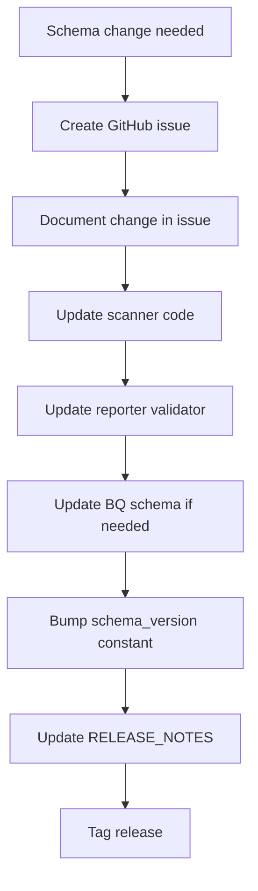

# Schema Versioning

| | |
|---|---|
| **Document** | Peregrine Penetrator — JSON Schema Versioning |
| **Classification** | CONFIDENTIAL |
| **Version** | 1.0 |
| **Date** | 2026-03-22 |
| **Author** | Peregrine Technology Systems |

## Version History

| Version | Date | Author | Changes |
|---------|------|--------|---------|
| 1.0 | 2026-03-22 | Peregrine Technology Systems | Initial schema versioning specification |

---

## Overview

The scan results JSON schema is the contract between the Scanner and the Reporter. Every JSON artifact and every BigQuery row carries a `schema_version` field.

## Versioning Rules

| Change Type | Version Bump | Example |
|-------------|-------------|---------|
| New optional field added | Minor (1.0 → 1.1) | Add `target_url` (singular) |
| Required field added | Major (1.x → 2.0) | New required metadata field |
| Field removed | Major (1.x → 2.0) | Remove `ai_assessment` from findings |
| Field renamed | Major (1.x → 2.0) | Rename `target_urls` → `target_url` |
| Field type changed | Major (1.x → 2.0) | Change `cvss_score` from float to string |

## Change Process

## Schema Version History

| Version | Date | Changes | Issue |
|---------|------|---------|-------|
| 1.0 | 2026-03-22 | Initial schema | #238 |

## Compliance Mapping

| Requirement | Standard | How Met |
|-------------|----------|---------|
| Change management | SOC 2 CC8.1 | Version tracked in issues and release notes |
| Data integrity | ISO 27001 A.8.24 | Schema version stamped on every artifact and BQ row |
