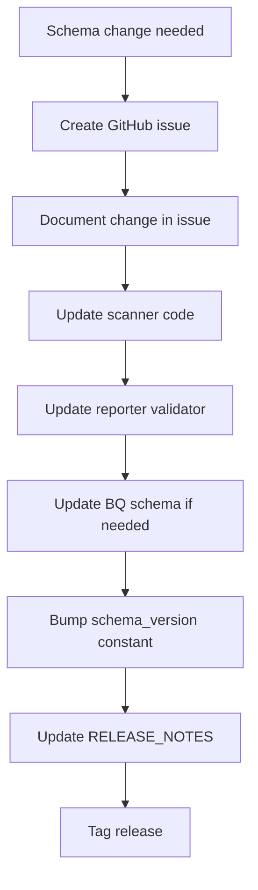

# Schema Versioning

| | |
|---|---|
| **Document** | Peregrine Penetrator — JSON Schema Versioning |
| **Classification** | CONFIDENTIAL |
| **Version** | 1.0 |
| **Date** | 2026-03-22 |
| **Author** | Peregrine Technology Systems |

## Version History

| Version | Date | Author | Changes |
|---------|------|--------|---------|
| 1.0 | 2026-03-22 | Peregrine Technology Systems | Initial schema versioning specification |

---

## Overview

The scan results JSON schema is the contract between the Scanner and the Reporter. Every JSON artifact and every BigQuery row carries a `schema_version` field to ensure data provenance and compatibility.

## Versioning Rules

1. The `schema_version` field is **required** in every JSON artifact
2. Every BigQuery row is stamped with the `schema_version` of the JSON it was loaded from
3. The Reporter **validates** the schema version before processing and rejects unknown versions
4. Version follows `MAJOR.MINOR` format

## What Triggers a Version Bump

| Change Type | Version Bump | Example |
|-------------|-------------|---------|
| New optional field added | Minor (1.0 → 1.1) | Add `target_url` (singular) |
| Required field added | Major (1.x → 2.0) | New required metadata field |
| Field removed | Major (1.x → 2.0) | Remove `ai_assessment` from findings |
| Field renamed | Major (1.x → 2.0) | Rename `target_urls` → `target_url` |
| Field type changed | Major (1.x → 2.0) | Change `cvss_score` from float to string |
| No schema change | No bump | Code-only changes |

## Change Process

1. **Create a GitHub issue** describing the schema change and rationale
2. **Update the scanner** — modify `ScanResultsExporter` and bump `SCHEMA_VERSION`
3. **Update the reporter** — add support for the new version in the schema validator
4. **Update BigQuery** — add/modify columns if needed
5. **Document** — update RELEASE_NOTES and schema documentation
6. **Tag release** — version tag on both scanner and reporter repos

## Version History

| Version | Date | Changes | Issue |
|---------|------|---------|-------|
| 1.0 | 2026-03-22 | Initial schema | #238 |

## Compatibility

- The Reporter should support the **current version and one prior version**
- BigQuery rows from older versions remain queryable (old rows keep their schema_version)
- GCS artifacts are immutable — an artifact written with v1.0 stays v1.0 forever
