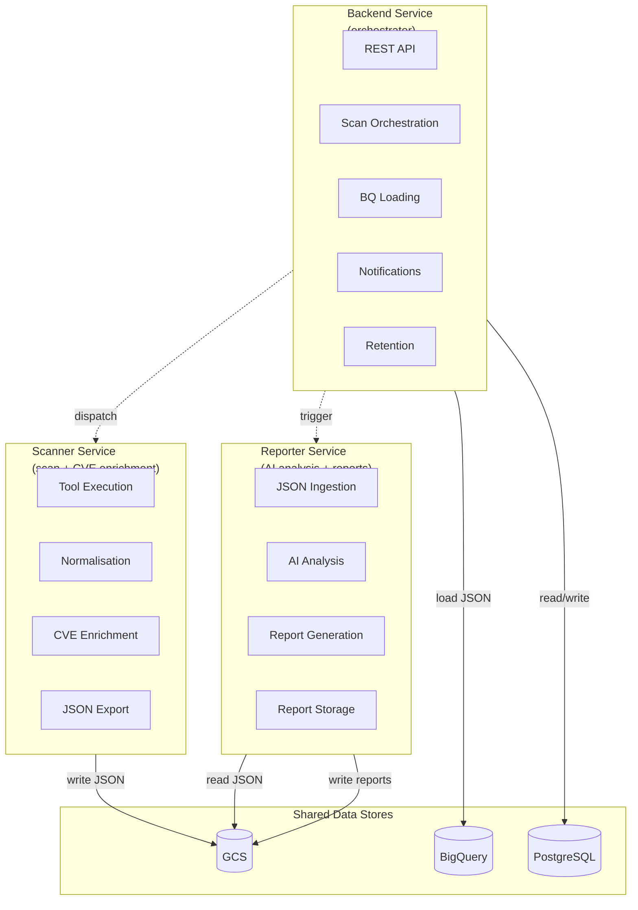

# Separation of Duties

| | |
|---|---|
| **Document** | Peregrine Penetrator Scanner — Separation of Duties |
| **Classification** | CONFIDENTIAL |
| **Version** | 1.0 |
| **Date** | 2026-03-22 |
| **Author** | Peregrine Technology Systems |

## Version History

| Version | Date | Author | Changes |
|---------|------|--------|---------|
| 1.0 | 2026-03-22 | Peregrine Technology Systems | Initial document |

---

## 1. Purpose

This document defines how responsibilities are divided across the three services of the Peregrine Penetrator platform. Separation of duties is enforced at the service boundary, GCP IAM, and network level to ensure that no single service can execute scans, analyse results, and generate reports without proper handoffs. This supports SOC 2 CC6.1 and ISO 27001 A.8.3 compliance.

## 2. Service Responsibilities

### 2.1 Scanner Service

| Responsibility | Description |
|---|---|
| Tool orchestration | Execute security tools (ZAP, Nuclei, sqlmap, ffuf, Nikto) |
| Finding normalisation | Map tool-specific output to unified schema with SHA-256 fingerprints |
| Deduplication | Remove duplicate findings across tools |
| CVE enrichment | Lookup NVD, CISA KEV, EPSS, and OSV data |
| JSON export | Write versioned JSON artifacts to GCS |

**Does NOT:** Generate reports, perform AI analysis, load data into BigQuery, or manage targets.

### 2.2 Reporter Service

| Responsibility | Description |
|---|---|
| JSON ingestion | Read scan findings and metadata from GCS |
| AI analysis | Submit findings to Claude API for triage and executive summary |
| Report generation | Produce JSON, Markdown, HTML, and PDF reports |
| Report storage | Write reports back to GCS |

**Does NOT:** Execute scans, enrich findings with CVE data, load BigQuery, or manage targets.

### 2.3 Backend Service

| Responsibility | Description |
|---|---|
| API surface | REST API for target and scan management |
| Orchestration | Initiate scans and trigger report generation |
| State management | Track scan lifecycle in PostgreSQL |
| BigQuery loading | Load JSON from GCS into BigQuery |
| Notifications | Dispatch Slack and email notifications |
| Retention | Execute data retention and purge operations |

**Does NOT:** Execute security tools, normalise findings, or generate reports.

## 3. Service Boundary Diagram

## 4. Access Boundary Matrix

| Resource | Scanner Service | Reporter Service | Backend Service |
|---|---|---|---|
| **GCS: scan findings** | Read/Write | Read | Read |
| **GCS: scan metadata** | Read/Write | Read | Read |
| **GCS: reports** | None | Read/Write | Read |
| **GCS: raw tool output** | Read/Write | None | None |
| **BigQuery: scan_findings** | None | None | Read/Write |
| **BigQuery: scan_metadata** | None | None | Read/Write |
| **PostgreSQL** | None | None | Read/Write |
| **NVD API** | Read | None | None |
| **CISA KEV API** | Read | None | None |
| **EPSS API** | Read | None | None |
| **OSV API** | Read | None | None |
| **Claude API** | None | Read | None |
| **Slack Webhook** | None | None | Write |
| **Email / SMTP** | None | None | Write |
| **Security Tools** | Execute | None | None |

## 5. GCP IAM Enforcement

Each service runs under a dedicated GCP service account with minimal permissions:

| Service Account | IAM Roles | Scope |
|---|---|---|
| `scanner@project.iam` | `roles/storage.objectCreator`, `roles/storage.objectViewer` | Scan data buckets only |
| `reporter@project.iam` | `roles/storage.objectViewer`, `roles/storage.objectCreator` | Scan data + report buckets |
| `backend@project.iam` | `roles/storage.objectViewer`, `roles/bigquery.dataEditor`, `roles/cloudsql.client` | All buckets (read), BQ dataset, Cloud SQL |

## 6. Network-Level Isolation

| Service | Network Access |
|---|---|
| Scanner | Outbound to targets (scan scope), NVD/CISA/EPSS/OSV APIs, GCS. No inbound except from Backend. |
| Reporter | Outbound to Claude API, GCS. No inbound except from Backend. |
| Backend | Outbound to GCS, BigQuery, PostgreSQL, Slack, SMTP. Inbound from API clients and CI/CD. |

## 7. Why This Matters

Separation of duties ensures:

1. **No single service can tamper with results.** The Scanner writes findings; the Reporter reads them. Neither can modify the other's output.
2. **AI analysis is independent of scanning.** The Reporter applies AI triage to findings it did not produce, providing an independent assessment.
3. **Data loading is controlled.** Only the Backend loads data into BigQuery, ensuring a single point of auditability for the analytics pipeline.
4. **Blast radius is limited.** A compromise of one service does not grant access to all platform capabilities.

## 8. Compliance Mapping

| Control | Framework | How Separation of Duties Addresses It |
|---------|-----------|----------------------------------------|
| CC6.1 | SOC 2 | Logical access boundaries enforced by dedicated service accounts, IAM roles, and network policies; no service has unrestricted access |
| CC6.3 | SOC 2 | Service accounts follow least privilege; access reviewed as part of IAM audit |
| A.5.3 | ISO 27001 | Duties segregated across three services with distinct responsibilities |
| A.8.3 | ISO 27001 | Access restricted per service identity; boundary matrix documents all access rights |
| A.8.32 | ISO 27001 | Change management separated — scanner config, report templates, and orchestration logic are independently versioned |

## 9. Related Documents

- [Architecture Overview](architecture.md)
- [Data Flow](data_flow.md)
- [Audit Logging](audit_logging.md)
- [Schema Versioning](schema_versioning.md)
