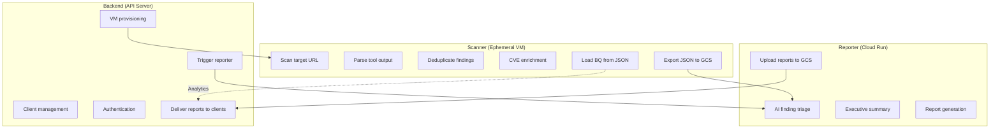

# Separation of Duties

| | |
|---|---|
| **Document** | Peregrine Penetrator — Separation of Duties |
| **Classification** | CONFIDENTIAL |
| **Version** | 1.0 |
| **Date** | 2026-03-22 |
| **Author** | Peregrine Technology Systems |

## Version History

| Version | Date | Author | Changes |
|---------|------|--------|---------|
| 1.0 | 2026-03-22 | Peregrine Technology Systems | Initial separation of duties document |

---

## Service Responsibilities

## Access Boundaries

| Service | GCS Access | BQ Access | External APIs | Target Access |
|---------|-----------|-----------|---------------|---------------|
| Scanner | Write (scan results) | Write (findings, metadata) | NVD, CISA KEV | Scan target URLs |
| Reporter | Read (scan results), Write (reports) | Write (audit logs) | Claude, Gemini, Grok APIs | None |
| Backend | Read (reports, signed URLs) | Read (dashboards) | DigitalOcean, Slack, Email | None |

## Why This Separation Matters

1. **Scanner cannot generate reports** — it produces factual data only. Interpretation is the Reporter's job.
2. **Reporter cannot scan** — it has no access to target applications or scanning tools.
3. **Backend cannot modify scan data** — it orchestrates but does not touch findings or results.
4. **Each service has minimum necessary permissions** — principle of least privilege.
5. **Scanner VMs are ephemeral** — no persistent state, no long-lived credentials, destroyed after use.

## Compliance Mapping

| Requirement | Standard | How Met |
|-------------|----------|---------|
| Separation of duties | SOC 2 CC6.1 | Three services with non-overlapping responsibilities |
| Least privilege | ISO 27001 A.8.3 | Per-service IAM roles and access scopes |
| Change management | SOC 2 CC8.1 | Each service in its own repo with independent CI/CD |
